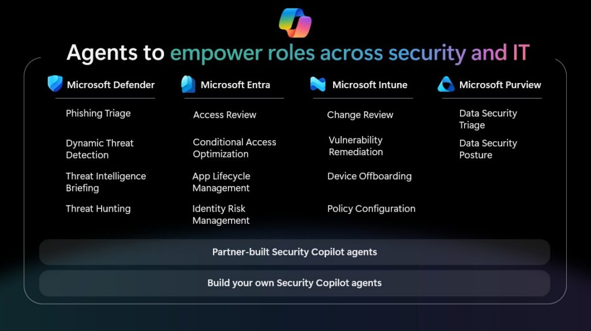

# A New Narrative for Agentic AI in Security

As threats multiply and adversaries adopt AI-driven tactics, security teams face mounting pressure to *do more with less*. The narrative around AI in security has often been tinged with anxiety... 

**Will AI take jobs, deskill practitioners, or introduce new risks?** 

*But this framing misses the REAL opportunity.*

---

## The Shift

For years, automation in security was about scripting away repetitive tasks, reducing the noise, and essentially making your day-to-day easier. But agentic AI, autonomous and adaptive agents that reason, plan, and act, marks a profound shift for the workforce. 

**These agents don’t just automate; they collaborate.** 

They operate alongside practitioners, handling the high-volume, low-value work that clogs security pipelines while surfacing context, recommendations, and insights that help humans make better decisions.

The result is that security professionals are freed from the grind of endless alert triage, script writing and analysis, and security policy reviews. Instead, they can focus on what truly matters: strategic risk reduction, proactive threat hunting, and building trust with stakeholders. I genuinely believe that organisations will thrive in this new era, and will build strategies, cultures, and digital teams that think and act alongside humans as teammates.

You just need to be ahead of the curve, and not get left behind.

### Credibility Through Consistency and Context

Credibility in security is built on two pillars: 

**Consistency** and **Context**. 

Consistency means responding to incidents, policy changes, and compliance requirements in a repeatable, defensible way. Context means understanding not just what happened, but why and what to do next. 

Agentic AI amplifies both.

- **Consistency:** Agents apply the same logic, evidence, and best practices **every time**, reducing variance and human error. 
	
- **Context:** By integrating signals from across the security stack and even external threat intelligence, Agents provide practitioners with the 'why?' behind every recommendation, making it easier to explain decisions to auditors, executives, and regulators.
	

In short, agentic AI **does not replace the human element** and instead **enhances it**, making every practitioner more credible, confident, and capable.

---

## Ignite 2025: Security Copilot Agents Now Included for Microsoft 365 E5

At Ignite 2025, Microsoft unveiled a landmark update for enterprise security teams: Security Copilot agents are now included for all Microsoft 365 E5 customers, with roll-out which commended November 2025. This inclusion marks a pivotal shift in how organisations access and operationalise agentic AI, unlocking embedded capabilities across Defender, Entra, Intune, Purview, and the standalone Security Copilot portal. 

Source: [Agents built into your workflow: Get Security Copilot with Microsoft 365 E5 | Microsoft Security Blog](https://www.microsoft.com/en-us/security/blog/2025/11/18/agents-built-into-your-workflow-get-security-copilot-with-microsoft-365-e5/?msockid=2153e7ce7cd16ace1acbf2687d126bcf) 

Not only that, an announcement soon after advised that Microsoft 365 E5 customers ALSO going to include a set of SCU's available on a monthly basis (which necessary to drive these Agents).

Source: [Learn about Security Copilot inclusion in Microsoft 365 E5 subscription | Microsoft Learn](https://learn.microsoft.com/en-us/copilot/security/security-copilot-inclusion)

### What’s Included

- **400 SCUs per 1,000 E5 licences**, pro‑rated for smaller deployments, scaling up to 10,000 SCUs per month.
- **No additional cost**, SCUs are bundled into the existing E5 subscription.
- **Zero‑click activation**, with auto‑provisioning and a 30‑day advance notification before go live.
- **Embedded agents**, natively integrated into Microsoft’s security stack and available via the Security Copilot portal.
- **Partner and custom agents**, accessible through the Security Store, featuring 30+ partner‑built agents and tools for building bespoke solutions.

*This is more than a licensing update*

It’s a strategic move to democratise AI‑driven security and make advanced capabilities accessible to organisations of all sizes.

### Understanding SCUs: Security Compute Units

A Security Compute Unit (SCU) is Microsoft’s metric for the compute power required to run Security Copilot workloads (Whether that’s a chat prompt, an agentic workflow, or an automated investigation).

**And no, it’s not a 'SKU'.**

*If I had a dollar for every time someone confused the two, I’d have enough SCUs to run Copilot on my Fridge 24/7 365.*

With E5 inclusion, customers receive:

- **400 licences = 160 SCUs/month**
- **4,000 licences = 1,600 SCUs/month**

SCUs are pooled at the tenant level and can be used across all workspaces and embedded experiences. There’s no need for manual provisioning.

Source: https://learn.microsoft.com/en-us/copilot/security/security-copilot-inclusion#licensing-and-capacity

### Auto‑Provisioning

One of the most impactful operational changes is the shift to auto‑provisioning. For eligible E5 tenants, Security Copilot is automatically configured.

**No Azure setup**

**No manual capacity provisioning, and**

**No complex onboarding flows.**

Key settings such as data residency, GPU processing location, and data sharing are pre‑selected based on your tenant’s geography and compliance posture. Default roles are assigned for owner and contributor access, with guided onboarding banners appearing in‑product to help teams get started.

This zero‑click model lowers the barrier to entry, allowing security teams to focus on adoption and value realisation rather than technical setup. However, it also places a premium on proactive planning.

**Organisations must be ready to govern, monitor, and optimise SCU usage from day one.**

### Consumption, Limits, and Overage

SCUs are consumed as agents and Copilot features are used. Each action, such as:

- phishing triage, 
	
- incident summarisation, or
	
- threat intelligence briefing 
	

These deduct a non-specific number of SCUs from the monthly pool. Allocations reset monthly, and unused SCUs do not roll over.

If usage exceeds the included allocation, Microsoft will throttle further use at a future date. Customers will have the option to purchase additional SCUs on a pay‑as‑you‑go basis at **$6 per SCU**.

### Why SCU Planning Matters

The move from hourly billing to monthly allocation introduces both predictability and risk. While it simplifies procurement and budgeting, it also means that unused SCUs are forfeited at month’s end, and overuse can lead to throttling or unexpected costs.

**This is where proactive planning is essential:**

- **Monitor usage**, using the in‑product dashboard to track SCU consumption by agent, user, and workload.
	
- **Prioritise high‑value use cases**, focusing on scenarios that deliver measurable impact, such as reducing mean time to respond or automating repetitive investigations.
	
- **Optimise configuration**, disabling non‑essential features that consume SCUs (e.g. automatic incident summaries for low‑severity alerts) and allocating resources to critical agents.
	
- **Plan for surges**, integrating agentic workflows into daily operations rather than sporadic, ad‑hoc use.

---

## Embedded Security Agents

Microsoft has moved agentic AI from an optional accelerator to a foundational capability across the entire security stack. Security Copilot agents are no longer standalone tools or experimental add‑ons. 

They are now embedded directly into the products security teams use every day. 

This shift transforms how practitioners investigate, respond, govern, and secure their environments.

Each product family now includes purpose‑built agents designed to reduce toil, enhance consistency, and elevate the credibility of every analyst, regardless of experience level. These agents operate in the flow of work, applying evidence‑based logic, contextual reasoning, and Microsoft’s threat intelligence to deliver faster, more accurate outcomes.

What follows is a breakdown of how each product area leverages agentic AI to solve long‑standing operational challenges, streamline decision‑making, and unlock new levels of efficiency and precision across the SOC, identity, endpoint, and data security domains.

### Defender Agents

In Microsoft Defender, Security Copilot agents are purpose-built to reduce SOC toil by automating the repetitive, high‑volume tasks that slow analysts down. Key capabilities include:

- **Phishing Triage Agent:** Automatically classifies and summarises user‑reported phishing incidents, reducing manual effort and accelerating response.
	
- **Alert Triage and Incident Summarisation:** Agents correlate signals, enrich alerts, and generate actionable summaries, enabling analysts to focus on true positives and complex investigations.
	
- **Natural Language Threat Hunting:** Analysts can ask questions in plain English (“Find activity related to this domain across my environment”) and receive focused, context‑rich results.
	
- **Missed Threat Detection:** Agents proactively hunt for gaps in coverage and recommend improvements to detection logic.
	

These agents are embedded directly within the Defender portal, delivering value in the flow of work without requiring analysts to learn new tools or interfaces.

Source: [Deploy AI agents in Microsoft Defender - Microsoft Defender XDR | Microsoft Learn](https://learn.microsoft.com/en-us/defender-xdr/security-copilot-agents-defender?bc=%2Fsecurity-copilot%2Fbreadcrumb%2Ftoc.json&toc=%2Fsecurity-copilot%2Ftoc.json)

#### Threat Intelligence Briefing Agent

An example of this, in a bit more detail would of course be the Threat Intelligence Briefing Agent, available both in the standalone Security Copilot portal and embedded within Defender, tackles a long‑standing challenge for threat intelligence analysts: the time‑consuming process of collecting, correlating, and contextualising threat data.

**Key features:**

- **Automated Briefing Generation:** Curates relevant threat intelligence based on the latest actor activity, vulnerabilities, and organisational context, in minutes rather than hours or days.
	
- **Dynamic Workflow:** Adapts its steps based on real‑time outcomes, ensuring briefings remain timely and relevant.
	
- **Customisable Parameters:** Analysts can specify the number of vulnerabilities to investigate, look‑back periods, regions, and industries of interest.
	
- **Integration with Defender and External Attack Surface Management:** Leverages signals from Defender for Endpoint and External Attack Surface Management to produce richer, more accurate reports.
	

By automating the grunt work of intelligence gathering, this agent frees analysts to focus on interpretation, communication, and proactive defence.

Source: [Microsoft Security Copilot Threat Intelligence Briefing Agent | Microsoft Learn](https://learn.microsoft.com/en-us/copilot/security/threat-intel-briefing-agent)

### Entra Agents

Microsoft Entra agents specialise in identity‑centric security tasks:

- **Conditional Access Optimisation Agent:** Monitors for users or applications not covered by existing policies, recommends updates, and enables one‑click remediation.
	
- **Identity Risk Management Agent:** Investigates risky users, suggests remediation paths (such as access revocation), and automates access reviews.
	
- **Application Lifecycle Management Agent:** Automates discovery and onboarding of applications, flagging those that violate policy.
	

Each agent operates with a unique, auditable identity (Entra Agent ID), ensuring actions are traceable and permissions are tightly scoped; a critical requirement for compliance and insider‑risk management.

Source: [Microsoft Entra Agents | Microsoft Learn](https://learn.microsoft.com/en-us/entra/security-copilot/entra-agents?bc=%2Fsecurity-copilot%2Fbreadcrumb%2Ftoc.json&toc=%2Fsecurity-copilot%2Ftoc.json)

### Intune Agents

In Microsoft Intune, Security Copilot agents help IT teams manage endpoints and policies at scale:

- **Change Review Agent:** Evaluates the impact of approval requests and recommends appropriate actions.
	
- **Device Offboarding Agent:** Identifies stale or misaligned devices and provides actionable insights for offboarding.
	
- **Policy Configuration Agent:** Translates plain‑language requirements into Intune policy settings, reducing configuration errors.
	
- **Vulnerability Remediation Agent:** Monitors vulnerabilities using Defender data, prioritises remediation, and provides step‑by‑step guidance.

These agents operate within the Intune admin centre, leveraging role‑based access controls to ensure only authorised users can trigger sensitive actions.

Source: [Security Copilot Agents in Intune - Microsoft Intune | Microsoft Learn](https://learn.microsoft.com/en-us/intune/agents/?bc=%2Fsecurity-copilot%2Fbreadcrumb%2Ftoc.json&toc=%2Fsecurity-copilot%2Ftoc.json)

### Purview Agents

Microsoft Purview agents bring AI‑powered automation to data security and compliance operations:

- **DLP and Insider Risk Management Agents:** Manage alert queues, prioritise high‑risk activities, and provide explanations for categorisation decisions.
	
- **Data Discovery and Remediation:** Assist in identifying oversharing, remediating sensitive data exposure, and generating compliance‑ready reports.
	
- **DSPM (Data Security Posture Management):** Centralises insights across Information Protection, DLP, and IRM, offering actionable recommendations for policy tuning and risk reduction.
	

Purview agents are particularly valuable for organisations facing regulatory scrutiny, helping maintain continuous compliance while reducing manual workload for data security teams.

Source: [Microsoft Security Copilot agents in Microsoft Purview (preview) | Microsoft Learn](https://learn.microsoft.com/en-us/purview/copilot-in-purview-agents?bc=%2Fsecurity-copilot%2Fbreadcrumb%2Ftoc.json&toc=%2Fsecurity-copilot%2Ftoc.json)

---

## Governance and Control: Agent 365 and Foundry

As the number of agents grows, so does the need for strong governance. Microsoft has introduced **Agent 365**, a centralised control plane for discovering, inventorying, and governing agents across the enterprise. Agent 365 ties agent identities to Entra, enforces RBAC‑like policies, and provides telemetry and visualisation for agent activity.

[Agent 365: AI Agent Management for Microsoft 365](https://www.microsoft.com/en-au/microsoft-agent-365?msockid=2153e7ce7cd16ace1acbf2687d126bcf)

Agentic AI introduces new risks alongside its benefits: opaque decision‑making, potential for overreach, insider risk, and the challenge of ensuring agent actions align with organisational intent. These “digital insiders” require the same level of oversight, auditability, and lifecycle management as human users.

**Key governance principles:**

- **Unique agent identities:** Every agent operates with a distinct, auditable identity (such as an Entra Agent ID), enabling granular permissioning and traceability.
	
- **Least privilege:** Agents receive only the permissions required for their function, with regular reviews to prevent privilege creep.
	
- **Audit trails:** All agent actions, prompts, and outputs are logged and available for review, supporting compliance and incident response.
	
- **Human‑in‑the‑loop:** High‑risk or destructive actions require explicit human approval, ensuring accountability remains with practitioners.
	
- **Adversarial testing:** Organisations should regularly test agents for prompt injection, memory poisoning, and other attack vectors, using red teaming and sandboxing where appropriate.
	

Microsoft’s Copilot Control System and Responsible AI documentation provide a comprehensive framework for securing agentic AI deployments. Key controls include:

- **Data security:** Use of Purview for data loss prevention, sensitivity labelling, and data residency enforcement.
	
- **AI security:** Built‑in protections against prompt injection, harmful content, and unauthorised data access.
	
- **Compliance and privacy:** Integration with Purview eDiscovery, audit, and lifecycle management tools.
	
- **Zero Trust:** Agents are treated as untrusted by default, with explicit verification and least‑privilege access.
	

By embedding these controls throughout the agent lifecycle, organisations can harness the power of agentic AI without compromising security, compliance, or trust.

Source: [Responsible AI overview | Microsoft Learn](https://learn.microsoft.com/en-us/copilot/security/responsible-ai-overview-security-copilot), [Responsible AI FAQ - Microsoft Security Copilot | Microsoft Learn](https://learn.microsoft.com/en-us/copilot/security/rai-faqs-security-copilot), [Security Copilot Agent Responsible AI FAQ - Microsoft Security Copilot | Microsoft Learn](https://learn.microsoft.com/en-us/copilot/security/rai-faqs-security-copilot-agents)

---

## Measuring Impact: What Does Success Look Like?

To move beyond anecdote and measure the true impact of agentic AI, organisations should track key performance indicators (KPIs) that reflect both operational efficiency and credibility amplification. 

Id recommend metrics like:

| KPI                         | Description                                             | Why It Matters                                 |
| --------------------------- | ------------------------------------------------------- | ---------------------------------------------- |
| Mean Time to Detect (MTTD)  | Average time from incident occurrence to detection      | Faster detection reduces attacker dwell time   |
| Mean Time to Respond (MTTR) | Average time from detection to containment/remediation  | Shorter MTTR limits damage and business impact |
| False Positive Rate         | Percentage of alerts incorrectly flagged as threats     | Lower rates reduce analyst fatigue             |
| Analyst Coverage            | Number of incidents handled per analyst per month       | Higher coverage signals increased efficiency   |
| Upskilling Rate             | Percentage of junior analysts completing advanced tasks | Indicates democratization of expertise         |
| Policy Review Accuracy      | Percentage of access reviews completed without error    | Reflects consistency and compliance            |
| SCU Utilization Rate        | Percentage of allocated SCUs consumed each month        | High utilization signals effective adoption    |
| Stakeholder Satisfaction    | Surveyed confidence in security team’s outputs          | Measures credibility with business leaders     |

This assists organisations with really confirming whether or not an Agent within operations is actually providing the value that you may need. This also helps align the potential shift to another Agentic AI, or process which may deem better value to the organisation, saving you money in the long run.

---

## Human Roles and Skills

One of the most significant shifts introduced by agentic AI is its ability to **democratise expertise**.

By embedding best practices, evidence‑based logic, and contextual recommendations directly into workflows, Security Copilot agents empower junior analysts to take on responsibilities that once required years of experience.

- **For junior analysts:** Agents offer step‑by‑step guidance, natural‑language explanations, and curated promptbooks that accelerate onboarding and build confidence.
	
- **For senior analysts:** Agents absorb the repetitive operational load, freeing time for proactive threat hunting, red teaming, and strategic uplift.
	
- **For CISOs and managers:** Agents generate clear, executive‑ready reporting that strengthens communication with boards and senior stakeholders.
	

The result is a SOC that shifts from a hierarchical, bottle necked structure to a collaborative, learning‑centred environment, where every practitioner’s credibility is amplified and expertise is shared rather than silo'd.

---

## Risk Scenarios and Mitigation

While agentic AI delivers transformative benefits, like all good things really, it also introduces a new class of risks that security teams must anticipate and manage:

- **Misuse or overreach:** Agents granted excessive permissions may take unintended actions, from deleting critical data to escalating privileges.
	
- **Insider risk:** Compromised or misaligned agents behave as “digital insiders”, potentially causing harm if not properly governed.
	
- **Supply chain vulnerabilities:** Partner or custom agents may introduce insecure dependencies or malicious code.
	
- **Opaque decision‑making:** Without transparency and auditability, agent actions can be difficult to explain or defend.
	
- **Capacity mismanagement:** Overuse or underuse of SCUs can result in throttling, wasted potential, or unexpected costs.
	

Now, there's no cookie cutter way to address these risks, though I recommend organisations:

- **Implement strong identity and access management:** Use Entra Agent ID for unique, auditable identities and enforce least‑privilege permissions.
	
- **Establish governance frameworks:** Define clear policies for agent onboarding, approval, monitoring, and offboarding, supported by regular reviews and audits.
	
- **Monitor and log all agent activity:** Centralise logs, configure real‑time anomaly alerts, and integrate with SIEM/SOAR platforms for correlation and response.
	
- **Require human‑in‑the‑loop for high‑risk actions:** For destructive or sensitive operations, mandate multi‑person sign‑off and explicit approval.
	
- **Vet partner and custom agents:** Review code, dependencies, and permissions before deployment; use Security Store attestation and SLAs as a baseline.
	
- **Continuously test and red team agents:** Simulate attacks, prompt injections, and privilege escalations to identify and remediate vulnerabilities before production rollout.
	

By treating agents as first‑class, identity‑bound, auditable services, organisations can capture the upside of agentic AI while minimising operational and security risks.

### Practical Adoption Steps: From Entitlement to Impact

#### 1. Prepare Your Environment

- **Confirm activation timeline:** Monitor for your 30‑day activation notice and validate configuration across Defender, Entra, Intune, and Purview.
	
- **Review data handling and compliance:** Engage legal and compliance teams to ensure data residency, privacy, and audit requirements are met.
	
- **Audit prerequisites:** Confirm that underlying products (such as Defender for Office 365 Plan 2, Sentinel, and mature Conditional Access policies) are in place to maximise agent effectiveness.
	

#### 2. Identify High‑Impact Use Cases

- **Select 2–3 scenarios:** Prioritise measurable, high‑value workflows such as phishing triage, incident investigation, access review, or policy tuning.
	
- **Define success metrics:** Establish KPIs (as mentioned above) - for example, reduced MTTR or increased analyst coverage - to track impact.
	

#### 3. Standardise and Measure

- **Develop promptbooks:** Build repeatable workflows for common tasks, using Microsoft’s curated libraries as a foundation.
	
- **Establish access controls:** Use role‑based access and agent identities to govern who can deploy and manage agents.
	
- **Monitor SCU consumption:** Use the in‑product dashboard to track usage, set alerts for surges, and optimise allocation.
	

#### 4. Govern and Optimise

- **Set up Agent 365 and Foundry:** Inventory all agents, enforce RBAC policies, and monitor activity for anomalies.
	
- **Pilot in monitor‑only mode:** Begin with read/suggest‑only agents, measure improvements, and gradually enable auto‑remediation as confidence grows.
	
- **Engage partners carefully:** Vet third‑party agents for security, compliance, and contractual SLAs before production deployment.
	

#### 5. Upskill and Communicate

- **Train your team:** Invest in AI literacy, prompt engineering, and governance skills across all practitioner levels.
	
- **Communicate value:** Share success stories and measurable outcomes with business stakeholders to build trust and secure ongoing investment.
	

---

The inclusion of Microsoft Security Copilot agents for all Microsoft 365 E5 customers marks a milestone moment for security operations. 

And I repeat:

**Agentic AI is not a threat to jobs**

It is a credibility amplifier, empowering practitioners at every level to deliver faster, more consistent, and more defensible outcomes. 

*Isn't that really what we all are trying to do in our day-to-day.*