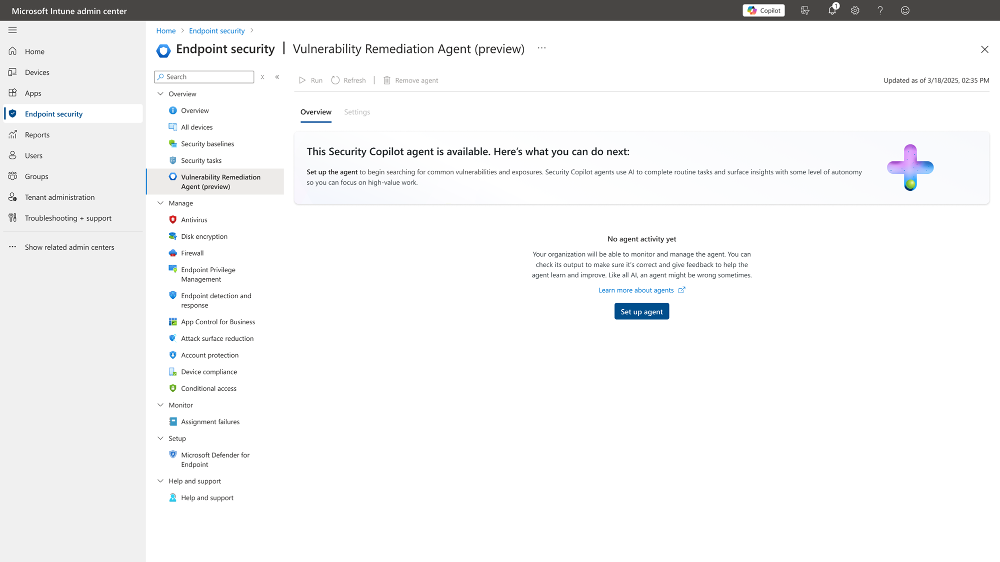
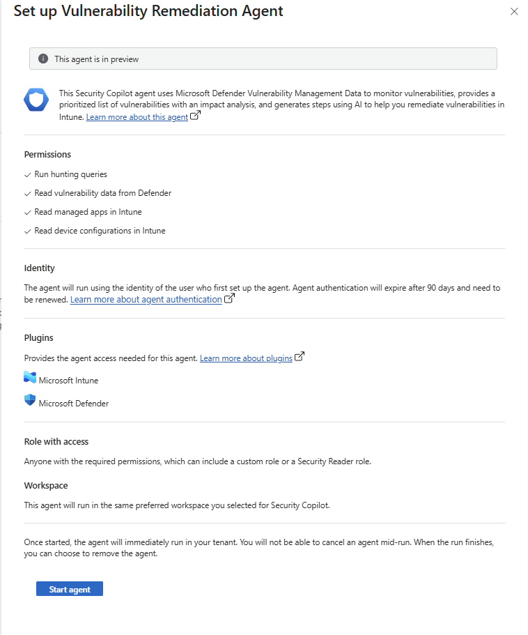
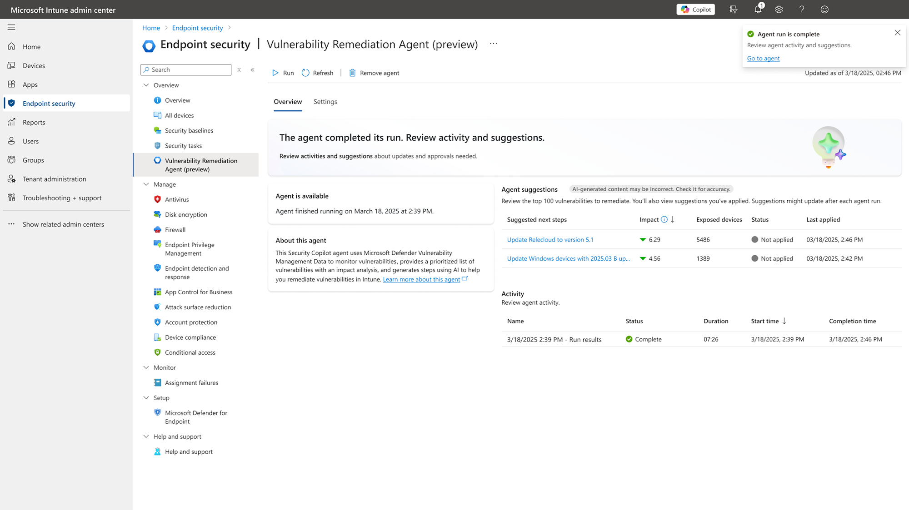

# Transforming Vulnerability Management with the Security Copilot Agent in Intune

As the volume and complexity of vulnerabilities continue to grow, and for many organizations, managing these risks effectively has become a game of catch-up across disparate tools and teams.

**But what if you could consolidate vulnerability management into a single, intelligent interface?** 

That’s precisely what Microsoft’s new Vulnerability Remediation Agent (*powered by Security Copilot and integrated into Microsoft Intune*) promises to deliver.

## Rethinking Endpoint Security with AI

At the heart of this transformation is the Vulnerability Remediation Agent, a new Intune-based extension designed to bring AI directly into your endpoint protection workflow. This isn’t just another data feed... it’s a full integration with Microsoft Defender Vulnerability Management, providing real-time CVE analysis at the device level.

More importantly, it goes beyond simple detection. Using the AI capabilities of Security Copilot, the agent analyses and prioritizes vulnerabilities based on exploitability, device exposure, and business context. It then delivers targeted, actionable remediation guidance, complete with ready-to-deploy scripts, right inside Intune.

Each remediation recommendation is enriched with metadata, indicating whether the action involves an app update, configuration adjustment, or policy change. This classification improves clarity for operational teams and helps align remediation tasks with existing configuration baselines.

**Support currently focuses on Windows devices**, but Microsoft has signaled intent to expand platform compatibility—including macOS and Linux endpoints—via future agent support in Intune’s cross-platform management stack.

## From Insight to Action

First, Defender Vulnerability Management conducts continuous assessments of enrolled endpoints, flagging known vulnerabilities and configuration risks. Once identified, the AI kicks in, analysing severity, potential impact, and exploit trends to assign a dynamic risk score to each CVE.

> When the agent runs, it analyzes data from Microsoft Defender Vulnerability Management and provides a prioritized list of suggestions that appear in the Intune admin center. You can drill-in to each suggestion to view details that include:
> 
> - The count of associated vulnerabilities (CVEs)
> - A Copilot-assisted summarized impact analysis
> - Suggested actions
> - Affected systems
> - Exposed devices
> - Potential impact
> - Step-by-step guidance for using Intune to remediate it
> 
> [Security Copilot Vulnerability Remediation Agent in Microsoft Intune | Microsoft Learn](https://learn.microsoft.com/en-us/intune/intune-service/protect/vulnerability-remediation-agent)

From there, remediation moves from reactive to proactive. The agent provides tailored, human-readable impact summaries and Intune-compatible remediation steps—no more guesswork, and no need to jump between consoles. Everything happens in one place, with audit logs capturing each action for compliance and reporting.

Admins also benefit from integrated session control. From within Intune, you can:

- **Run** a remediation session to trigger or re-trigger AI-guided suggestions
    
- **Refresh** to sync the latest CVE intelligence and update actions
    
- **Remove** the agent when necessary (while session data is retained for 90 days in the Security Copilot portal for auditing)
    

Each action is scoped to the admin who initiated the session, ensuring that sensitive insights are only visible to authorized individuals.

## What You Need to Deploy

Deploying the agent is straightforward, but there are a few prerequisites to check off first:

- [**Microsoft Intune Plan 1 subscription**](https://learn.microsoft.com/en-us/intune/intune-service/fundamentals/licenses) - This subscription provides the core Intune capabilities.
    
- [**Microsoft Security Copilot**](https://learn.microsoft.com/en-us/copilot/security/microsoft-security-copilot) - Security Copilot must share a Tenant with Intune, and to set up the agent your account must have permission to the workspace for Security Copilot. For more information, see [Get started with Microsoft Security Copilot](https://learn.microsoft.com/en-us/copilot/security/get-started-security-copilot#onboarding-to-security-copilot).
    
- [**Security compute units (SCU)**](https://learn.microsoft.com/en-us/copilot/security/manage-usage) - You must have sufficient SCUs to power Security Copilot workloads, including agents.
    
- [**Microsoft Defender Vulnerability Management**](https://learn.microsoft.com/en-us/defender-vulnerability-management/defender-vulnerability-management) - This capability is provided by Microsoft Defender for Endpoint P2 or Defender Vulnerability Management Standalone.
    
- [**Microsoft Intune Suite**](https://learn.microsoft.com/en-us/intune/intune-service/fundamentals/intune-add-ons) - Intune Suite standalone solution add-on licenses including Intune Endpoint Privilege Management, Enterprise Application Management, and Intune Plan 2 do not meet this prerequisite.
    

## Step by Step Setup in Microsoft Intune

Once prerequisites are met, follow these steps:

1. **Sign in to the Microsoft Intune admin center**  
    Go to [https://intune.microsoft.com](https://intune.microsoft.com).
    
2. **Navigate to the agent configuration page**
    
    - Go to **Endpoint security** > **Vulnerability Remediation Agent (Preview)**.

3. **Enable the agent**
    
    - Select the **Set Up Agent** button.
        
    - Click **Start Agent** to turn on the agent for your tenant.
        

## What to Expect?

Once the agent is enabled:

- Initial device vulnerability data starts appearing within minutes.
    
- Security Copilot begins analysing the data and generating prioritized remediation actions.
    
- You’ll see a new tab in the Intune console showing:
    
    - **Prioritized actions** (based on CVE severity and exposure)
        
    - **Affected device counts**
        
    - **Suggested scripts or policy changes**
        
    - **Session logs** tied to your user identity
        

As an Administrator:

- You can manually **Run** a new session, **Refresh** the results, or **Remove** the agent from the settings page.
    
- Each suggested action includes export options, remediation steps, and links to affected device groups.
    
- Sessions and actions are **scoped to your admin identity**, so your activity doesn’t overwrite or conflict with others working in parallel.
	

!!! note

    Sessions are retained for 90 days in the Copilot “My Sessions” view, accessible only to the initiating admin. Actions taken from within sessions are logged and visible in Intune for audit and compliance.

!!! tip

    Start with a pilot device group (e.g., test lab or IT staff endpoints), observe the generated actions, and validate end-to-end deployment and tracking. You can apply scope tags and assignment filters to fine-tune who sees or receives recommendations. (Though, Scope Tags are not supported during Public Preview)
	

And, if the Solution is not right for you:

To remove the Vulnerability Remediation Agent, in the [Intune admin center](https://go.microsoft.com/fwlink/?linkid=2109431) , go to **Endpoint security** > **Vulnerability Remediation Agent (preview)** and select **Remove agent**. After an admin accepts the prompt, the agent is removed, and the agent pane is restored to its original state.

!!! note

    To remove the agent instance, the admin account must have the _Owner_ role in Security Copilot. An account with the _Contributor_ role can run the agent and view results but can't manage the agent instance.
	

!!! warning

    When an agent is removed, all existing agent suggestions are deleted. This includes details about suggestions that were marked as _Applied_.
	

## Looking Ahead

The Vulnerability Remediation Agent marks only the beginning. Microsoft seems to have some ambitious plans for a suite of Copilot-powered agents across Intune, and I am eagerly looking forward to them.