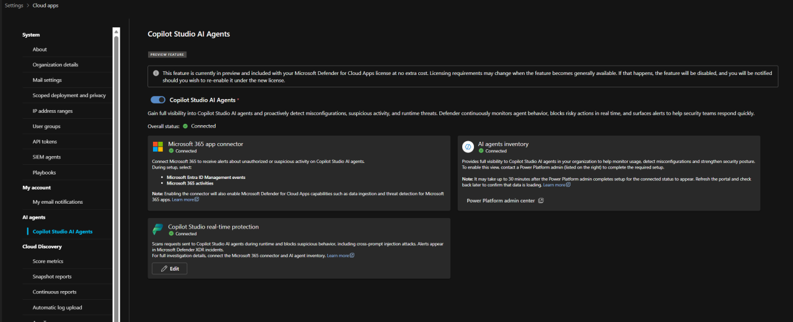
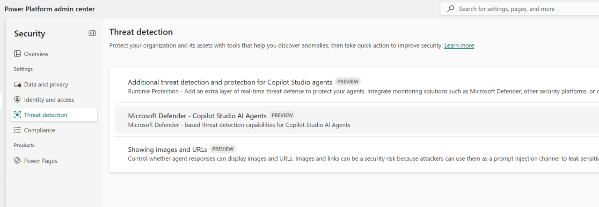
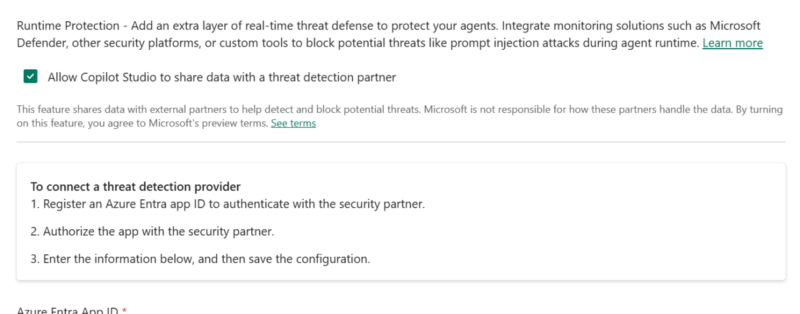

# Enabling Protection and Visibility for AI Agents with Microsoft Defender for Cloud Apps

I always know a feature is still in preview when the first thing I do is hover over the toggle and think, _“Alright, what is this going to break?”_  

Copilot Studio Real Time Protection inside Defender for Cloud Apps gives exactly that feeling. It is powerful, necessary, and still wearing its early access badge.

Still, if we are going to let AI agents run around our environments making decisions, the least we can do is give them a security system that actually watches what they are doing. So I start where every good security story begins: in the Defender portal, staring at a toggle that promises protection and visibility for AI agents.

## Understanding how the pieces fit together

Before diving into the toggles, it helps to understand the architecture. There are three systems involved, and each one plays a different role.

- Defender for Cloud Apps provides the enforcement and visibility layer. This is where runtime decisions, alerts, and oversight live.
	
- Power Platform provides the environment level controls and the data sharing path that lets Defender receive telemetry.
	
- Copilot Studio Real Time Protection is the runtime gatekeeper that evaluates every tool invocation an agent attempts.
	

Once you know this, the back and forth between portals makes a lot more sense. You are wiring up a pipeline that lets Power Platform send agent telemetry to Defender, and lets Defender make allow or block decisions in real time.

## The preview warning that sets the tone

The banner reminds me that this is a preview feature bundled with the Defender for Cloud Apps licence ***for now***.  

**My Translation:** Enjoy it while it is free, because when GA arrives, someone in security will ask why the toggle suddenly turned itself off, and why is it no longer free?

To me though? Fine. I accept the terms of engagement and head to:

!!! note

    You will need Security Administrator for this...
	

**Defender XDR > System > Settings > Cloud Apps > Copilot Studio AI Agents > Turn on the toggle**

Defender immediately starts wiring things together. The M365 app connector links itself automatically, which is one of those rare moments where something in security configuration works without a fight.

!!! tip

    Before you plan to write an article on deploying configuration, make sure to take screenshots during it, to use in that article. Lets just pretend this says "Not Connected". Thanks
	

## Power Platform Admin Center enters the chat

Of course, nothing involving Power Platform is ever fully automatic, so off I go:

!!! note

    You will need Power Platform Administrator for this...
	

**Power Platform > Security > Threat Detection > Microsoft Defender Copilot Studio AI Agents (Preview)**

Toggle: **Enable Microsoft Defender Copilot Studio AI Agents**

I flip the switch and it politely tells me it will need 30 minutes.

Which, in Power Platform time, is basically an invitation to make a coffee and maybe a well deserved lunch break.

Eventually though, it shows as connected. One piece down.

## Now for Copilot Studio Real Time Protection

Back to Defender.  
Back to the toggle.  
Back to the part where I know I am about to be asked to create an app registration.

I select Connect on Copilot Studio Real Time Protection and turn it on. Defender offers two paths:

- Run the automated script
	
- Do it manually through App Registration
	

This is where the internal monologue really kicks in.

### The automated script option

Running the script prompts for:

- Tenant ID
	
- Endpoint URL from the Enable Power Platform Integration
	
- Display Name for the app
	
- FIC Name
	

It then checks whether MSAL.PS exists and installs it if needed. Gives you the App ID GUID at the end. Wipe hands on pants.

The automated script is the fastest path and ideal for most tenants. It handles the identity objects for you and avoids the manual steps.

Now, Ill be honest, I actually decided to go with the manual method... I wanted to see what was involved in the Federated Credentials aspect (a new 'thing' for me).

## The manual method (for those interested)

Pretty straight forward for the process, but in summary (and go to [Microsoft Learn](https://learn.microsoft.com/en-us/microsoft-copilot-studio/external-security-provider#option-b-configure-manually-using-azure-portal for a deeper dive into it) for a proper set of instructions):

1. Create a **Single Tenant App Registration**
	
2. Follow the instructions here to generate the Base64 values for the Tenant ID and Endpoint URL.
	
3. Enter the Base64 aspects into the Value, and create a Federated Credential using it.
	

A quick note on what these things actually are:

- The Endpoint URL is the ingestion endpoint Defender uses to receive real time agent telemetry from Power Platform.
	
- Federated Identity Credentials allow Defender to authenticate to the app registration without secrets. No client secret, no certificate, just workload identity federation. This is why the app registration looks strangely empty.
	

Once the App Registration and FIC are complete, I enter the details into the Defender settings prompt and click Save.

If it saves, great!

If it does not, it is because Entra was not configured properly and Defender is not shy about saying so.

## Back to Power Platform again

Now that Defender knows about the app, Power Platform needs to know too.

I head back to:

**Power Platform > Security > Threat Protection > Additional threat detection and protection for Copilot Studio agents**

I select the environment, click **Setup**, and then:

- Tick **Allow Copilot Studio to share data with threat detection partner**
	
- Enter the same **App ID** and **Endpoint URL** from Defender
	
- Set **Error Behaviour** to Block the Query
	
- Save
	

If everything is configured correctly, I get:

**Connection is On for Environment**

If not, I get the equally predictable:

"**Your Microsoft Entra app is not properly configured**"

(At least it is honest.)

**One important detail here:** this configuration is per environment. Turning it on in one environment does not enable it tenant wide. Every environment that hosts agents needs to be wired up individually.

## How the protection behaves at runtime

Once everything is wired up, the threat detection system sits in front of every tool invocation an agent attempts. It has one second to decide:

- Allow
	
- Block
	

If it cannot decide in time, the system defaults to **allow**.  

This one second window applies to every tool invocation. The decision is enforced by the Power Platform runtime, and the default allow behaviour is intentional so that agents do not break mid flow if Defender is slow or unreachable

Even after everything is enabled, it can still take up to 30 minutes before Defender starts showing data. (Took mine a few hours, I wont lie, but lets stick with 30 minutes.)

## What Defender actually sees

Once the plumbing is in place, Defender becomes the eyes and ears for your AI agents. It can surface:

- Tool invocation logs
	
- Agent identity inventory
	
- Misconfiguration detection
	
- Suspicious behaviour patterns
	
- Risk scoring
	
- Real time blocks on risky tool calls
	

This is also where the new AI Agent Inventory lives, giving you a central view of your agents, their tools, and their posture.

It is the difference between having AI agents running in your tenant and having AI agents running in your tenant with actual oversight.

---

But all in all, In the end, all of this wiring together of Defender, Power Platform, Copilot Studio, app registrations, scripts, toggles, and waiting periods is really about one thing.

**Giving you a proper security perimeter around AI agents that would otherwise be operating on trust alone.**

Once everything is connected, you move from hoping your agents behave to actually seeing what they are doing, stopping what they should not be doing, and giving your security team the visibility they expect from any other workload in the environment.

It feels like a lot of setup, but the payoff is real oversight, real protection, and real confidence that your AI agents are working for you rather than wandering off into trouble.