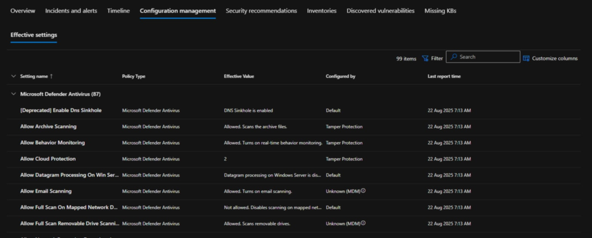
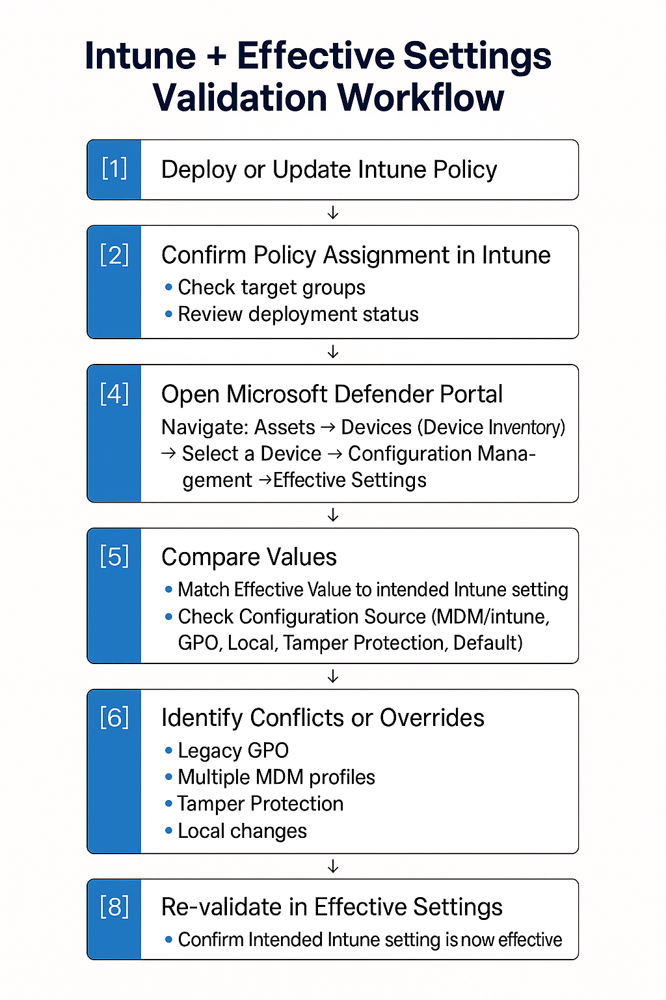

# Intune + Defender: See What’s Really Effective

An organisation’s endpoint security posture is only as strong as the settings that are actually applied on its devices. In modern environments, those settings can originate from multiple sources including Intune MDM, traditional Group Policy, Microsoft Security Baselines, or even built‑in defaults enforced by Tamper Protection. These layers can sometimes align, but more often they compete, with one silently overriding another.

For Intune administrators, this complexity can make it difficult to confirm that a newly deployed endpoint security profile is truly in effect. Even when the Intune admin centre reports a successful deployment, the endpoint itself may be running with a different configuration because another source has taken precedence.

Without a clear way to see which configuration is winning and where it originates, troubleshooting becomes guesswork and policy remediation can stall. The Effective Settings feature in Microsoft Defender for Endpoint delivers a single, consolidated view of the enforced configuration, allowing administrators to cut through the noise and make informed, decisive adjustments.

> “You think you’ve disabled a feature. Your GPO says it’s off. Intune says it’s off. But on the endpoint? It’s _on_ — because Tamper Protection or a legacy MDM profile is winning. This is where Effective Settings turns detective.”

---
## What is Effective Settings in MDE?

The Effective Settings feature is found in the Microsoft Defender portal when viewing an individual device. It gives you a direct view of the settings that are actually in place on that endpoint, not just what policies say should be applied.

For each item, it brings together three key pieces of information:

- The **policy type**, such as Antivirus, Firewall, or Attack Surface Reduction Rules.
    
- The **effective value**, which shows the configuration the device is currently running with.
    
- The **configuration source**, telling you where that value came from. This could be an Intune MDM profile, a local configuration, a Group Policy Object, Tamper Protection defaults, or a built‑in default where no explicit policy exists.
    

Because this view is updated in real time as policies apply or change, it can immediately reflect when a setting has been overridden or enforced by a different source. For Intune‑managed devices, this means you can validate that your endpoint security profiles are not only delivered but are also the active configuration on the device.

---
## Accessing and Interpreting the Feature

**Steps:**

1. Sign in to the Microsoft Defender portal with Security Administrator or Endpoint Security Manager permissions.
    
2. Navigate: **Assets → Devices (Device Inventory) → 'Select a Device' → Configuration Management → Effective Settings**.
    
3. Review the **per‑setting breakdown**:
    
    - _Policy Type_ – Logical category of the setting.
        
    - _Effective Value_ – Final enforced state on the endpoint.
        
    - _Configuration Source_ – Origin (MDM/Intune, Group Policy, Local, Tamper Protection, Default).
        
4. Use filters to focus on specific policy types during an investigation.
    

---
## Required Roles and Permissions

To work with both Intune policy deployment and the Effective Settings feature in Microsoft Defender for Endpoint, you should assign the **least‑privilege roles** that still allow the necessary actions. This ensures administrators can perform their tasks without holding excessive permissions.

### For Intune Policy Deployment

- **Endpoint Security Manager** _(Microsoft Intune built‑in role)_
    
    - Grants the ability to create, edit, and assign endpoint security policies in Intune.
        
    - Scoped to specific device or user groups via Intune RBAC for granular control.
        
- **Intune Administrator** _(only if broader device/app management is required)_
    
    - Use sparingly — this role has wider permissions than Endpoint Security Manager.
        

### For Effective Settings Monitoring in Microsoft Defender for Endpoint

- **Security Administrator** _(Microsoft Entra ID role)_
    
    - Required to view the **Configuration Management** and **Effective Settings** tabs in the Microsoft Defender portal.
        
    - Allows full visibility into security policies and their applied values.
        
- **Security Reader** _(Microsoft Entra ID role)_
    
    - Can view Effective Settings but cannot make changes.
        
    - Suitable for audit or compliance teams who only need read‑only access.
        

### Best Practice

- Assign **Endpoint Security Manager** for Intune policy work.
    
- Assign **Security Administrator** for full Effective Settings monitoring, or **Security Reader** for read‑only scenarios (such as this one). 
    
- (and though I shouldn't have to say it) **Avoid using Global Administrator except in emergency situations — it is highly privileged and not required for these tasks.**
	

---
## Intune + Effective Settings Validation Workflow

Before diving into common conflict scenarios, it helps to have a repeatable process for confirming that your Intune policies are not only deployed but are also the active configuration on the endpoint. The workflow below combines Intune reporting with the Effective Settings view in Microsoft Defender for Endpoint, giving you a clear, end‑to‑end method for validating policy enforcement.

By following these steps, you can quickly move from policy intent in the Intune admin centre to verified configuration on the device, closing the gap between “should be” and “is.” This approach ensures you start every investigation from a known, trusted baseline.

_This workflow shows how to pair Intune policy reporting with Effective Settings to confirm that your intended configuration is actually applied on the endpoint._

With a verified baseline in place, you can then turn your attention to identifying and resolving conflicts. Let’s look at some of the most common scenarios where Effective Settings can reveal hidden issues.

---
## Using Effective Settings for Conflict Detection

### Legacy GPO Overlap

A legacy Group Policy Object may still enforce an outdated setting that no longer aligns with your Intune security baseline. Effective Settings will show the policy type, the effective value, and that the configuration source is Group Policy, helping you pinpoint and retire that GPO.

### Tamper Protection Overrides

Tamper Protection can reset certain settings to Microsoft‑recommended defaults. In Effective Settings, the configuration source will be marked as Tamper Protection, making it clear the change is intentional.

### Multiple MDM Profiles

Different Intune assignments targeting the same setting with conflicting values can cause unexpected results. Effective Settings reveals the winning configuration source and value, allowing you to consolidate or re‑scope policies.

### Manual Local Changes

If local admin merge is enabled, settings can be altered directly on the endpoint. Effective Settings will show the configuration source as Local, signalling the need to disable local merges or re‑enforce the intended configuration.

---
## Turning Findings into Governance Actions

Once Effective Settings has helped you uncover conflicts or unexpected configurations, act on those findings in a structured way:

- **Policy clean‑up** – Retire outdated GPOs and remove redundant Intune profiles.
    
- **Standardisation** – Align all policies to your current security baseline.
    
- **Change control integration** – Document effective settings changes in CAB reviews.
    
- **Continuous monitoring** – Schedule periodic exports of Effective Settings for compliance audits.
    

For Intune admins, this process also strengthens the link between what is deployed and what is enforced, ensuring that your cloud‑based policy management delivers the intended results on every device.

---
## Real‑World Example

> _Scenario:_ Your ASR rule “Block credential stealing from LSASS” is expected to be enabled across all endpoints.
> 
> Effective Settings shows:
> 
> - **Policy Type:** Attack Surface Reduction
>     
> - **Effective Value:** Disabled
>     
> - **Configuration Source:** Local Group Policy
>     

From this, it is immediately clear that the intended Intune profile is not applying as expected. A legacy Local Group Policy is taking precedence and forcing the setting to Disabled. The resolution is to update the GPO to “Not Configured,” trigger a policy refresh, and then force an Intune sync so the managed setting is applied correctly.

---
## Pro Tips

- Combine Effective Settings with **Advanced Hunting** in Microsoft 365 Defender to query configuration data across your fleet.
    
- Make it part of your **post‑deployment validation** for any new Intune security profile.
    
- Use findings to build **policy ownership maps** in multi‑team environments, reducing the risk of conflicting changes.
    

---

Effective Settings is not only a tool for verifying security... it is a discipline for how you can govern and maintain your environment. For Intune administrators, it bridges the gap between cloud‑delivered policy intent and on‑device reality, providing a level of visibility that is often missing (or pending) in MDM‑only reporting.

The hope is that more capabilities like this will surface directly in the Intune admin centre, giving administrators the same “single pane of truth” without having to pivot between portals. Until then, Effective Settings in Microsoft Defender for Endpoint remains one of the most valuable tools for confirming that your protection related Intune policies are not just deployed, but truly effective.