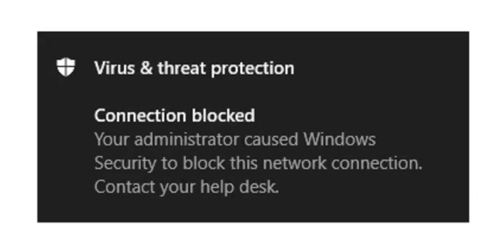

# Unleashing Microsoft Defender for Endpoint: Advanced Features You're Missing

Many organisations rely on Microsoft Defender for Endpoint as their frontline security solution, yet surprisingly, its most advanced features often go untouched. Over the years, there’s a common trend that paints a bleak picture... 

Defender is in place, providing baseline protection, but the deeper capabilities that could significantly strengthen security posture remain **unused**. Unlocking these features means better threat detection, automated security workflows, and tighter policy enforcement, all of which help organisations stay ahead of evolving cyber threats. 

**The potential is there — it’s just waiting to be fully utilised.**

If you're serious about security (and let's be honest, you should be), enabling these features can take your protection from "good enough" to "next-level" with a few simple clicks. Let’s dive into some key capabilities that need configuration and why they’re almost a necessity for securing your environment.

Now there is some pre-assumed knowledge of licensing within your environment, but given we as IT Professionals should have security at the top of mind, I will also assume you have security at the top of mind, and you have Microsoft 365 E5 or at least E5 Security Add-On. If you haven't, some of these may not apply, but Id hope these would persuade you to consider, potentially consolidate, and take full advantage of the robust security features available within the Microsoft Security ecosystem.

---

## Web Content Filtering & Network Protection: Preventing Web-Based Threats

Starting off with Web Content Filtering, I'm sure you're all aware, **not all websites are created equal.**

some are packed with malware, phishing scams, or content that just doesn’t belong in a professional environment. Web Content Filtering and Network Protection allow organisations to block malicious or non-compliant site categories, ensuring users don’t wander into digital danger zones.

### How Does It Work?

Web Content Filtering and Network Protection operate as part of Microsoft Defender’s Web Protection capabilities, ensuring that users are safeguarded from malicious domains and risky content.

**Web Content Filtering**

- Allows organisations to track and regulate access to websites based on content categories.
	
- Blocks access to high-risk categories such as malware, phishing, adult content, and illegal activities.
	
- Provides audit mode, allowing security teams to monitor web usage before enforcing strict policies.
	

**Precedence for multiple active policies**

Applying multiple different web content filtering policies to the same device results in applying the more restrictive policy for each category. Consider the following scenario:

- **Policy 1**: blocks categories 1 and 2 and audits the rest
	
- **Policy 2**: blocks categories 3 and 4 and audits the rest
	

The result is that categories 1-4 are all blocked, as illustrated in the following image.

**Network Protection**

- Expands Microsoft Defender SmartScreen to block all outbound HTTP(S) traffic that attempts to connect to poor-reputation sources.
	
- Prevents connections to malicious domains, including those hosting phishing scams, exploits, and malware.
	
- Works across Microsoft Edge, Chrome, Firefox, Brave, and Opera, ensuring protection beyond Microsoft browsers.
	

### How to Configure

**Turning it On**

1. 	Navigate to **Settings > Endpoints > General > Advanced Features**.
	
2. 	Scroll down to Web Content Filtering and toggle it ON.
	
3. 	Click Save Preferences.
	

**Configure Web Content Filtering Policies**

1. 	Go to **Settings > Endpoints > Rules > Web Content Filtering**.
	
2. 	Select Create Policy and define blocked categories.
	
3. 	Assign policies to device groups.
	
4. 	Enable audit mode to monitor web activity before enforcing strict blocks.
	

**Enable Network Protection**

1. 	Navigate to **Settings > Endpoints > General > Advanced Features**.
	
2. 	Locate Network Protection and toggle it ON.
	
3. 	Choose Block Mode to prevent access to malicious domains.
	
4. 	Click Save Preferences.
	

**Pro tip:** Start with blocking **CATEGORIES NOT APPROVED BY YOUR ORGANISATION, YOU KNOW WHICH ONES I MEAN**, then refine policies over time using audit mode.

---

## Endpoint Detection and Response (EDR) in Block Mode: Proactive Threat Mitigation

**Detection is great, but why stop there?** 

With EDR in block mode, Microsoft Defender not only **detects** malicious activity but also actively **remediates** it, even if Defender Antivirus is running in passive mode. This can be helpful when you potentially are using a Third-Party AV solution, but you want to guarantee the protection that Defender can provide your organisation.

### How Does It Work?

**Detection of Malicious Activity**

- Microsoft Defender for Endpoint continuously monitors **device behavior** and **network activity**.
	
- If a **malicious artifact** is detected, EDR in Block Mode **steps in to take action**, even if Defender Antivirus is not the primary AV solution.
	

**Automatic Remediation**

- EDR in Block Mode **removes or quarantines** threats that were missed by the primary antivirus solution.
	
- Security teams can view **remediation actions** in the **Microsoft Defender portal** under **Action Center**.
	

**Post-Breach Protection**

- Even if an attacker bypasses the primary antivirus, EDR in Block Mode ensures that **malicious files, scripts, and processes** are blocked.
	
- Defender’s **behavioral blocking and containment** capabilities help prevent further compromise.
	

**Integration with Threat & Vulnerability Management**

- If EDR in Block Mode is **not enabled**, Defender for Endpoint will **recommend turning it on** in the **Threat & Vulnerability Management dashboard**.
	
- Security teams can review **detection trends** and **remediation reports** to assess its effectiveness.
	

For more details, check out [Microsoft Learn](https://learn.microsoft.com/en-us/defender-endpoint/edr-in-block-mode).

### How to Configure

To enable **EDR in Block Mode**, follow these steps:

1. Navigate to **Settings > Endpoints > General > Advanced Features**.
	
2. Locate **Enable EDR in Block Mode** and toggle it **ON**.
	
3. Scroll down and **click Save** (because forgetting to save is a classic mistake I make!).
	
4. Verify that **Microsoft Defender Antivirus** is running in **passive mode** (if using a third-party AV solution).
	

**Pro Tip:** **Enable EDR in Block Mode** even if Defender Antivirus is the primary AV—it provides **extra protection**.

---

## Live Response: Remote Incident Analysis

**When security incidents happen, speed matters.** 

**Live Response** in **Microsoft Defender for Endpoint** provides security teams with **instant remote access** to compromised devices, allowing them to **investigate, collect forensic data, and take immediate remediation actions**—all without needing physical access to the endpoint.

This feature is particularly valuable for **incident response teams**, as it enables **real-time threat hunting**, malware analysis, and containment of security breaches before they escalate.

### How Does Live Response Work?

Live Response operates as a **remote shell connection**, giving security analysts direct access to a device for **in-depth investigative work**. Here’s how it functions:

1. **Initiating a Live Response Session**

- Security analysts can start a **Live Response session** from the **Microsoft Defender portal**.
	
- Once initiated, a **secure remote shell** is established, allowing analysts to execute commands directly on the affected device.
	

2. **Investigating Threats**

- Analysts can **run basic and advanced commands** to inspect system logs, processes, and network activity.
	
- Suspicious files can be **downloaded for further analysis**, including malware samples and PowerShell script outputs.
	

A List of these commands can be found over at: [Live response command examples - Microsoft Defender for Endpoint | Microsoft Learn](https://learn.microsoft.com/en-us/defender-endpoint/live-response-command-examples)

3. **Executing Remediation Actions**

- Analysts can **upload and execute PowerShell scripts** or executables to mitigate threats.
	
- Threats can be **removed or quarantined**, preventing further spread across the network.
	

4. **Undoing Actions & Continuous Monitoring**

- If necessary, remediation actions can be **reversed** to restore system integrity.
	
- Security teams can **proactively hunt for emerging threats** using Live Response capabilities.
	

### How to Configure

To enable **Live Response**, follow these steps:

1. **Enable Live Response in Defender for Endpoint**:

- Navigate to **Settings > Endpoints > Advanced Features**.
	
- Toggle **Live Response** to **Enabled** (and remember to click Save, down the bottom).
	

2. **Assign Permissions to Security Administrators**:

- Use **Role-Based Access Control (RBAC)** to restrict Live Response access to **security administrators only**.
	
- Ensure that only **privileged users** can execute remote commands.
	

3. **Enable Live Response for Servers** (if applicable):

- Navigate to **Advanced Features** and enable **Live Response for Servers**.
	
- Ensure that **Windows Server devices** meet the required patch levels.
	

4. **Configure PowerShell Execution Policies**:

- By default, **unsigned PowerShell scripts** are blocked.
	
- If necessary, enable **unsigned script execution** (with caution) to allow custom remediation scripts.
	

**Pro tip:** Restrict access to **security administrators only**, this will ensure that only delegated and privileged users can access this powerful functionality.

---

## Automated Investigation & Response (AIR): Reducing Incident Response Time

**Manual incident response is time-consuming, and attackers don’t wait around.** 

AIR automates investigations, triages alerts, and **suggests remediation actions**, dramatically speeding up response time.

### How Does AIR Work?

Automated Investigation & Response (AIR) in **Microsoft Defender for Endpoint** acts as a **virtual security analyst**, continuously monitoring threats and taking action when necessary. It follows a structured process to **triage, investigate, and remediate** security incidents, ensuring that threats are handled efficiently without overwhelming security teams.

**1. Triggering an Automated Investigation**

An AIR investigation can begin in two ways:

- **Automatically:** When Defender detects a suspicious activity or malicious artifact, an alert is triggered, and an **automated investigation** starts immediately.
	
- **Manually:** Security analysts can initiate an investigation by selecting a device or alert in the **Microsoft Defender portal** and choosing **"Initiate Automated Investigation"**.
	

Once an investigation begins, AIR **examines the affected device**, correlates alerts, and expands its scope if necessary.

**2. Expanding the Investigation Scope**

AIR doesn’t just stop at the initial alert—it **actively looks for related threats** across the environment:

- If the same malicious file or behavior is detected on other devices, AIR **adds them to the investigation**.
	
- If an entity (such as a user or process) is linked to multiple alerts, AIR **broadens its analysis** to include all affected endpoints.
	
- If more than **10 devices** are impacted, AIR requires **manual approval** before expanding further.
	

**3. Analyzing Threats & Generating a Verdict**

AIR uses **advanced inspection algorithms** to analyze suspicious files, processes, and registry changes. It assigns a **verdict** to each investigated entity:

- **Malicious:** Immediate remediation is recommended.
	
- **Suspicious:** Further analysis is required.
	
- **Benign:** No action needed.
	

All findings are logged in the **Action Center**, where security teams can review pending actions.

**4. Remediation Actions & Self-Healing**

Once AIR determines a threat is **malicious**, it takes action based on the configured automation level:

- **Full Remediation:** AIR **automatically removes** the threat without requiring approval.
	
- **Manual Approval:** Security teams must **approve or reject** remediation actions before execution.
	

Microsoft guarantees that AIR **only acts when 99.9% confident** in its verdict. This ensures that **false positives are minimized**, and critical threats are handled swiftly.

For a deeper dive into AIR’s functionality, check out [Microsoft Learn](https://learn.microsoft.com/en-us/defender-endpoint/automated-investigations).

### How to Configure

1. Go to **System** > **Settings** > **Endpoints** > **Permissions** under **Device Groups**.
    
2. Review your device group policies. More specifically, look at the **Remediation level** column. You might need to create or edit your device groups to get the level of automation you want.

**Pro tip:** Set automation levels to **'full remediation'** for low-risk alerts while requiring **manual approval** for high-severity threats. Microsoft has made mentions that they guarantee they will only act on certain events, only when 99.9% confident, and you best hope that you have automation on your side when its 99.9% certain.

---

## Enforcement Scope (with Synthetic Entra ID Devices for Servers): Strengthening Policy Consistency

**Now this is more of a "added benefit", but one that I believe is overseen, yet powerful when wanting to look at managing things "traditionally".** 

Managing security policies across diverse endpoints, especially **servers**, can get tricky. Unlike standard endpoints, servers often operate in **hybrid environments**, may not be fully enrolled in **Microsoft Intune**, and require **consistent security enforcement** to prevent misconfigurations.

By leveraging **Microsoft Entra ID** and **Synthetic Entra ID Devices**, organisations can ensure that security policies are **uniformly applied** across all endpoints, including servers that may not be traditionally enrolled in Intune.

### How Synthetic Entra ID Devices Work?

For devices that are **not fully registered** in Microsoft Entra ID, a **synthetic device identity** is created. This allows the device to **retrieve and enforce security policies** without requiring full Entra ID registration. This is particularly useful for **Windows Server environments**, where traditional endpoint management methods may not be feasible.

[How to Manage Microsoft Defender Policies with Intune on Non-Managed Devices | Microsoft Community Hub](https://techcommunity.microsoft.com/blog/coreinfrastructureandsecurityblog/how-to-manage-microsoft-defender-policies-with-intune-on-non-managed-devices/3724894)

- **Why it matters:** Ensures that **security policies are enforced** even on servers that are not directly enrolled in Intune.
	
- **How it works:** When a device onboards to **Microsoft Defender for Endpoint**, it is checked for **Intune enrollment**. If the device is **not enrolled**, a **synthetic Entra ID identity** is created, allowing the device to receive and enforce security policies.
	

### How to Configure

To enable **Enforcement Scope** for servers using **Synthetic Entra ID Devices**, Navigate to **Settings > Endpoints > Configuration Management** and Enable **Defender for Endpoint security settings management**.

Once this is configured, you will start to see "Managed By" show values such as Co-Managed, Intune, MDE and ConfigMgr (based on where your endpoints are managed).

*And last, but not least;*

**Pro tip:** Use **Microsoft Entra ID dynamic device groups** to ensure policies are properly applied across all endpoints/servers, especially when enabling for all servers, and Linux endpoints. These can act as " **Catch-All's** " for your 'baseline' policies.

---

**Security is not a set-it-and-forget-it deal.** 

By enabling and fine-tuning these advanced Defender for Endpoint features, organisations can **fortify their defences** against evolving cyber threats. I hope that this gives you the insights and evidence to adopt Defender for Endpoint's Advanced Features within your organisation.
