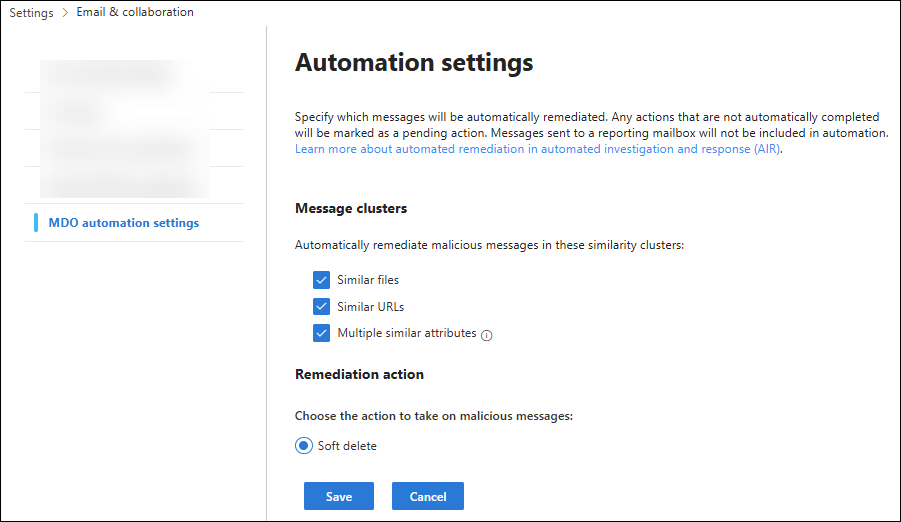
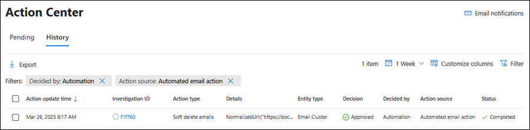
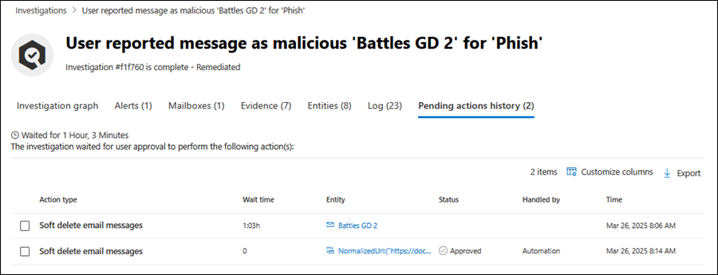
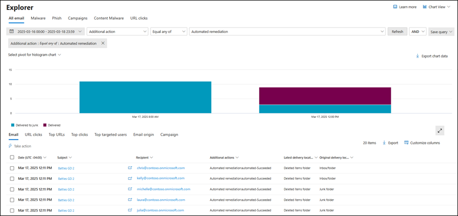
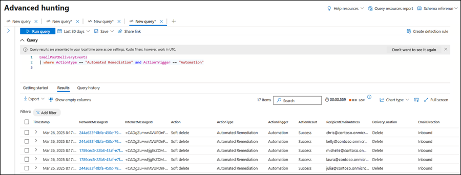
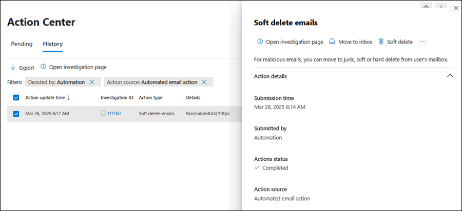

# AIR's Off-by-Default Auto-Remediation for MDO


Every AIR investigation builds a cluster around a malicious file or URL, then finds every other message across the tenant that shares it. That part happens regardless of configuration. What doesn't happen by default is remediation of that whole cluster in one motion, it sits in **Pending action**, waiting for a SOC analyst to review and approve it. 

On a quiet day that's fine. 

On a busy one, or across a queue with dozens of concurrent investigations, individual messages within a cluster can end up under-actioned, delayed, or missed entirely while an analyst works through what's in front of them. 

Automated remediation closes that gap. It's off by default, and in most environments I'd argue it shouldn't stay that way.

> !!! info "Licensing Requirement"
> Automated remediation is a feature of **automated investigation and response (AIR)**, which requires Microsoft Defender for Office 365 Plan 2. That's included in Microsoft 365 E5, Microsoft 365 E5 Security, or available as a standalone Plan 2 add-on. If your tenant is running Plan 1 only, you won't see the Automation settings page at all. Check your licensing before you go looking for a menu that isn't there.

---
## Why this exists

Microsoft frames the benefit plainly: automated remediation expedites remediation of more threats and **saves SecOps the time otherwise spent approving clusters that are, in most cases, an easy call**. 

That second point matters more than it sounds. A cluster built around a confirmed malicious file or URL isn't asking an analyst to make a judgement call, the judgement's already been made by AIR's investigation. What's left is a queue-clearing exercise, and queue-clearing exercises are exactly where true positives slip through: an analyst under time pressure triages the obvious ones and the rest sit pending, sometimes long enough that the threat has already had time to spread further than it needed to.

Automated remediation removes that manual bottleneck for the cluster types you choose to trust. The remediation action fires the moment AIR closes the investigation, no queue, no wait, no dependency on an analyst getting to it before the message gets opened somewhere else in the org.

There's a ceiling on how far this reaches: clusters larger than 10,000 messages don't auto-remediate regardless of configuration, and still land as **Pending action** for manual review. That's the one scenario where the queue-based model still applies, and it's a sensible one, a cluster that size warrants a second set of eyes before nine thousand mailboxes get touched at once.

## Configuration steps

The settings live in the Defender portal, not in Sentinel, and not in the Microsoft 365 Defender legacy automation rules. Head to:

**Settings** > **Email & collaboration** > **MDO automation settings**

Or jump straight there with [https://security.microsoft.com/securitysettings/mdoAutomationSettings](https://security.microsoft.com/securitysettings/mdoAutomationSettings)

You'll find two sections on that page: **Message clusters** and **Remediation action**. Tick the cluster types you want to auto-remediate, confirm the remediation action, and select **Save**. That's the entire configuration surface. No PowerShell cmdlet, no policy object to manage separately, just a checkbox page standing between you and a meaningfully smaller Pending action queue.



## The three cluster types: what each one catches

The **Message clusters** section is where the coverage decision gets made, and it's not all-or-nothing. Each type extends automated remediation to a different flavour of related message.

| Cluster type                    | What triggers it                                                                | What it catches                                                                            |
| ------------------------------- | ------------------------------------------------------------------------------- | ------------------------------------------------------------------------------------------ |
| **Similar files**               | AIR identifies a malicious file during investigation                            | Every other message across the tenant carrying that same file                              |
| **Similar URLs**                | AIR identifies a malicious URL during investigation                             | Every other message across the tenant carrying that same URL                               |
| **Multiple similar attributes** | Messages share sender or content attributes tied to a confirmed malicious email | Messages matching one of four attribute pairings that AIR uses to find likely-related mail |

The first two are the easiest sell: if a file or a URL has already been confirmed malicious, there's no ambiguity left in remediating every message that contains it. Leaving those in Pending only buys you risk, not accuracy.

The third is the widest net, and the one that does the most work in catching messages the other two would miss entirely. It's built from combinations of sender and content signals rather than a single confirmed-bad artefact: `BodyFingerprintBin1/SenderIp`, `BodyFingerprintBin1/P2SenderDomain`, `Subject/P2SenderDomain`, and `Subject/SenderIp`. 

This is exactly the mechanism that reaches campaigns spread across multiple slightly-varied messages, the ones that don't share a single file or link but clearly came from the same actor. Without this cluster type enabled, that whole category of related mail relies on an analyst spotting the pattern manually and actioning each match by hand.

## Remediation action: soft delete, and only soft delete

Right now there's a single option in the **Remediation action** section: **Soft delete**. Messages get moved to the Recoverable Items folder rather than being purged outright, which gives automated remediation a built-in safety margin, if a cluster ever gets caught that shouldn't have been, there's a recovery path rather than a permanent loss.

> !!! warn "Recoverability depends on retention, not on AIR"
> How long a soft-deleted message stays recoverable is governed by the deleted item retention setting on each mailbox, not by anything AIR controls. Confirm that window suits your organisation, and check it against any compliance obligations around retaining flagged malicious mail, before you lean on it as your safety net.

## How SOC teams operate with this in the portal

The shift for a SOC team isn't in how they investigate, it's in where they look for evidence of what already happened, since there's no approval action left to click for the cluster types you've enabled. A few places to know:

**Action Center.** Automatically remediated clusters land on the **History** tab, not Pending. Filter by **Decided by** = **Automation** to see exactly what fired without a human touching it. If something needs reversing, **Move to Inbox** or **Move to Junk** are available from the cluster details flyout on that same tab.



**AIR investigations.** Within an individual investigation, auto-remediated clusters show on the **Pending action history** tab with **Handled by** set to **Automation**. Same investigation view your analysts already use, just a different value in that column, and one less click required to get there.



**Threat Explorer.** Messages that were automatically remediated carry an **Additional action** value of **Automated remediation:automated**, useful for pulling exactly this population out when reporting on what the automation caught over a given period.



**Advanced hunting.** This is the one worth bookmarking for reporting and validation. Auto-remediated messages sit in `EmailPostDeliveryEvents` with both `ActionType` and `ActionTrigger` set to specific values, which makes it straightforward to build a running tally of what automation is catching that a manual queue might not have gotten to in time.

```kql title="Auto-remediated messages via AIR"
EmailPostDeliveryEvents
| where ActionType == "Automated Remediation"
| where ActionTrigger == "Automation"
| project Timestamp, NetworkMessageId, RecipientEmailAddress, ActionType, ActionTrigger
```



**Reverting an action.** If a cluster gets soft-deleted that shouldn't have been, the **Take action** wizard in Threat Explorer or Advanced hunting restores it, or use **Move to Inbox** from the Action center flyout described above. Recoverability still comes back to the mailbox retention setting either way, not to how the message was originally deleted.



## Worth sorting out before you enable it

None of this is a reason to hold off, it's what makes the rollout smooth rather than a surprise for the SOC team the following morning.

- **Confirm retention before day one.** Soft delete only protects you if the mailbox's deleted item retention window is long enough to matter, and if your compliance obligations for retaining flagged mail are satisfied by Recoverable Items. Check both before, not after, your first automated action fires.
	
- **Brief the team on where to look.** History instead of Pending, Advanced hunting instead of an approval click. The investigation quality doesn't change, but the workflow analysts use to review what happened does.
	
- **Watch the first few weeks through Advanced hunting.** The KQL above gives you a running view of exactly what's being caught. Use it to validate that automated remediation is catching what you expected it to, particularly for **Multiple similar attributes**, which has the widest reach of the three.
	
- **Remember the 10,000 message cap is a backstop, not a limitation on value.** Most real-world clusters sit well under that threshold, which is precisely the population this feature is built to clear without waiting on a human.


Off by default doesn't mean edge case. It means Microsoft is leaving the decision to you, and for well-understood, high-confidence threats, that decision is usually an easy one to make.