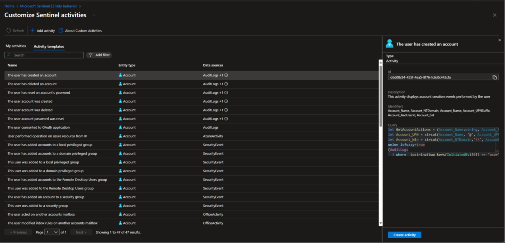

# KQL Made Less Scary: A Practical Starting Point Hidden in Plain Sight

**Kusto Query Language (KQL)** is the heartbeat of Microsoft Sentinel. For new Security Analysts, it can feel daunting to start writing queries from scratch.

**The good news is, you don’t have to.**

At first glance, KQL can look like alphabet soup mixed with maths homework. But once you start pulling it apart, you’ll see it’s less about memorising syntax and more about learning how to ask the right questions of your data. Microsoft Sentinel already provides a wealth of pre-built queries, and the community has shared countless more. By learning to reverse engineer these, you can accelerate your understanding of KQL while building practical skills for real-world security operations.

## Why KQL Matters for Security Analysts

KQL is more than just a query language, it is the lens through which you investigate threats, hunt for anomalies, and validate detections. Whether you are pivoting on an account, host, or IP address, KQL gives you the ability to ask precise questions of your data. For analysts entering the field, developing fluency in KQL is a career accelerator.

And here’s the secret: nobody is born fluent. Every seasoned analyst you meet has stared at a blank query window at some point, wondering where to start.

## A Hidden Gem in Sentinel: Activity Templates

One of the most overlooked (or maybe even undiscovered) learning resources in Sentinel is tucked away under:

**Microsoft Sentinel > Entity Behaviour > Customise Entity Page (Preview) > Activity Templates**

Here is why this section is so valuable:
	
- 47 Pre-Built Queries: Split across Account and Host entities
	
- Data Source Mapping: Each template clearly lists which data sources are required for the query to function. This alone is a learning opportunity, helping you understand which logs power which detections
	
- Entity Context: You will see whether the query is designed for Accounts or Hosts, giving you insight into how Sentinel ties telemetry back to entities
	
- Detailed Breakdown: Selecting a template reveals:
	
	- A description of the query’s purpose
		
	- The identifiers it uses (for example UPN, SID, Hostname)
		
	- The KQL query itself
		
	

This is a goldmine for junior analysts. Instead of starting with a blank query window, you can study working examples, understand their logic, and adapt them to your environment.

## Reverse Engineering as a Learning Method

> **💡 Pro Tip**  
> 
> Even after completing the Microsoft SC‑200 certification, I still find myself needing a refresher when it comes to KQL. If you are not writing queries every single day, it is perfectly normal to forget the finer points of an operator or syntax.  
>  
> My go‑to method is reverse engineering. By breaking apart existing queries, I can quickly re‑familiarise myself with the logic, remind myself of the operators in play, and reinforce the scenarios they are designed to address. Think of it as keeping your KQL muscle memory active.

So in the context of the Entity Behaviour KQL queries, when you open one of these templates, don’t just copy and paste. Instead:

1. **Read the Description** – Understand the scenario the query is designed to detect
	
2. **Trace the Data Sources** – Ask yourself: _Why does this query need this log source_
	
3. **Break Down the KQL** – Look at each operator (`join`, `summarise`, `extend`) and test them in isolation
	
4. **Modify and Experiment** – Change filters, add columns, or adjust time ranges to see how the output changes

This process builds both confidence and intuition. Over time, you will recognise common KQL patterns used across detections and hunting queries.

## Beyond Sentinel: Community and Resources

While Sentinel’s Activity Templates are a fantastic starting point, the learning does not stop there.

- **The Definitive Guide to KQL**: This Microsoft Press book is an excellent resource for structured learning. Even better, the official GitHub repository contains all the queries aligned to the book’s chapters, ready to run and adapt: [GitHub - KQLMSPress/definitive-guide-kql: Sample queries and data as part of the Microsoft Press book, The Definitive Guide to KQL](https://github.com/KQLMSPress/definitive-guide-kql)
	
- **GitHub Repositories**: Beyond the book, the security community has shared thousands of KQL queries across open repositories. These cover everything from hunting techniques to detection rules, and are invaluable for seeing how others approach real-world problems
	
- **Microsoft Learn**: For syntax and operator deep dives, [Microsoft Learn](https://learn.microsoft.com/azure/data-explorer/kusto/query/) remains the definitive reference
	

And here’s a tip: don’t just be a consumer of queries. Once you’ve adapted something and made it better, share it back. That’s how the community grows, and it’s also how you start building your own reputation as a contributor.

## Why This Matters for Your Career

The demand for Security Analysts with Microsoft Sentinel expertise is growing rapidly. Employers are not just looking for button-clickers, they want analysts who can think in KQL. By leveraging pre-existing queries as a learning foundation, you will:

- Build practical skills faster
	
- Understand how detections are constructed
	
- Gain confidence in modifying and creating your own queries
	
- Position yourself as a valuable contributor in SOC and threat hunting teams
	

---

If you are new to Microsoft Sentinel and KQL, don’t feel pressured to start from scratch. Use what is already available, such as Activity Templates, the official _Definitive Guide to KQL_ repository, and community contributions, to accelerate your learning. Reverse engineering queries is not just a shortcut, it is one of the most effective ways to understand how Sentinel works under the hood.

Remember, nobody becomes fluent in KQL overnight. It’s a journey of curiosity, trial and error, and the occasional copy-paste rescue. Stick with it, and you’ll find that KQL becomes less of a tool you use and more of a language you think in.