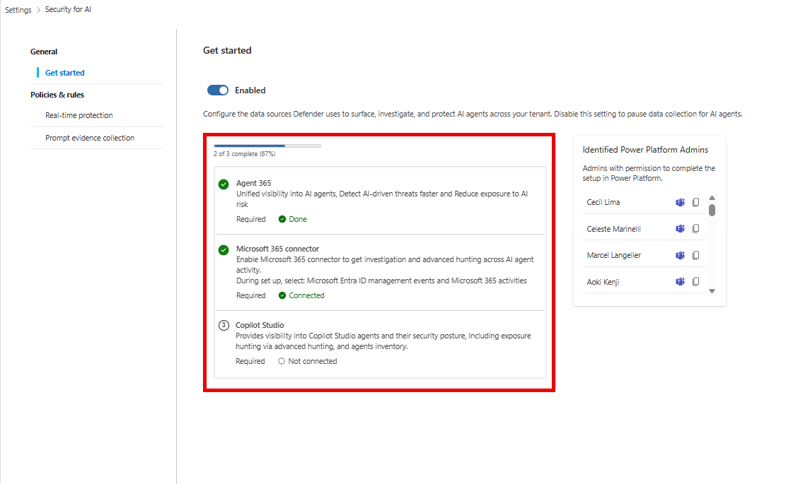
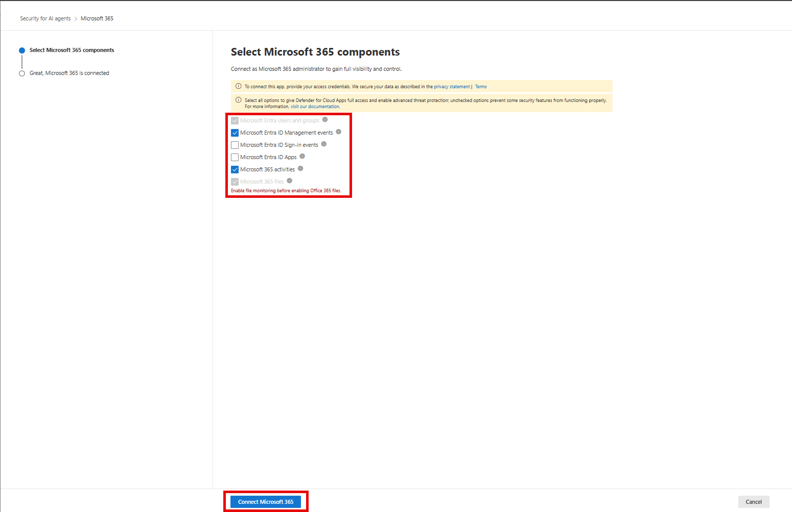
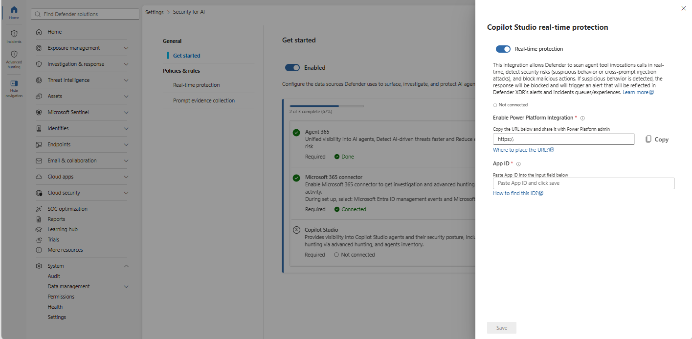
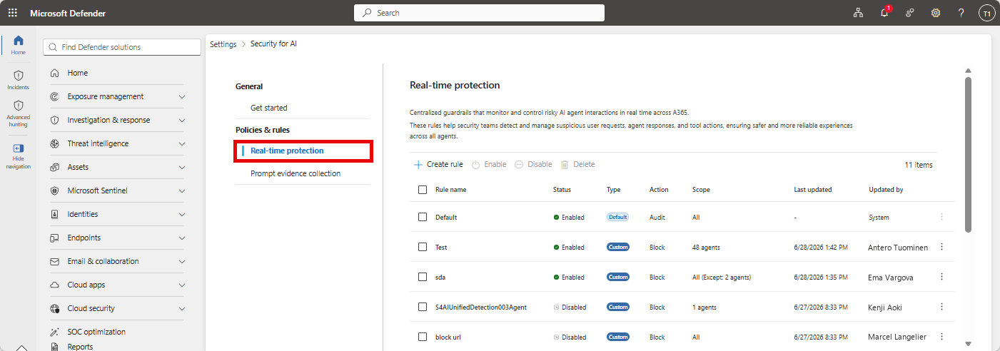

# Security for Microsoft Agent 365 with Defender


Every SOC I talk to is asking some version of the same question right now: *"we've got agents running in the tenant, who's watching them?"* Until this year, the honest answer was "nobody, really." Agents built in Copilot Studio, declarative agents from Copilot Agent Builder, and whatever your business units spun up in Foundry all lived in a visibility gap between identity, data, and endpoint security. Microsoft Agent 365 is the control plane meant to close that gap, and Defender XDR is now the enforcement and investigation layer sitting on top of it.

This article breaks down what shipped, what it actually does day to day, and what to check before you tell your leadership team "we have this covered."

---

## The short version

- Microsoft Agent 365 became generally available on 1 May 2026, licensed per user, with Microsoft E5 as the recommended prerequisite.
	
- Defender's security integration with Agent 365 rolled out as a GA capability in July, but not everything under the hood is GA. Detection and investigation for AI agents is still explicitly flagged **Preview** in Microsoft Learn, and so is part of the overarching "Protect AI agents" capability set. Treat this as a GA rollout with Preview components inside it, not a fully mature, blanket-GA feature.
	
- Onboarding is a three-step exercise: enable data collection (automatic once you're on Agent 365), connect the Microsoft 365 app connector, and connect Copilot Studio for real-time protection.
	
- Coverage comes in two tiers. All Agent 365-managed agents get a baseline of discovery, posture assessment, near-real-time detection, and investigation. Agents built on Copilot Studio and Foundry get extended real-time protection and detection depth on top of that baseline.
	
- If you skip the Microsoft 365 connector, Copilot Studio real-time protection still blocks malicious activity at runtime, but you get no alerts and no incidents in the Defender portal for it. That's worth repeating to whoever signs off your rollout plan.
	

---

## Why this exists: the agent threat surface

Traditional app security assumes a fairly static thing to defend: known endpoints, known identities, known data flows. Agents break that assumption. They reason over natural language input, decide which tools to call, and take autonomous action across connected systems, which means the attack surface now includes the agent's decision-making process itself, not just its infrastructure.

Microsoft groups the risk into four buckets that are worth keeping in your back pocket for any agent security conversation:

- **Model and supply-chain risk** - a compromised dependency anywhere in the model chain can turn every downstream agent into an attack vector.
	
- **Misconfiguration and over-privilege** - agents with excessive permissions or poorly configured tool authentication open the door to unauthorised access.
	
- **Runtime abuse** - malicious inputs or unexpected reasoning paths can push an agent into performing unsafe actions during execution.
	
- **Prompt- and content-based attacks** - this is where cross-prompt injection attacks (XPIA) live, including zero-click attacks hidden in emails or retrieved content that manipulate agent behaviour without any user interaction.
	

Addressing that requires discovery, posture management, detection, and runtime protection working together rather than as separate bolt-ons. That's the pitch for this integration.

---

## Architecture: how Defender plugs into Agent 365

Microsoft Agent 365 is the control plane. It's where agents get registered, governed, and where identity and lifecycle policy live. Defender doesn't replace that, it consumes it. Once you enable your Agent 365 license, Defender integrates automatically and layers security on top at two distinct levels.

| Tier                                    | What you get                                                                                       | Applies to                                                                                                                                                           |
| --------------------------------------- | -------------------------------------------------------------------------------------------------- | -------------------------------------------------------------------------------------------------------------------------------------------------------------------- |
| **Core (all Agent 365-managed agents)** | Discovery, risk-based prioritisation, near-real-time detection, investigation via Advanced Hunting | Every agent onboarded to Agent 365, including local agents on supported endpoints                                                                                    |
| **Extended (supported platforms)**      | Full real-time protection and deeper near-real-time detection                                      | Agents built with Copilot Studio (full real-time protection) and Microsoft Foundry (extended near-real-time detection). Availability varies by platform and scenario |

The distinction matters operationally. If someone asks "are our Copilot Studio agents protected," the honest answer depends on whether Copilot Studio is actually connected in the Security for AI settings, not just whether the agent exists in the Agent 365 registry.

---

## Onboarding: what actually happens when you flip this on

The onboarding flow lives at **Settings > Security for AI > Get started** in the Defender portal, and it's genuinely a checklist experience rather than a single toggle. Three things need to happen.



### 1. Data collection (automatic, but check it)

When you onboard to Agent 365, Defender automatically enables data collection for AI agent discovery, posture assessment, and threat detection. The **Enable** toggle defaults to on. Worth a five-minute check on day one rather than assuming it stuck.

### 2. Connect the Microsoft 365 app connector

This is the connector that unlocks investigation and Advanced Hunting for agent activity. In the **Select Microsoft 365 components** step, you need at minimum:

- **Microsoft Entra ID Management events** - audits admin activity in Entra ID.
	
- **Microsoft 365 activities** - audits user activity across Microsoft 365 apps.
	  



**Microsoft Entra Users and groups** is selected by default as a prerequisite for all monitoring capabilities.


> !!! warning "Skip this connector and you fly blind on Copilot Studio alerts"
> Real-time protection for Copilot Studio agents will still block suspicious activity at runtime even without this connector connected. But the alerts and incidents for those blocks won't show up anywhere in the Defender portal. Operationally, that means blocking without visibility, which is a hard sell to anyone doing incident response or reporting up the chain.

### 3. Connect Copilot Studio for real-time protection

This is the one that needs a Power Platform administrator in the room, since it's a cross-team handshake:

1. In Defender, toggle **Real-time protection** on for Copilot Studio.
	
2. Copy the integration URL and hand it to your Power Platform admin.
	
3. They complete onboarding on the Power Platform side using [Enable external threat detection and protection for Copilot Studio custom agents](https://learn.microsoft.com/en-us/microsoft-copilot-studio/external-security-provider#step-2-configure-the-threat-detection-system), making sure the App ID matches the Microsoft Entra ID application configured in step 1 of that guide.
	
4. Get the App ID back from them, paste it into Defender, save.
	



A validation error on save after a recent App ID change usually just means propagation lag, give it a minute and retry before assuming it's broken.

---

## What you actually get once it's connected

### Discovery and inventory

The **AI Agents** page under **Assets** gives you a centralised inventory covering Copilot Studio, Foundry, Microsoft 365, supported non-Microsoft platforms, and local agents discovered on endpoints. Each agent entry surfaces risk level, active risk indicators, recommendations, and active alerts, with drill-down into configuration, identity and authentication details, tools, and MCP servers.

For querying this programmatically, the `AgentsInfo` table in Advanced Hunting is your inventory source of truth. It replaced the older `AIAgentsInfo` table as part of the Agent 365 transition, so if you've got saved queries from before this rollout, they need updating.

```kql title="Latest snapshot of all active agents"
AgentsInfo
| summarize arg_max(Timestamp, *) by AgentId
| where LifecycleStatus != "Deleted"
```

`AgentsInfo` stores multiple historical snapshots per agent, so `arg_max(Timestamp, *)` is doing real work here, not just tidying output.

### Security posture management

Advanced Hunting ships with prebuilt queries under the **AI Agents** query category to surface misconfigurations, risky settings, and excessive permissions across all Agent 365-managed agents. This is the posture layer, separate from the risk-level calculation, and it's where I'd expect most of the early "quick win" remediation work to land for a SOC standing this up.

### Near-real-time detection

This is the Preview piece flagged above. Defender analyses Agent 365 observability telemetry, tool usage, and execution patterns to flag jailbreak attempts, XPIA attempts, malicious content propagation, secrets and credentials leakage, evasion techniques, and suspicious user access. Detections surface as alerts in the standard Defender portal workflow, triage, incident correlation, the lot.

Two things worth knowing:

- Copilot Studio, Foundry, and Microsoft 365 Copilot Agent Builder agents send observability data by default. Agents on other platforms need the Agent 365 SDK wired up manually.
	
- Near-real-time alerts only surface in **audit mode**. Once a blocking rule covers an agent, near-real-time alerts stop generating for that agent, because the action gets blocked instead.
	

### Real-time protection

This is the runtime enforcement layer, and it's genuinely GA. Coverage depends on agent type:

- **Agent 365 tool invocations** are evaluated through Work IQ MCP before they run. Agents relying on tools that aren't onboarded to Agent 365 or don't integrate with Work IQ MCP aren't covered here, worth checking against your actual tool inventory rather than assuming blanket coverage.
	
- **Copilot Studio agents** are covered independently of Work IQ MCP, contingent on the Copilot Studio connector being live.
	
- **Local agents** are covered through Defender for Endpoint's runtime protection, which needs to be running in active mode and is onboarded separately from cloud agents entirely.
	



Rules live under **Settings > Security for AI > Policies & rules > Real-time protection**. There's a built-in **Default** rule that audits everything without blocking, giving you a baseline view before you start enforcing. Custom rules let you scope blocking to specific agents and detection types (secret exfiltration, malicious content propagation, evasion techniques, unsafe email domain, and others), with the ability to exclude specific agents from a rule.

Every audit or block event lands in the `BehaviorInfo` table as a queryable behaviour, including what happened, why it was flagged, and which agent, user, and tool were involved. That table is your hunting and custom-detection substrate for this feature.


> !!! warning "Copilot Studio behaviour recording gap"
> Block events from Microsoft Prompt Shields for Foundry and Microsoft 365 Copilot Agent Builder get recorded as behaviours in `BehaviorInfo`. Copilot Studio doesn't support this yet. If you're building hunting queries or automation off `BehaviorInfo` and expecting full parity across platforms, you'll come up short on Copilot Studio specifically until this closes.

### Investigation and hunting

Alerts correlate into incidents the same way any other Defender signal does, giving you the incident graph, entity relationships, and blast radius view. For hunting, six Advanced Hunting tables matter here:

| Table              | What it holds                                                                     |
| ------------------ | --------------------------------------------------------------------------------- |
| `AlertInfo`        | Alert metadata, including near-real-time detection alerts                         |
| `CloudAppEvents`   | Agent 365 observability data: agent actions, tool invocations, data access events |
| `AgentsInfo`       | Agent inventory and configuration: identity, platform, ownership, metadata        |
| `AlertEvidence`    | Entities and artifacts tied to alerts (agents, users, tools, URLs, resources)     |
| `BehaviorInfo`     | Real-time protection audit and block events                                       |
| `BehaviorEntities` | Entities tied to those behaviours                                                 |

Correlating `BehaviorInfo` against `AlertInfo` is the practical move for tracing a blocked action back through to any related alert and building out the full story for an incident.

---

## Prompt evidence collection

By default, Defender captures prompt snippets from suspicious interactions and attaches them as alert evidence, redacting sensitive data and secrets automatically. It's on by default, controllable at **Settings > Security for AI > Prompt evidence collection**.

Worth a conversation with your privacy or legal team before you leave this on by default in a production tenant, since customer conversations captured as evidence can still be sensitive even with redaction applied. This is exactly the kind of control that should show up in your data governance documentation, not just get left on the default.

---

## Licensing and prerequisites reality check

Before anyone gets excited about turning this on tenant-wide:

- You need at least one user licensed with a qualifying Microsoft Agent 365 license, and Agent 365 itself works best with Microsoft E5 as a prerequisite, not a hard requirement, but expect gaps without it.
	
- Security Administrator role or higher in Microsoft Entra ID for the Defender-side setup.
	
- Defender for Endpoint must run in **active mode** for local agent discovery and runtime protection, and local agents are onboarded through a completely separate path to cloud agents.
	
- Copilot Studio real-time protection needs a Power Platform administrator's involvement, it isn't a Defender-admin-only setup.
	  

None of this is exotic, but it's enough moving parts that "we enabled Security for AI" and "we have full coverage" are two different statements. Worth being precise about which one is true in your environment before it goes in a report.

---

## Data handling and privacy: the conversation I'm not seeing enough of

Every walkthrough of this feature focuses on discovery, detection, and blocking. Almost nobody's talking about where the data actually lives, and for anyone operating in Australia, that's a gap worth closing before you onboard a tenant, not after. Microsoft has published the specifics in [Data handling and privacy in Microsoft Defender as part of Agent 365](https://learn.microsoft.com/en-us/defender-xdr/security-for-ai/privacy-defender-agent-365), and a few points deserve more airtime than they're getting.

### What's actually being collected

As part of these AI agent security capabilities, Defender collects:

- **Observability trace payloads** submitted during agent execution, which can include session inputs and outputs depending on how the developer instrumented the agent.
	
- **Agent configuration attributes** pulled from the Agent 365 registry, and from Defender for Endpoint for local agents.
	
- **User identifiers**, such as Microsoft Entra user IDs tied to agent sessions.
	
- **Pseudonymised identifiers** used for cross-tenant analytics and trend detection.
	
- **Tenant, subscription, and agent identifiers** used to route and attribute the data correctly.
	

Customers control what ends up in trace payloads through their own agent instrumentation, and admins can toggle these capabilities independently of the rest of Agent 365 from the Defender settings page.

### Data residency: don't assume this follows your existing Defender residency

This is the part I'd flag hardest for an Australian audience. This capability runs on a two-region model, not a full global residency map:

|Tenant provisioning location|Data storage location|
|---|---|
|European Union or United Kingdom|European Union|
|All other regions, including Australia|United States|

> !!! warning "This is a separate residency commitment to your core Defender data"
> Australia doesn't get its own region under this model. A tenant provisioned in Australia has its Agent 365 security data (trace payloads, session data, agent inventory) stored in the United States, by design. 
> 
> This is a distinct commitment from the data residency options available for other Defender and Microsoft 365 workloads, and the two shouldn't be conflated when you're answering a data sovereignty question from a customer, a board, or an APRA-regulated entity. 
> 
> If residency is a hard requirement in your environment, this is a "check before you onboard" item, not a "raise it after go-live" item, because the tenant's storage location is locked in at creation and can't be moved afterwards.

For MSSPs provisioning or advising on tenants across the ANZ region specifically, this is worth a standing line item in any AI agent security onboarding checklist.

### Retention and deletion

- Observability and session data (trace payloads, inputs and outputs, user identifiers) is retained for up to 30 days, and is what you're actually querying in the Defender portal during that window.
	
- Agent inventory data, and data shared onward with Defender XDR, is retained for up to 180 days.
	
- All of this is deleted within 30 days of contract termination or expiration.
	

### How Microsoft uses it, and who else sees it

Microsoft uses cross-tenant patterns and threat intelligence to improve detection and prevention, under the standard [Microsoft Privacy Statement](https://privacy.microsoft.com/privacystatement) commitments. Importantly, customer data isn't used to train generative AI foundation models without the customer's documented instruction, consistent with the [Microsoft Product Terms](https://www.microsoft.com/licensing/terms/).

Within Microsoft's own ecosystem, this data is shared with other licensed products the customer holds, including Defender XDR itself, Defender for Endpoint, Security Exposure Management, and Entra ID Protection. If you're a Government Community Cloud (GCC) customer, be aware that data sharing between government and commercial cloud boundaries can occur depending on where the service is offered, which is its own conversation worth having with your compliance team rather than assuming standard commercial boundaries apply.

None of this should stop anyone from adopting the feature. It should just be part of the same due diligence you'd apply to any new data-collecting security control, and right now it isn't getting that level of scrutiny in what I'm seeing published.

---

## Where this leaves you

The core discovery-to-detection-to-response loop is here and it's a genuine gap-filler, but the maturity is uneven by design. Discovery and posture are solid. Real-time blocking for Agent 365 tool invocations and Copilot Studio is GA and functional. Detection and investigation is doing real work but is still Preview, and platform coverage inside that (Copilot Studio's `BehaviorInfo` gap, for instance) isn't uniform yet.

For a SOC standing this up now, the practical sequencing is: get the Microsoft 365 connector and Copilot Studio connected first so you're not blocking blind, run the default audit rule long enough to understand your actual agent behaviour baseline, then move to custom blocking rules once you trust the signal. Treat anything still under Preview as exactly that, useful, but not yet something to write an SLA against.