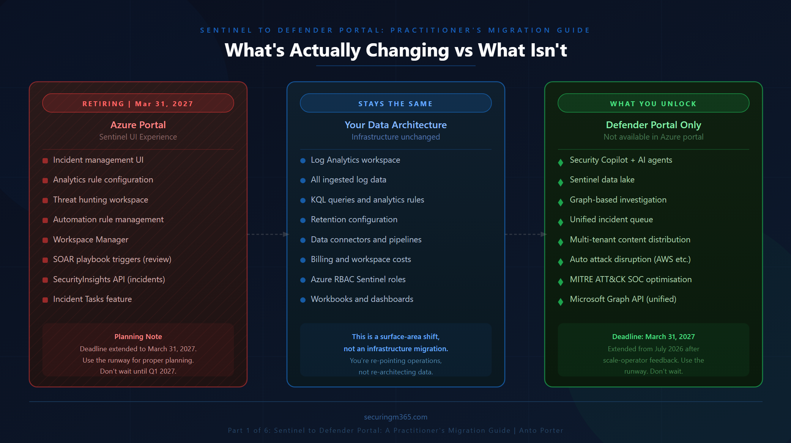

# Series: Sentinel to Defender Portal - What's Actually Changing (And What Isn't)

> Part 1 of 6

I know you're busy, so here is the TLDR:

---

Let me guess. You saw the announcement, felt a brief flash of "do I need to panic about this," and then went back to your actual work because you didn't have a clear answer either way.

That flash of uncertainty is the problem. 

Not because the migration is alarming, but because Microsoft's communication has consistently told us *what* is happening, without cleanly answering the question that actually matters in a production environment.

> *What is architecturally changing versus what is just appearing on a different screen?*

That distinction matters a lot, because the answer is different depending on who you are. 

If you're running a single-tenant Sentinel workspace with no custom automation and no MSSP obligations, the honest answer is: *this is mostly a UI shift, and your weekend is safe.*

If you're running Sentinel at scale across multiple customer tenants, with Workspace Manager, custom playbooks, GDAP-delegated access, or any meaningful SOAR investment, then "it's just a portal change" is genuinely bad advice. The migration has real operational implications for you, and they're not well-documented anywhere in a form that's actually usable.

This series is written for the second group. And this first post exists to establish a shared mental model before any of the how-to detail lands in parts two through six.

## First: The Deadline Just Changed

In January 2026, Microsoft extended the Azure portal sunset date for Sentinel from July 1, 2026 to **March 31, 2027**. The stated reason was consistent feedback from customers and partners managing Sentinel at scale, who needed additional time and capabilities in place to ensure a seamless migration.

Worth pausing on that. Microsoft extending a retirement deadline is not a routine event. It's a public acknowledgement that real operational blockers exist in complex environments. If you're an MSSP or an enterprise architect managing Sentinel across tenants, you're exactly the kind of operator this extension was granted because of.

The extra time is runway to migrate properly, not permission to ignore this until Q1 2027. The Defender portal is where Sentinel innovation is happening now. Security Copilot integration, the Sentinel data lake, the graph-based investigation experience, automatic attack disruption beyond Microsoft's own products... none of these are available in the Azure portal experience. Every month you stay in Azure-only is a month you're operating without those capabilities.

Treat the extension as breathing room for proper planning, not a snooze button.

## What Is Actually Retiring

This is the most important thing to get right before anything else, because the most common misunderstanding in the community right now is conflating the retirement of the Azure portal UI with some kind of data migration or infrastructure replacement. They are not the same thing.

Here is what is retiring: **the experience of managing Sentinel through portal.azure.com.** 

That is it.

Here is what is not changing: your Log Analytics workspace. The underlying data store, your KQL analytics rules, your ingestion pipelines, your retention configuration, your billing, your workspace architecture. None of that moves. None of that is being replaced. The Defender XDR data lake is a separate concept; it's Microsoft-managed storage for the Defender correlation layer, not a replacement for your Log Analytics workspace, and you don't get direct access to it as a customer except through Advanced Hunting and supported APIs.

The migration is a surface-area shift, not an infrastructure migration. You're moving the operations layer:

- where you manage incidents, 
- configure analytics rules, 
- run hunts, and 
- trigger automation

from one portal to another. **The data stays where it is.**

This distinction matters practically because it affects how you scope your migration effort. You're not re-architecting your data. You're re-pointing your operational workflows.

## What Is Genuinely Different in the Defender Portal

Now the honest part in both directions. Because there are real improvements, and there are real changes to how things work that some environments will feel as losses of control, at least initially.

**What gets better**

The unified incident queue is the headline, and for once the vendor story matches the operational reality. Before this, if you were running Defender for Endpoint and Sentinel side by side, you were doing your incident triage in two places. An attacker who moved from an endpoint compromise into an identity attack and then into lateral movement across cloud workloads could generate alerts that ended up in separate incidents across separate portals, because the signals were processed by different correlation engines with no shared context.

The Defender correlation engine addresses this by processing all signals together and grouping related alerts into a single incident based on shared entities, attack patterns, and timing. Analysts spend less time as traffic cops across multiple queues and more time investigating actual attack chains.

The other material improvement is that multi-tenant content distribution is now available from the Defender multitenant portal. As of February 2026, you can replicate analytics rules, automation rules, workbooks, and alert tuning rules across tenants from a central management point, with local execution in each target tenant. For MSSPs, this is a significant operational improvement over the Workspace Manager model. More on this in Part 5.

**What changes operationally**

The incident correlation engine is the Defender XDR engine now, not Sentinel's. This means incident grouping logic is no longer something you configure in the same way. The engine cannot be turned off. Some creative SOC teams are already working out how to guide its behaviour, routing test incidents separately to prevent unwanted merges, for example, but if your existing workflows depend on precise manual control of how alerts map to incidents, this is a real adjustment.

Incident Tasks and manually created incidents don't carry over. If your SOC has built analyst workflows around Sentinel's incident task functionality, those workflows need to be rebuilt in the Defender portal's investigation model.

Automation rules have changed in a subtle but important way. After onboarding, incident creation happens via the Defender XDR engine, which means the incident creation rules you previously managed in Sentinel must be disabled to avoid conflicts. Your automation rules will also need to be reviewed for trigger and condition changes introduced by the unified experience. Alert-triggered automation for playbooks tied to alerts that don't create incidents is especially worth auditing before migration.

There's also an API consideration that's easy to miss. The unified experience is built on the Microsoft Graph REST API, not the legacy Microsoft Sentinel SecurityInsights API. If you have automation, integrations, or tooling that calls the Sentinel API for incident management, those will need to be updated to the Graph API. The Sentinel API still works for managing Sentinel-specific resources like analytics rules and automation rules, but for unified incidents and alerts, Graph is the recommended path going forward.

## What You Unlock by Moving

I've spent most of this post on complexity and caveats, deliberately, because the community is already well-served by promotional content about the benefits. But it would be incomplete to not name what you actually gain by migrating, because for most environments the trade is a good one once you've done the work properly.

Security Copilot is only available in the Defender portal. The Sentinel data lake, the graph-based investigation layer, automatic attack disruption across third-party sources like AWS and Proofpoint, the enhanced SOC optimisation recommendations mapped to MITRE ATT&CK... none of these exist in the Azure portal experience. The Defender portal is where Sentinel's product roadmap lives. The Azure portal experience is in maintenance mode.

The February 2026 Sentinel update is a good example of where this is heading. Multi-tenant content distribution, partner-built Security Copilot agents deployable from the Microsoft Security Store, enhanced UEBA with prebuilt queries ready to deploy from the content hub. All of this is Defender portal only. Each month the capability gap between the two experiences widens.

The organisations that migrate with intention and do the RBAC, automation, and connector work properly will be operating a meaningfully more capable security operations platform by the time the March 2027 deadline arrives. The ones who wait will be scrambling through the same work under deadline pressure.

## How to Think About Your Timeline

The March 2027 deadline gives you approximately 12 months of actual planning and execution runway from now. That sounds comfortable until you account for the fact that any real Sentinel environment has multiple moving pieces, and some of them have external dependencies.

The GDAP story for MSSPs is still being completed by Microsoft. Multi-workspace support within a single tenant is still maturing. The SOAR migration path for complex automation environments needs to be mapped against your specific playbook inventory. These aren't reasons to delay starting, they're reasons to start scoping now so you know exactly which items are blocked on Microsoft and which are in your own hands.

A reasonable approach for most environments: spend the next four to six weeks on the pre-migration inventory that becomes Part 2 of this series. Understand what you have before you decide what to move and when. The organisations I've seen struggle with migrations at scale are almost always the ones who underestimated the inventory phase.

> *You don't get to have a migration plan until you know exactly what you're migrating.*

---

The rest of this series will take you through the inventory and assessment framework, the RBAC transition in detail, what happens to your automation and playbooks, the MSSP-specific path, and finally what life looks like after the migration is done.

If anything in this post surfaces questions about your specific environment, the Microsoft Sentinel Tech Community discussion space is active and worth engaging with. I'll be posting a companion thread there with this series, and I'm genuinely interested in what edge cases people are running into in complex environments.
