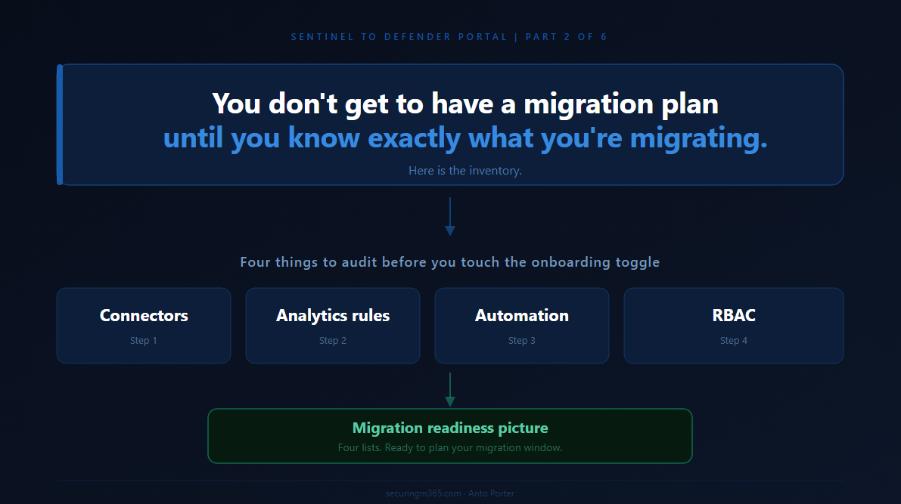

# Series: Sentinel to Defender Portal - Before You Touch Anything

> Part 2 of 6

You all seemed to like Part 1's TLDR, so here it is for Part 2:

---

There is a particular kind of pain that comes from starting a migration before you understand what you are actually migrating.

I have seen it play out the same way every time. Someone reads the announcement, decides the deadline is real, and kicks off the onboarding process with the best of intentions. Three weeks later they are untangling duplicate incident creation, tracking down playbooks that silently stopped firing, and explaining to the team why automation rules that keyed off incident titles are now behaving unexpectedly.

None of that is inevitable. It is what happens when you skip the inventory phase.

Part 1 of this series established the core mental model: the Azure portal UI is retiring on March 31, 2027, your underlying data architecture is not changing, and the deadline exists because this migration has genuine complexity for environments running at scale. Part 2 is where the practical work starts. Before you touch the onboarding toggle, before you schedule the migration window, before you brief your team on what is changing, you need to know exactly what you have.

This post gives you a decision framework for working through that inventory. The framing throughout is forward-looking: what does the Unified portal in Defender XDR actually look like when you land there, and what in your current environment do you need to understand, adjust, or remediate to work well within it?

The output of this process is not a list of problems. It is a migration readiness picture: which parts of your environment will move cleanly, which parts need attention before you onboard, and which parts have dependencies outside your control.

## Start With the Right Question

Most migration inventories start with "what do we have?" That is the wrong starting point. The right starting point is "what will change automatically when I connect my workspace?"

The Unified portal in Defender XDR is a genuinely different operational surface. Several things happen automatically the moment you complete the onboarding step, and your inventory should focus on understanding those automatic changes and whether your environment is ready for them.

There are four areas where the Unified portal introduces meaningful change, and your inventory should be structured around them:

What the Defender XDR connector automatically enables on connection, and what that means for incident creation rules currently running in your environment. How analytics rules interact with the Defender XDR correlation engine, which replaces Fusion and takes over incident naming. How automation rules and playbooks need to be positioned for the Unified portal's incident creation model. How the layered RBAC model works in the Unified portal and where your current role assignments need to be supplemented.

Work through each one in order. Your connector state affects your analytics rules. Your analytics rules determine what your automation fires on. Your RBAC model determines who can operate across it all.

---

## Step One: Connector Audit

The single most important thing to know before you onboard is what happens automatically at the moment of connection.

[Microsoft's documentation on the Defender XDR connector](https://learn.microsoft.com/en-us/azure/sentinel/connect-microsoft-365-defender) is explicit: the Defender XDR connector is automatically enabled when you onboard Microsoft Sentinel to the Defender portal. The manual configuration steps are not required if you have already onboarded. This means the connector is not a pre-migration decision. It is an automatic consequence of onboarding.

What you do need to decide before you onboard is how to handle what the connector automatically triggers. [Microsoft's documentation on deploying for unified security operations](https://learn.microsoft.com/en-us/unified-secops/overview-deploy) is direct on this: after you connect Microsoft Sentinel to Microsoft Defender, a bi-directional sync between Microsoft Defender XDR incidents and Microsoft Sentinel is automatically established. To avoid creating duplicate incidents for the same alerts, Microsoft recommends that you turn off all Microsoft incident creation rules for Microsoft Defender XDR-integrated products, including Defender for Endpoint, Defender for Identity, Defender for Office 365, Defender for Cloud Apps, and Microsoft Entra ID Protection.

The onboarding wizard will prompt you to disable those rules during the connection process. The problem is that by the time you are sitting in the wizard, you are reacting rather than prepared. Teams that have not audited their incident creation rules in advance tend to click through that prompt without fully understanding the scope of what they are disabling, or worse, skip it and discover the duplicate incident problem in their queue the following morning. The inventory work here is not about the act of disabling the rules. It is about knowing exactly which rules are active, why they exist, and whether anything downstream depends on them, before the wizard asks the question.

[The transition documentation](https://learn.microsoft.com/en-us/azure/sentinel/move-to-defender) adds important context on what this looks like from the data layer: when Microsoft Sentinel is integrated with Microsoft Defender, the fundamental architecture of data collection and telemetry flow remains intact. Existing connectors continue operating without interruption. From a Log Analytics perspective, the integration introduces no change to the underlying ingestion pipeline or data schema. Alerts related to Defender products are streamed directly from the Microsoft Defender XDR connector to ensure consistency.

So the connectors themselves do not break. The risk is duplicate incident creation from having both the XDR connector's bi-directional sync active and individual Microsoft incident creation rules still enabled. Those incident creation rules tend to be set-and-forget from early Sentinel deployments. Nobody remembers they exist until the XDR connector spins up and the incident queue doubles overnight.

**The pre-migration decision for connectors:**

Review each Microsoft security product connector currently active in your workspace and identify which ones have Microsoft incident creation rules enabled. Defender for Endpoint, Defender for Identity, Defender for Office 365, Defender for Cloud Apps, and Microsoft Entra ID Protection are the specific products Microsoft calls out. Document these before onboarding so you arrive at the wizard already knowing the answer, not forming a view under pressure.

For non-Defender connectors, Syslog, CEF, Windows Security Events, Azure Activity, and third-party sources, these ingest directly into your Log Analytics workspace and are unaffected by the portal change. Document them for completeness but they are not your migration risk.

One additional item worth flagging in your inventory: [Microsoft's data connectors documentation](https://learn.microsoft.com/en-us/azure/sentinel/connect-data-sources) confirms that as per the 2024 announcement, after September 14, 2026, the legacy HTTP Data Collector API will no longer be supported. If you have custom data ingestion built against that API, that is a separate workstream that needs scoping now, independent of the portal migration.

> Document your connector audit as two lists: Microsoft incident creation rules to disable as part of onboarding, and custom ingestion flagged for the September 2026 API retirement.

## Step Two: Analytics Rule Review

In the Unified portal, your analytics rules continue to run. [Microsoft's transition documentation](https://learn.microsoft.com/en-us/azure/sentinel/move-to-defender) confirms that most functionalities of analytics rules remain the same in the Defender portal, including creation, updating, and management through the wizard, repositories, and the Microsoft Sentinel API.

What changes is what happens above them, specifically around incident creation and incident naming.

[Microsoft's documentation on the Defender XDR integration](https://learn.microsoft.com/en-us/azure/sentinel/microsoft-365-defender-sentinel-integration) is explicit on the naming point: with the Defender XDR connector enabled, you can no longer predetermine the titles of incidents. The Defender XDR correlation engine presides over incident creation and automatically names the incidents it creates. This change is liable to affect any automation rules you created that use the incident name as a condition. To avoid this pitfall, use criteria other than the incident name as conditions for triggering automation rules. Microsoft recommends using tags.

This is worth pausing on because it is one of the failure modes that surfaces most quietly. An automation rule built around a condition like "if incident title contains Suspicious sign-in, then enrich and notify" does not throw an error after onboarding. It just stops matching. The incidents are still there, the automation is still enabled, and everything looks fine until someone notices that a class of enrichment or notification has silently stopped running. This pattern appears in more production environments than most teams would like to admit, precisely because the incidents coming from the Unified portal carry XDR-assigned names that bear no resemblance to what was expected.

The second change is around the Fusion analytics rule. The alert correlation functionality managed by the Fusion analytics rule in the Azure portal is handled by the Defender XDR engine in the Defender portal, which consolidates all signals in one place. If you have analytics rules whose incident grouping logic was tuned against Sentinel's Fusion behaviour, those rules may produce different incident patterns after onboarding.

There is also a specific table consideration worth documenting during your review. [The transition documentation](https://learn.microsoft.com/en-us/azure/sentinel/move-to-defender) notes that the IdentityInfo table becomes a native Defender table in the Unified portal that does not support table-level RBAC. If your organisation uses table-level RBAC to restrict access to the IdentityInfo table in the Azure portal, this access control will no longer be enforced after onboarding. Any analytics rules or Advanced Hunting queries that run in Microsoft Defender, such as custom detections, should be reviewed and updated. Microsoft Sentinel analytics rules and workbooks continue to use the IdentityInfo table in the Log Analytics workspace and are not affected.

**Your analytics rule review should work through three questions for each rule:**

Does the rule rely on incident naming or title matching downstream? Flag for remediation before onboarding. Microsoft's recommended replacement is to use tags as automation conditions rather than incident name.

Does the rule have incident grouping logic tuned against Sentinel's Fusion correlation behaviour? Flag for post-onboarding validation, understanding that the Defender XDR correlation engine may produce different grouping outcomes.

Does the rule query the IdentityInfo table and interact with table-level RBAC restrictions? Review against the table schema changes before onboarding.

A practical approach at scale: filter your analytics rules by data source. Rules querying non-Defender tables are low risk and can be batch-confirmed. Rules querying Defender product tables or using IdentityInfo with table-level RBAC need individual review.

## Step Three: Automation and Playbook Inventory

Automation is where the Unified portal introduces the clearest structural change, and where problems most commonly surface days or weeks after onboarding rather than immediately.

The core change is stated explicitly in [Microsoft's automation rules documentation](https://learn.microsoft.com/en-us/azure/sentinel/automate-incident-handling-with-automation-rules): in this scenario, all incident creation happens in the Defender portal, and therefore the incident creation rules in Microsoft Sentinel must be disabled.

The same documentation notes the main reason to use alert-triggered automation in the Unified portal context: for responding to alerts generated by analytics rules that do not create incidents, that is, where incident creation is disabled in the analytics rule settings. This is especially relevant when your workspace is onboarded to the Defender portal.

There is also an important API change. [The transition documentation](https://learn.microsoft.com/en-us/azure/sentinel/move-to-defender) confirms that the Unified portal supports API calls based on the Microsoft Graph REST API v1.0 for automation related to alerts, incidents, advanced hunting, and more. If you are using the Microsoft Sentinel SecurityInsights API to interact with incidents, you may need to update your automation conditions and trigger criteria due to changes in the response body. The Microsoft Sentinel API continues to support actions against Sentinel resources such as analytics rules and automation rules, but for unified incidents and alerts, Microsoft recommends the Microsoft Graph REST API.

A third consideration from [the automation rules documentation](https://learn.microsoft.com/en-us/azure/sentinel/automate-incident-handling-with-automation-rules): after onboarding to the Defender portal, if multiple changes are made to the same incident in a five to ten minute period, a single update is sent to Microsoft Sentinel with only the most recent change. If you have automation that fires on rapid successive incident updates, this batching behaviour needs to be accounted for.

**Work through your automation inventory in two passes:**

The first pass is a triage by trigger type. Automation rules triggered by incident creation or update are highest priority given the incident creation model change. Alert-triggered playbooks should be reviewed in the context of whether they are responding to alerts from rules where incident creation is disabled, which is the supported use case in the Unified portal. Any automation using the SecurityInsights API for incident management should be flagged for assessment against the Graph API migration path.

The second pass focuses on conditions. [Microsoft's documentation on creating and using automation rules](https://learn.microsoft.com/en-us/azure/sentinel/create-manage-use-automation-rules) specifically recommends using the Analytic rule name condition as a stable identifier for routing automation in the Unified portal, not incident title, as incident titles are no longer predetermined. Work through every automation rule that currently uses incident title as a matching or routing condition and replace it before you onboard. These are the rules that will not break visibly, they will just quietly stop doing their job.

> Document your automation inventory as three lists: ready for the Unified portal, requires remediation before onboarding, and any automation using the SecurityInsights API flagged for Graph API assessment.

## Step Four: RBAC Audit

The Unified portal uses a layered permissions model that combines your existing Azure RBAC assignments with Microsoft Entra ID RBAC for the data lake. Understanding where those layers interact is what your RBAC audit needs to produce.

[Microsoft's roles and permissions documentation](https://learn.microsoft.com/en-us/azure/sentinel/roles) describes the model directly: Microsoft Sentinel uses Azure RBAC to provide built-in and custom roles for Microsoft Sentinel SIEM, and Microsoft Entra ID RBAC to provide built-in and custom roles for the Microsoft Sentinel data lake.

[The onboarding documentation](https://learn.microsoft.com/en-us/unified-secops/microsoft-sentinel-onboard) confirms the baseline behaviour after connecting: your existing Azure RBAC permissions allow you to work with the Microsoft Sentinel features you have access to. Azure RBAC changes are reflected in the Defender portal. Continue to manage roles and permissions for your Microsoft Sentinel users from the Azure portal.

For Sentinel SIEM access, Azure RBAC roles carry across without change. The layering applies when team members also need access to the Sentinel data lake. [Microsoft's What's New documentation](https://learn.microsoft.com/en-us/azure/sentinel/whats-new) confirms that starting in July 2025, Microsoft Sentinel data lake permissions are provided through Microsoft Defender XDR Unified RBAC, with support available in addition to global Microsoft Entra ID roles.

For multi-tenant environments, there is a specific and currently firm limitation: granular delegated admin privileges (GDAP) with Azure Lighthouse is not supported for Microsoft Sentinel data in the Defender portal. [The onboarding documentation](https://learn.microsoft.com/en-us/unified-secops/microsoft-sentinel-onboard) directs customers to use Microsoft Entra B2B authentication instead. If your environment uses GDAP today for delegated Sentinel access, that access model needs to change before or alongside your portal migration. The full multi-tenant picture is covered in Part 3.

**Your RBAC audit should produce a simple mapping:**

For each role or user group, document what they currently access in the Azure portal Sentinel experience and what they will need to access in the Unified portal. Flag anyone who needs access to the Sentinel data lake, as they require Defender XDR Unified RBAC roles in addition to their existing Azure RBAC assignments. Flag any cross-tenant delegated access that currently uses GDAP with Azure Lighthouse, as this needs to transition to Entra B2B.

## The Output: Your Migration Readiness Picture

At the end of this inventory you should have four documents, one per step, each structured as a simple ready or needs-work list. Together they give you a clear picture of the work between where you are today and a clean landing in the Unified portal.

Which Microsoft incident creation rules need to be disabled as part of the onboarding step? Which analytics rules rely on incident title matching or Fusion grouping logic that will behave differently under the Defender XDR engine? Which automation needs to be remediated for the new incident creation model or the API change? Which users and groups need Unified RBAC roles for data lake access, or need GDAP replaced with Entra B2B?

That picture also separates your own work from the work that depends on Microsoft. The GDAP support gap for multi-tenant access is in progress at Microsoft. Knowing which items are yours to action and which are blocked on Microsoft's roadmap is essential for building a realistic migration timeline.

One question that comes up often at this point: is this a one-time pre-migration audit, or something you continue running afterwards? The honest answer is both. The pre-migration pass gives you the readiness picture you need to onboard cleanly. But Sentinel environments do not stand still. Connectors get added, analytics rules get cloned and modified, playbooks get built for slightly different use cases and left running. A lightweight post-migration version of this audit, run quarterly or after significant environment changes, is what separates teams that stay on top of their Unified portal environment from those that accumulate the same kind of pre-migration complexity all over again.

> *The inventory almost always surfaces more than people expect. Not because environments are poorly managed, but because Sentinel deployments accumulate complexity organically over time.*

The migration to the Unified portal is a forcing function to get a clean picture of what you are actually running. That clarity has value well beyond the migration itself.

---

Part 3 covers the RBAC transition in detail: what the Unified RBAC migration path looks like, how the multi-tenant access model works in the Defender portal, and what the current GDAP gap means practically for MSSPs while Microsoft works to complete that capability.