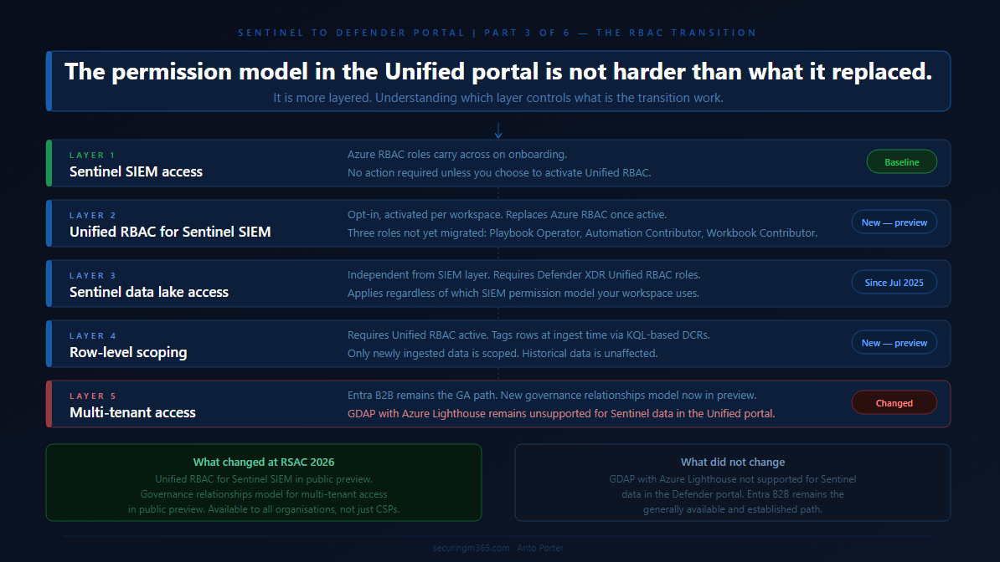

# Series: Sentinel to Defender Portal - The RBAC Transition

  > Part 3 of 6

Following the self opposed trend, Here is the TLDR:

---

The permissions story in the Unified portal is the one that has moved the most since this series started.

When Part 2 published, the RBAC picture was relatively straightforward: 

- Azure RBAC carries across for Sentinel SIEM access, 
	
- Unified RBAC is needed for the data lake, and 
	
- GDAP with Azure Lighthouse is not supported for Sentinel data in the Defender portal. 
	

*That was accurate then.* It is still partially accurate now. But in the weeks since, Microsoft announced two significant additions at RSAC 2026: 

	
**Unified RBAC for Sentinel SIEM itself is now in public preview**, and
	
**a new Defender-native GDAP model is arriving for non-CSP organisations.**
	

This article covers what those changes mean in practice, what the complete permission picture looks like for the Unified portal today, and how to think about the transition path depending on whether you are running a single-tenant environment, a multi-tenant enterprise, or an MSSP operating across many customer workspaces.

>A note before starting: where Part 2 said GDAP was not supported for Sentinel data in the Defender portal and directed readers to Entra B2B as the interim path, that guidance was correct at the time. The new Defender-native GDAP model announced at RSAC is a different mechanism from the Azure Lighthouse GDAP integration that remains unsupported. These are not the same thing, and the article will be specific about the distinction.

---

## The Permission Model in the Unified Portal: A Baseline

The first thing to establish is what the permission model actually looks like in the Unified portal, because it has more moving parts than it appears at first.

[Microsoft's planning guidance for unified security operations](https://learn.microsoft.com/en-us/unified-secops/overview-plan) describes the model clearly: the Defender portal unifies three separate RBAC systems. Microsoft Entra ID RBAC is used for delegating access to Defender functionality such as device groups. Azure RBAC is used by Microsoft Sentinel to delegate permissions. Defender Unified RBAC is the newer model that spans across Defender workloads. All three coexist in the Unified portal, and understanding which one controls what is what this article is about.

The baseline behaviour when you onboard is this: your existing Azure RBAC permissions for Sentinel carry across to the Defender portal unchanged. [Microsoft's onboarding documentation](https://learn.microsoft.com/en-us/unified-secops/microsoft-sentinel-onboard) confirms this directly: after connecting, your existing Azure RBAC permissions allow you to work with the Microsoft Sentinel features you have access to, and Azure RBAC changes are reflected in the Defender portal. For teams running Sentinel SIEM only, with no Defender XDR capabilities and no data lake, this is a no-action scenario on the permissions side.

The layering starts when your requirements go beyond that baseline. Access to Defender XDR capabilities alongside Sentinel SIEM requires Microsoft Entra ID roles or Defender Unified RBAC. Access to the Sentinel data lake requires Defender XDR Unified RBAC. Row-level data scoping requires Unified RBAC to be activated and configured. Multi-tenant access for MSSPs requires either Entra B2B today, or the new Defender-native GDAP model arriving in preview.

Work through each layer in the context of your environment and you have your permission transition plan.

---

## Layer One: Sentinel SIEM Access

For existing Sentinel operators, the three Azure RBAC roles you know carry across directly. [Microsoft's roles and permissions documentation](https://learn.microsoft.com/en-us/azure/sentinel/roles) defines the built-in Azure roles used for Sentinel SIEM:

- Microsoft Sentinel Reader, 
	
- Microsoft Sentinel Responder, and 
	
- Microsoft Sentinel Contributor. 
	

These continue to work in the Unified portal after onboarding, managed from the Azure portal as before, with changes reflected in the Defender portal.

This is the stable foundation. Nothing about this changes unless you choose to activate Unified RBAC for your Sentinel workspace, which is a separate and deliberate step covered in the next section.

One nuance worth flagging from [Microsoft's planning guidance](https://learn.microsoft.com/en-us/unified-secops/overview-plan): the minimum permission for an analyst to view Sentinel data in the Unified portal is the Azure RBAC Sentinel Reader role. Without it, the Microsoft Sentinel navigation menu is not visible in the Defender portal, even if the analyst has access to the Defender portal itself through Entra ID roles. This catches teams who configure Defender portal access for analysts through Entra global roles but forget that Sentinel visibility requires the specific Azure RBAC assignment. Check every analyst role mapping for this before onboarding.

---

## Layer Two: Unified RBAC for Sentinel SIEM

The significant new development announced at RSAC 2026 is that [Unified RBAC for Microsoft Sentinel SIEM is now in public preview](https://techcommunity.microsoft.com/blog/microsoftsentinelblog/microsoft-sentinel-is-now-supported-in-unified-rbac-with-row-level-access/4503121), available from April 2026. This extends the Microsoft Defender Unified RBAC model to cover Sentinel SIEM directly, meaning you can manage Sentinel permissions from the same place you manage Defender XDR permissions, in a single, consistent system in the Defender portal.

This is opt-in, not automatic. Unified RBAC for Sentinel is activated per workspace, not globally. [Microsoft's documentation on activating Unified RBAC](https://learn.microsoft.com/en-us/defender-xdr/activate-defender-rbac) confirms that until activated, the existing Azure RBAC model continues to apply. Activation is done from System > Permissions > Roles > Activate workloads in the Defender portal, where you select which Sentinel workspaces to enable.

The decision matters because activating Unified RBAC for a workspace has a specific consequence: Unified RBAC becomes the primary source of permissions for that workspace, replacing Azure RBAC for Sentinel. [Microsoft's documentation on managing Unified RBAC](https://learn.microsoft.com/en-us/defender-xdr/manage-rbac) is direct on this point: when you activate some or all of your workloads to use the new permission model, the roles and permissions for those workloads are fully controlled by Microsoft Defender Unified RBAC. Making permission changes in the Azure portal after Unified RBAC is active for a workspace may lead to sync errors.

The role mapping between Azure RBAC and Unified RBAC for Sentinel is as follows, from [the public preview announcement](https://techcommunity.microsoft.com/blog/microsoftsentinelblog/microsoft-sentinel-is-now-supported-in-unified-rbac-with-row-level-access/4503121):

- Microsoft Sentinel Reader maps to Security operations / Security data basic (read). 
	
- Microsoft Sentinel Responder adds Security operations / Alerts (manage) and Security operations / Response (manage). 
	
- Microsoft Sentinel Contributor adds Authorization and settings / Detection tuning (manage) on top of the Responder permissions.
	

Microsoft provides an import function to recreate existing Azure RBAC roles in Unified RBAC automatically, which reduces the manual effort of rebuilding role assignments from scratch. This is the recommended starting point rather than rebuilding manually.

Three roles are not yet available in Unified RBAC and must continue to be managed in the Azure portal: 

- Microsoft Sentinel Playbook Operator, 
	
- Automation Contributor, and 
	
- Workbook Contributor. 
	

[Microsoft's permission mapping documentation](https://learn.microsoft.com/en-us/defender-xdr/compare-rbac-roles) calls these out explicitly. If your environment uses any of these roles, you will maintain a dual-management posture for those specific assignments even after activating Unified RBAC.

One additional behaviour worth understanding: in Unified RBAC, being a Global Administrator does not automatically grant permissions over workspaces. It grants the right to assign permissions, including to yourself. This is a meaningful change from the Azure portal behaviour, where Global Admins have implicit broad access.

### The decision framework for Unified RBAC activation

If your environment runs Sentinel SIEM only and your team has straightforward role requirements covered by the three main roles, activating Unified RBAC gives you a single management location and sets you up for row-level scoping if you need it later. The import function makes the transition low-effort.

If your environment also uses Playbook Operator, Automation Contributor, or Workbook Contributor role assignments, factor in that those roles require continued Azure portal management alongside Unified RBAC. The dual-management posture is workable but needs to be documented clearly so it does not become an operational blind spot.

If your environment uses custom Azure RBAC roles for Sentinel, review those against the Unified RBAC permission structure before activating. The mapping may not be one-to-one.

---

## Layer Three: Sentinel Data Lake Access

The Sentinel data lake sits under a different permissions model from Sentinel SIEM regardless of whether you have activated Unified RBAC. [Microsoft's roles and permissions documentation](https://learn.microsoft.com/en-us/azure/sentinel/roles) confirms that Microsoft Entra ID RBAC provides built-in and custom roles for the Sentinel data lake, while Azure RBAC handles Sentinel SIEM. Data lake permissions have been provided through Microsoft Defender XDR Unified RBAC since July 2025.

This means any team member who needs to run queries against the data lake, access long-term retained data, or work with the data lake exploration capabilities in the Defender portal needs Defender XDR Unified RBAC roles in addition to their existing Sentinel SIEM access, regardless of your Unified RBAC activation decision for SIEM. The two layers are independent.

For environments where you want granular, scoped access to the data lake without Entra global roles, [Microsoft's documentation on creating custom Unified RBAC roles](https://learn.microsoft.com/en-us/defender-xdr/create-custom-rbac-roles) supports Data operations permissions specifically for the Sentinel data lake. This is the path for environments where Entra global roles would grant broader access than you want your SOC team to have across Microsoft portals.

---

## Layer Four: Row-Level Scoping

Row-level scoping is the most significant access control capability that did not exist in the Azure portal Sentinel experience, and it is the capability that changes the architecture conversation for large enterprises and MSSPs running shared workspaces.

[Microsoft's announcement of Unified RBAC for Sentinel](https://techcommunity.microsoft.com/blog/microsoftsentinelblog/microsoft-sentinel-is-now-supported-in-unified-rbac-with-row-level-access/4503121) describes the core use case: multiple SOC teams can operate securely within a shared Sentinel environment, querying only the data they are authorised to see, without separating workspaces or introducing complex data flow changes. The motivating scenarios are teams segregated by business unit, geography, or data sensitivity, or external teams who need access to specific data subsets without exposure to the full workspace.

[Microsoft's documentation on configuring Sentinel scoping](https://learn.microsoft.com/en-us/azure///sentinel/scoping) describes how it works. Administrators define logical scopes aligned to organisational structure, apply scope tags to rows in tables using KQL-based rules during ingestion, and assign users or groups to scopes through Unified RBAC roles. Tagged data is restricted to users whose role includes that scope. Users can be assigned to multiple scopes simultaneously, with access rights aggregated across all assigned scopes.

Several important constraints to understand before evaluating this capability:

- Row-level scoping requires Unified RBAC to be activated for the workspace first. It cannot be used with Azure RBAC permissions on workspaces or Entra global role permissions alone.
	
- Only newly ingested data is tagged. Previously ingested data is not retroactively scoped. If you have years of historical data in a workspace, scoping applies from the point of activation forward.
	
- Scoped users can see an incident if they have access to at least one underlying alert. They can manage an incident only if they have access to all underlying alerts and have the required permissions. This means a scoped analyst may be able to see an incident but not take action on it, depending on the alert composition.
	
- Certain experiences do not support row-level scoping, including Jupyter Notebooks. Scoped users cannot view data for workspaces in those experiences.
	

### The design-intent perspective on row-level scoping

This capability is primarily valuable for two scenarios. The first is large enterprise environments where multiple distinct SOC teams operate within a shared Sentinel deployment and workspace separation would introduce operational or cost overhead that is disproportionate to the benefit. The second is MSSP environments where the new Defender-native GDAP model may handle tenant-level separation, but row-level scoping provides an additional precision layer within a shared workspace for a single customer environment.

For most single-tenant organisations with a unified SOC team, row-level scoping is not a capability you need to evaluate immediately. It is worth understanding so you can design your Unified RBAC structure to accommodate it if your requirements evolve.

---

## Layer Five: Multi-Tenant Access

This is the layer that has changed the most since Part 2 published, and it requires the most precision to describe accurately.

### What Part 2 said and why it was correct

Part 2 stated that GDAP with Azure Lighthouse is not supported for Microsoft Sentinel data in the Defender portal, and directed readers to Microsoft Entra B2B authentication as the supported path. That remains accurate. [Microsoft's onboarding documentation](https://learn.microsoft.com/en-us/unified-secops/microsoft-sentinel-onboard) still states this explicitly, and [the multitenant management requirements documentation](https://learn.microsoft.com/en-us/unified-secops/mto-requirements) confirms that GDAP provides access to Defender data only, not Sentinel data. Part 2 was not wrong. The landscape has moved since then, but the specific limitation described was real at the time.

### What has changed

At RSAC 2026 in March 2026, Microsoft announced a new extension to GDAP that makes it available to all Sentinel and Defender customers, including non-CSP organisations. [The announcement on Tech Community](https://techcommunity.microsoft.com/blog/microsoftsentinelblog/how-granular-delegated-admin-privileges-gdap-allows-sentinel-customers-to-delega/4503123) describes this as a Defender-native GDAP model, managed directly through the Microsoft Defender portal, available in public preview in April 2026.

This is a different mechanism from the Azure Lighthouse GDAP integration that Part 2 flagged as unsupported. The existing Azure Lighthouse GDAP limitation for Sentinel data in the Defender portal has not changed. What is new is a separate, Defender-portal-native GDAP capability that did not previously exist.

The new GDAP model operates through a three-step handshake requiring explicit mutual consent between the governing and governed tenants. The governed tenant initiates the relationship, allowing the governing tenant to request access. The governing tenant creates and sends a delegated access request with specific permissions through the multitenant organisation portal. The governed tenant approves. This consent-based model is designed around zero-trust principles, requiring explicit approval at each step rather than broad delegated access established once and maintained indefinitely.

For organisations running SIEM and XDR together, the new GDAP model means delegated access for both Sentinel and Defender can be managed from a single portal using a consistent model. For Sentinel-specific access, this brings parity with the Azure portal experience where Azure Lighthouse handled delegated access, now handled natively in the Defender portal through the new GDAP mechanism.

### The current state for MSSPs and multi-tenant operators

As of April 2026, Entra B2B remains the established and generally available path for cross-tenant Sentinel access in the Defender portal. The new Defender-native GDAP model is in public preview. For organisations already operating on Entra B2B, the practical question is whether the new GDAP model's consent-based three-step handshake offers operational advantages over the B2B guest account model at your scale. That evaluation belongs in your environment, against your specific tenant count, your compliance requirements, and your operational preference for governed versus federated access.

Azure Lighthouse continues to work for cross-workspace queries and Azure resource-level access. The specific limitation from Part 2, GDAP with Azure Lighthouse not supporting Sentinel data in the Defender portal, remains in place. This distinction matters: Azure Lighthouse itself is not deprecated, and using it for cross-workspace KQL queries in Advanced Hunting and analytics rules continues to work. What does not work is using the Lighthouse GDAP mechanism to access Sentinel data through the Defender portal's unified experience.

Part 4 of this series, covering the MSSP and multi-tenant migration playbook in detail, will go deeper into how these access models interact at scale.

---

## Building Your Permission Transition Plan

With all five layers mapped, the permission transition plan for most environments follows a natural sequence.

Start with the baseline audit from Part 2: who currently has which Azure RBAC Sentinel roles, confirm every analyst has the minimum Sentinel Reader role assigned, and identify anyone whose access relied on broad Entra global roles that may behave differently in the Unified portal context.

For the Unified RBAC decision: if your team requirements are covered by the three main Sentinel roles and you want a single management location, use the import function to recreate your Azure RBAC assignments in Unified RBAC and activate it per workspace. If you have Playbook Operator, Automation Contributor, or Workbook Contributor role assignments, document those as a separate ongoing Azure portal management responsibility.

For data lake access: identify which team members need data lake capabilities and assign them the appropriate Defender XDR Unified RBAC roles. This is separate from the Unified RBAC activation decision for SIEM and applies regardless of which SIEM permission model you use.

For row-level scoping: evaluate whether your environment has the shared-workspace multi-team scenario that scoping is designed for. If not, note it as a future capability and move on. If yes, design your scope definitions before activating, because the tagging applies only to newly ingested data from activation forward.

For multi-tenant access: if you are on Entra B2B today, assess the new Defender-native GDAP preview against your operational requirements. If you are an MSSP with an existing Azure Lighthouse setup, understand that Lighthouse remains the mechanism for Azure resource-level access and cross-workspace queries, while the new Defender-native GDAP model is the path toward Sentinel access management directly in the Defender portal at tenant scale.

> *The permission model in the Unified portal is not harder than what it replaced. It is more layered, and the layers serve different purposes. The transition work is mostly about understanding which layer controls what, not about rebuilding from scratch.*

---

Part 4 covers the automation and SOAR transition: 
	
- What moves cleanly, 
	
- What needs remediation, and 
	
- What the SecurityInsights to Microsoft Graph API migration path looks like in practice.
	