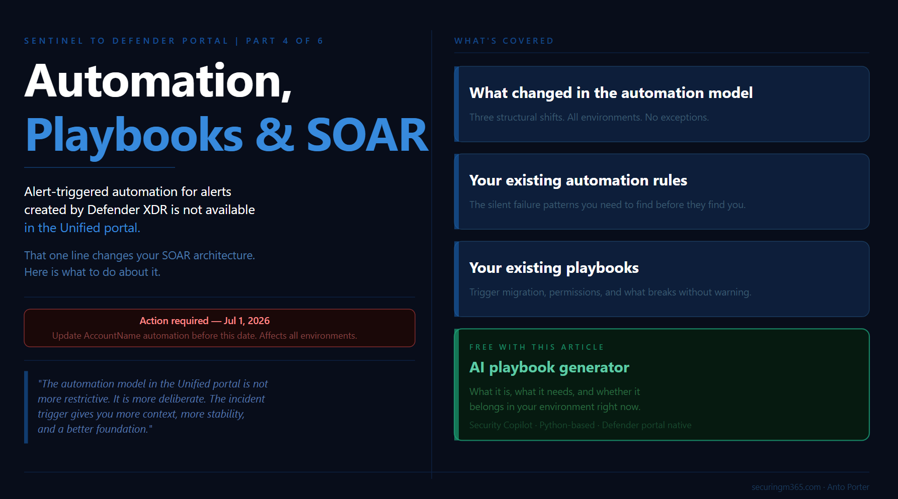

# Series: Sentinel to Defender Portal - Automation, Playbooks and SOAR

  > Part 4 of 6

TLDR:

---

Alert-triggered automation for alerts created by Microsoft Defender XDR is not available in the Defender portal.

That single line from [Microsoft's automation documentation](https://learn.microsoft.com/en-us/azure/sentinel/automate-incident-handling-with-automation-rules) is worth sitting with before anything else in this article. If your SOC automation strategy was built around alert-triggered playbooks firing on Defender XDR signals, those playbooks do not fire in the Unified portal in the same way. The constraint is not a bug or a gap that will be patched quietly. It is a consequence of how the Defender XDR engine owns incident creation in the Unified portal, and understanding it is the starting point for understanding everything else about SOAR in this environment.

This is Part 4 of the Sentinel to Defender Portal migration series. Parts 2 and 3 covered the pre-migration inventory and the RBAC transition. Part 4 is about what your SOAR environment looks like operationally once you are inside the Unified portal: what changed in the automation model, what this means for your existing automation rules, what this means for your existing playbooks, and what is genuinely new. There is also a companion piece for this article: a deployable Bicep template and GitHub README for a compromised user response playbook, built for the Unified portal's incident trigger model.

Before diving in, one deadline that applies directly to the content in this article: [Microsoft's What's New documentation](https://learn.microsoft.com/en-us/azure/sentinel/whats-new) includes a call to action to update queries and automation by July 1, 2026 for standardised account entity naming. Starting that date, the account entity's Name field will consistently hold only the UPN prefix, not the full UPN. If your automation rules or playbooks compare the AccountName property against a full UPN value like user@contoso.com, they will break. This is a separate deadline from the March 2027 portal retirement and it applies to all environments, not just those in the middle of migration. It is called out now because Part 4 is where you will find and fix those conditions.

---

## What Changed in the Automation Model

The Unified portal introduces three structural changes to the automation model that affect every environment, regardless of how simple or complex your current SOAR configuration is.

It is worth framing these changes in context before working through them. The shift away from alert-based automation toward incident-based orchestration has been happening gradually for several years. Most newer Sentinel workflows were already treating the incident as the primary operational object rather than the alert itself. What the Unified portal migration does is make that direction explicit and remove the option to build around it. Teams who have been building on newer workflow patterns will land more smoothly than those carrying a large alert-triggered estate from earlier deployments. The migration surfaces the architectural debt rather than creating it.

**Incident creation ownership has moved.** In the Unified portal, all incident creation happens via the Defender XDR engine. [Microsoft's automation rules documentation](https://learn.microsoft.com/en-us/azure/sentinel/automate-incident-handling-with-automation-rules) is explicit: in this scenario, the incident creation rules in Microsoft Sentinel must be disabled. This was covered in the pre-migration checklist in Part 2. What Part 4 adds is the operational consequence: automation rules that were previously triggered by Microsoft incident creation rules no longer have those triggers. Every automation rule that was scoped to Sentinel-created incidents from Defender XDR products needs to be reviewed in the context of the unified incident model.

**Alert-triggered automation has a new constraint.** [Microsoft's documentation](https://learn.microsoft.com/en-us/azure/sentinel/automate-incident-handling-with-automation-rules) is direct: alert-triggered automation is available only for alerts created by Scheduled, NRT, and Microsoft security analytics rules. Alert-triggered automation for alerts created by Microsoft Defender XDR is not available in the Defender portal. The correct use case for alert-triggered automation in the Unified portal is responding to alerts from analytics rules where incident creation is disabled in the rule settings.

The reason this pattern was more common in earlier Sentinel deployments is worth understanding. When Sentinel's correlation capabilities were less mature, some environments built their own external correlation logic around individual alerts, deliberately avoiding incident creation to maintain control over the grouping and enrichment process. Defender XDR's native correlation is now significantly stronger, which makes that design pattern largely redundant for most environments. If you have alert-triggered playbooks firing on Defender XDR alerts, those need to be re-evaluated against the incident trigger model. For teams that still need to process alerts individually after migrating to the incident trigger, the pattern is to enumerate the related alerts inside the playbook workflow after the incident trigger fires, giving you the same per-alert access with the richer incident context as the entry point.

**The API surface has changed.** The Unified portal supports API calls based on the [Microsoft Graph REST API v1.0](https://learn.microsoft.com/en-us/azure/sentinel/move-to-defender) for automation related to alerts, incidents, advanced hunting, and more. The Microsoft Sentinel SecurityInsights API continues to support actions against Sentinel resources such as analytics rules and automation rules. But for interacting with unified incidents and alerts, Microsoft recommends using the Microsoft Graph REST API. If your automation uses the SecurityInsights API to read or update incidents, the response body has changed and your conditions and trigger criteria may need updating.

There is also a batching behaviour to account for in high-frequency environments: after onboarding to the Defender portal, if multiple changes are made to the same incident within a five to ten minute period, a single update is sent to Microsoft Sentinel with only the most recent change. Automation that fires on rapid successive incident updates needs to be designed around this.

---

## Your Existing Automation Rules

Automation rules are where the migration produces the most work with the least visibility, because the rules do not throw errors when they stop matching. They just stop doing their job.

The structural foundation of automation rules in the Unified portal remains the same. [Microsoft's documentation](https://learn.microsoft.com/en-us/azure/sentinel/automate-incident-handling-with-automation-rules) describes the core capabilities: automation rules allow you to centrally manage automation, apply automations when incidents are created or updated, triage incidents by changing status, assigning owners, adding tags, creating analyst tasks, and controlling the order of actions that execute. None of that changes.

What changes is the condition model and what incident properties are stable enough to use as conditions.

**Incident title conditions are unreliable.** As covered in Part 2, the Defender XDR correlation engine presides over incident creation and automatically names incidents. Any automation rule built around "if incident title contains X" will silently stop matching when the Unified portal assigns names from its own correlation logic that bear no resemblance to the expected strings. [Microsoft's documentation on the Defender XDR integration](https://learn.microsoft.com/en-us/azure/sentinel/microsoft-365-defender-sentinel-integration) is explicit: use criteria other than the incident name as conditions for triggering automation rules. The recommended replacement is the Analytic rule name condition, which references the analytics rule that generated the alert rather than the incident title the correlation engine assigned.

This is also a useful prompt to reconsider how much logic belongs in the automation condition versus inside the playbook itself. The automation rule should act as a routing mechanism, invoking the right playbook based on stable, broad conditions. The granular logic, the enrichment decisions, the specific field comparisons, belongs inside the playbook where you have full incident context and better control over how it executes. Trying to encode complex routing logic in automation conditions is what creates fragile rules that break silently when the underlying data model shifts.

**The Updated by condition has new values.** The Unified portal introduces additional values for the Updated by property that did not exist in the Azure portal. [Microsoft's automation rules documentation](https://learn.microsoft.com/en-us/azure/sentinel/automate-incident-handling-with-automation-rules) describes these: AIR for updates by automated investigation and response in Defender for Office 365, and alert grouping done by analytics rules. If you have automation rules that use Updated by as a condition to prevent loops or route updates to specific handlers, review them against the expanded value set.

**Account entity naming changes by July 1, 2026.** This is the near-term deadline that affects automation rules directly. [Microsoft's entity types reference documentation](https://learn.microsoft.com/en-us/azure/sentinel/entities-reference) is specific: starting July 1, 2026, the Name field will consistently hold only the UPN prefix for all accounts. Previously it could sometimes hold the full UPN. If you have automation rules or playbooks that compare the AccountName property against a full UPN value, update them to reconstruct the full value from Name plus UPNSuffix, or use other available identifiers instead. This is not a migration-related change. It affects all Sentinel environments and the deadline is firm.

**Work through your automation rules in two passes.** The first pass identifies every rule using incident title as a condition and replaces it with Analytic rule name. The second pass identifies every rule using AccountName as a condition and validates whether it compares against a full UPN, flagging those for the July 1 deadline. Both passes should be completed before onboarding if you have not already done so.

---

## Your Existing Playbooks

Playbooks in Microsoft Sentinel are based on workflows built in Azure Logic Apps. [Microsoft's playbook documentation](https://learn.microsoft.com/en-us/azure/sentinel/automation/automate-responses-with-playbooks) confirms this carries across: playbooks continue to function in the Unified portal. The Logic Apps infrastructure does not change. What changes is the trigger model and the permission model for running them.

**The incident trigger is the correct model in the Unified portal.** [Microsoft's automation rules documentation](https://learn.microsoft.com/en-us/azure/sentinel/automate-incident-handling-with-automation-rules) is direct: the most appropriate way to create playbooks is to base them on the Microsoft Sentinel incident trigger in Azure Logic Apps. The main reason to use alert-triggered automation is for responding to alerts from analytics rules where incident creation is disabled. A playbook built on the alert trigger that was previously invoked by an analytics rule should be migrated to be invoked by an automation rule instead. [Microsoft's migration documentation](https://learn.microsoft.com/en-us/azure/sentinel/automation/migrate-playbooks-to-automation-rules) covers this: the advantages are automation management from a single location, a single automation rule triggering playbooks for multiple analytics rules, defined execution order, and expiration date support.

If your existing playbooks contain per-alert logic that you need to preserve after moving to the incident trigger, the approach is to enumerate the related alerts from the incident object inside the playbook workflow. The incident trigger gives you access to the full incident entity including all related alerts. You iterate over them inside the Logic App to apply alert-level processing, giving you the same per-alert access with the richer context that the incident trigger provides as the entry point.

**The Microsoft Sentinel service account runs incident-triggered playbooks.** This is a permission detail that catches teams during migration. [Microsoft's playbook documentation](https://learn.microsoft.com/en-us/azure/sentinel/automation/automate-responses-with-playbooks) is clear: Microsoft Sentinel uses a service account to run playbooks on incidents. This service account must have the Microsoft Sentinel Automation Contributor role on the resource group where the playbook resides. Without it, the playbook will not trigger from an automation rule, even if the Logic App's own managed identity has the right permissions. If you grant Microsoft Sentinel the required permissions from the Automation settings page in the Defender portal, you are granting this service account access to your playbook resource groups. Check this for every resource group containing playbooks before onboarding.

**Playbook permissions scope to subscriptions by default.** [Microsoft's documentation on creating playbooks](https://learn.microsoft.com/en-us/azure/sentinel/automation/create-playbooks) notes that by default, a playbook can be used only within the subscription to which it belongs, unless you specifically grant Microsoft Sentinel permissions to the playbook's resource group. After onboarding to the Defender portal, the Active playbooks tab shows a predefined filter with the onboarded workspace's subscription. If your playbooks span multiple subscriptions, ensure the permission grants cover all relevant resource groups.

**System-assigned managed identity is the recommended authentication method.** [Microsoft's authentication documentation](https://learn.microsoft.com/en-us/azure/sentinel/automation/authenticate-playbooks-to-sentinel) confirms this: enable managed identity on the Logic Apps workflow resource, then assign the appropriate Sentinel role to that identity on the workspace. For playbooks that only read incidents, Microsoft Sentinel Reader is sufficient. For playbooks that update incidents or watchlists, Microsoft Sentinel Responder is required. The managed identity approach reduces the number of separate identities to manage and is the default when creating playbooks through the Defender portal wizard.

---

## What Is New: The AI Playbook Generator

The most significant new SOAR capability in the Unified portal is the AI playbook generator, announced in April 2026. [Microsoft's documentation on generating playbooks](https://learn.microsoft.com/en-us/azure/sentinel/automation/generate-playbook) describes it: the SOAR playbook generator creates Python-based automation workflows coauthored through a conversational experience with Cline, an AI coding agent, powered by an embedded VS Code environment within the Defender portal. You describe automation logic in natural language, and the system generates validated, code-based playbooks with complete documentation and visual flow diagrams.

This is a material change from the Logic Apps designer experience. Generated playbooks use Python rather than Logic Apps workflows, which means different deployment and management patterns. They use the Enhanced Alert Trigger, which extends coverage beyond the standard alert trigger to target alerts across Microsoft Sentinel, Microsoft Defender, and XDR platforms, with tenant-level application and advanced conditions.

**Prerequisites for the AI playbook generator.** Your tenant must be Security Copilot enabled with SCUs available. SCUs are not billed for playbook generation, but their availability is a technical requirement. Your Sentinel workspace must be onboarded to Microsoft Defender. Integration profiles must be configured for any external services the generated playbook will call, for example third-party ticketing systems or notification channels. These are managed centrally in the Defender portal under the Automation tab.

**The Security Copilot dependency is worth examining honestly.** The generator's specific differentiator is not the code generation itself but the integration surface: the Enhanced Alert Trigger with tenant-level application across Sentinel and Defender signals, the integration profiles managed centrally in the Defender portal, and validated output that accounts for the Unified portal's specific automation architecture. Those are meaningful advantages over generating a Logic Apps workflow in an external AI tool.

That said, for organisations without Security Copilot enabled, general-purpose AI tools including GitHub Copilot, Claude, and similar are already capable of generating Logic Apps workflows, ARM templates, and Python-based Azure Functions to a useful standard. The accessibility of Azure Functions in particular has shifted considerably with AI assistance. Building Python-based SOAR workflows previously required deep developer experience. Today, a practitioner with strong operational knowledge and access to AI tooling can build fairly advanced workflows without that background. The Defender portal generator is the right choice if you have Security Copilot available and want the integration surface it provides. If you do not, the gap between it and external AI-assisted authoring is smaller than it might appear.

**The design-intent perspective.** The AI generator sits at the intersection of two directions Microsoft is investing in simultaneously: making automation authorship accessible to analysts who are not Logic Apps specialists, and building toward the agentic SOC model where AI-driven workflows handle more of the enrichment and response loop. For environments already running mature Logic Apps playbooks, the generator is a useful authoring accelerant for new use cases rather than a replacement for your existing investment.

---

## The Compromised User Playbook

The companion piece for this article is a deployable Bicep template implementing the compromised user response scenario described in [Microsoft's tutorial documentation](https://learn.microsoft.com/en-us/azure/sentinel/automation/tutorial-respond-threats-playbook). This is the scenario that most clearly demonstrates the correct automation architecture for the Unified portal: incident trigger, approval gate, conditional action.

[GitHub Link](https://github.com/AntoPorter/antoporter.github.io/tree/main/docs/defenderxdr/sentinel/sentineldefender/)

The playbook implements the following flow. An incident is created for a potentially compromised user and an automation rule triggers the playbook. The playbook sends a notification to a Microsoft Teams channel so the SOC is immediately aware. An approval email is sent to designated administrators with Block and Ignore option buttons. The playbook waits for a response. If the administrators choose Block, the playbook disables the user account in Microsoft Entra ID. If they choose Ignore, the playbook closes the incident in Sentinel.

The template uses a system-assigned managed identity for the Logic App, which connects to the Microsoft Sentinel connector and the Microsoft Entra ID connector. The Microsoft Sentinel Automation Contributor role is assigned to the Sentinel service principal on the playbook resource group. The Microsoft Sentinel Responder role is assigned to the Logic App's managed identity on the workspace.

The Bicep template and deployment instructions are available in the companion GitHub repository. The README covers prerequisites, parameter descriptions, post-deployment role assignments, and how to wire the automation rule that calls this playbook in the Defender portal.

> *The playbook is intentionally scoped to the core pattern: incident trigger, Teams notification, approval gate, Entra ID disable action. It is self-contained and deployable without external ticketing system credentials. Extend it for your environment from that foundation.*

---

## Building Your SOAR Transition Plan

With the four areas above mapped, the SOAR transition for most environments follows a clear sequence.

Complete the automation rule review first. Replace every incident title condition with Analytic rule name. As you do this, use it as an opportunity to shift complex routing logic out of the condition layer and into the playbook itself, where it belongs. Identify and flag every AccountName condition that compares against a full UPN for the July 1, 2026 deadline. These passes are the highest-priority actions regardless of where you are in the migration timeline.

Migrate alert-triggered playbooks to automation rule invocation. Follow [Microsoft's migration documentation](https://learn.microsoft.com/en-us/azure/sentinel/automation/migrate-playbooks-to-automation-rules) for each playbook: create an automation rule with an alert-created or incident-created trigger, add a Run playbook action, and remove the direct analytics rule attachment. For playbooks with existing per-alert logic, restructure that logic to enumerate the related alerts from the incident object inside the workflow rather than at the trigger level.

Verify service account permissions before onboarding. Go to Automation > Settings > Playbook permissions in the Defender portal and confirm Microsoft Sentinel has access to every resource group containing playbooks. If a playbook appears greyed out in the automation rule dropdown, missing resource group permission is almost always the cause.

Review playbook authentication. Any playbook not already using managed identity authentication should be migrated. The managed identity approach aligns with the Unified portal's connection model and reduces the credential management overhead that comes with service principal-based connections.

For net-new playbook development after onboarding, evaluate whether the AI playbook generator fits your scenario. If you have Security Copilot available, the Defender portal generator's integration surface is worth the evaluation. If you do not, AI-assisted authoring in Logic Apps or Azure Functions is a capable alternative that does not require it.

> *The automation model in the Unified portal is not more restrictive than the Azure portal model. It is more deliberate. The constraint on Defender XDR alert-triggered automation exists because the incident trigger model gives you more context, more stability, and a better foundation for the kind of complex response logic that actually reduces analyst workload.*

---

Part 5 covers the MSSP and multi-tenant migration playbook: how all of the content from Parts 1 through 4 applies at scale across many customer workspaces, what the content distribution story looks like in the Unified portal, and how to sequence a migration programme across a portfolio of tenants.