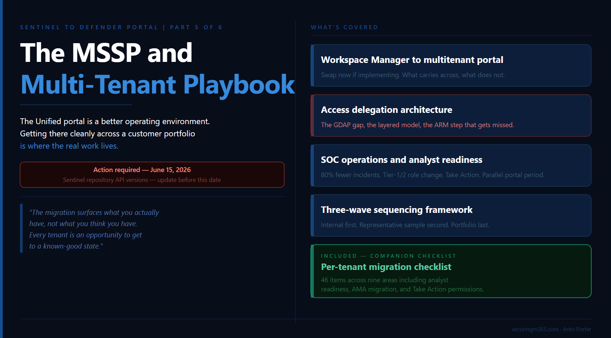

# Series: Sentinel to Defender Portal - The MSSP and Multi-Tenant Migration Playbook

  > Part 5 of 6

TLDR:

---

Everything this series has covered so far, connectors, RBAC, automation, playbooks, applies when you multiply it across a portfolio of customer workspaces. The complexity does not change in kind. It changes in scale, in coordination overhead, and in the number of things that can go wrong at the same time.

> A quick caveat before we go further. There is limited public discussion (that I have stumbled upon) on how this actually operates across MSSP's globally, so what I am describing reflects how I (personal opinion) would tackle this going forward.

Part 5 is where the series comes together operationally. It covers what the Unified portal looks like as an MSSP operating environment, how to sequence a migration program across a customer portfolio, how content distribution works at scale, and where the access delegation model has evolved in ways that should inform how you design your operating architecture today.

This migration is genuinely worth getting right. The Unified portal is a better operational environment than the Azure portal for running Sentinel at scale. The cross-tenant incident visibility, the unified hunting surface, the content distribution capabilities, and the AI-assisted investigation features are meaningful improvements for MSSPs and enterprise operators alike. The preparation work covered in this series exists because landing on that better environment cleanly is harder than it appears, and the preparation is what makes the difference between a migration that delivers on the promise and one that just moves the problem.

There is also a companion checklist at the end of this article: a sequenced per-tenant document structured around the five areas covered across Parts 2 through 5, sized for MSSP use where the same checklist applies across every customer workspace migration.

Before anything else, one deadline worth calling out immediately:

> **Action required by June 15, 2026:** If you are using APIs to create and manage Microsoft Sentinel repository connections, transition to API version 2025-09-01, 2025-06-01, or 2025-07-01-preview before June 15, 2026. [Microsoft's repositories documentation](https://learn.microsoft.com/en-us/azure/sentinel/ci-cd-custom-content) confirms that older API versions used by Microsoft Sentinel repositories will no longer be supported after that date. Existing repository connections are not affected, but API-based connection management will break if not updated.

---

## From Workspace Manager to Multitenant Management

If you built your MSSP operating model in the Azure portal around Workspace Manager, the most important thing to understand before reading anything else in this article is that Workspace Manager and the Defender portal's multitenant management capabilities are not the same thing and do not overlap cleanly.

[Microsoft's Workspace Manager documentation](https://learn.microsoft.com/en-us/azure/sentinel/workspace-manager) is direct on this: support for Workspace Manager is currently in preview, and if you onboard Microsoft Sentinel to the Microsoft Defender portal, the guidance is to see Microsoft Defender multitenant management instead. The documentation itself points you away from Workspace Manager at the point of onboarding. If you are implementing your MSSP environment now and have not yet committed to Workspace Manager, implement directly on the multitenant management capabilities in the Defender portal.

If you are already running Workspace Manager in production, you are not in immediate trouble. The Azure portal retirement deadline is March 31, 2027. The more urgent consideration is whether to continue building on Workspace Manager during your customer migration program or to run a parallel track migrating your own operating infrastructure. Most MSSPs who are mid-flight on customer migrations will take the pragmatic path of completing the customer program first, then transitioning their operating model. What matters is that you do not treat Workspace Manager as a long-term foundation to keep investing in.

### What the multitenant portal gives you

The [Microsoft Defender multitenant management portal](https://learn.microsoft.com/en-us/unified-secops/mto-overview) provides a single unified view across all managed tenants. From it you can triage incidents and alerts across SIEM and XDR data simultaneously, run advanced hunting queries across multiple tenants, manage cases across customers, view vulnerability management data and device inventories, and distribute content at scale using distribution profiles. For each tenant, the portal connects to one primary workspace and an unlimited number of secondary workspaces.

The multitenant portal queries the primary workspace per tenant natively without requiring Azure Lighthouse. Azure Lighthouse is still required when you need to query a secondary workspace in a different tenant from Advanced Hunting, analytics rules, or workbooks. For those queries, use the workspace() operator from either the multitenant management portal or security.microsoft.com.

One additional workspace design consideration for MSSPs: Microsoft specifically recommends at least one workspace per Microsoft Entra tenant for MSSP-style scenarios, because some built-in service-to-service data connectors operate only within their own tenant boundary. If your architecture has consolidated customer data into shared workspaces, review that design against this constraint before migration.

Custom content deployment at scale, which Workspace Manager handled through its push model, is now handled through a combination of native content distribution profiles and CI/CD pipelines, covered in the content distribution section below.

---

## Access Delegation: Designing the Right Architecture Now

Part 3 covered the five permission layers in the Unified portal and introduced the Defender-native governance relationships model in public preview. Part 5 adds the operational constraints that shape how MSSPs should be thinking about their access delegation architecture, and one honest gap in the current capability set that affects timing decisions.

### The GDAP plus Unified RBAC roadmap consideration

A Microsoft employee confirmed in the Tech Community discussion around the RSAC 2026 GDAP announcement that [Unified RBAC support for GDAP in the Defender portal is planned on the roadmap but has no firm date](https://techcommunity.microsoft.com/blog/microsoftsentinelblog/how-granular-delegated-admin-privileges-gdap-allows-sentinel-customers-to-delega/4503123/replies/4506043). The governance relationships model currently assigns access through Unified RBAC roles defined in the access template. The full integration of GDAP with Unified RBAC for the Defender portal is still ahead.

This is worth understanding before committing to an access delegation architecture, because changing your access model after migration across a large customer portfolio is a significant operational effort. Entra B2B is generally available, established, and fully functional in the Unified portal today. The governance relationships model is in public preview and being built out with GDAP plus Unified RBAC integration on the roadmap. If you are in the middle of an active migration program across a customer portfolio, implementing on Entra B2B is the lower-risk path. If you are starting fresh or have the runway to evaluate the governance relationships model in a controlled environment first, it is worth doing given it is the forward direction.

### Why GDAP is not optional regardless of access model

[Microsoft's documentation on managing multiple tenants](https://learn.microsoft.com/en-us/azure/sentinel/multiple-tenants-service-providers) is explicit: you cannot deploy connectors in Microsoft Sentinel from within a managed workspace configured with Azure Lighthouse alone. To deploy a connector, you must also configure GDAP. This is the reason Azure Lighthouse should not be treated as a complete standalone solution for MSSP environments.

**The layered delegation architecture the industry is converging on:**

**Azure Lighthouse** handles cross-workspace queries, analytics rule management, workbook deployment, and Azure resource-level access that does not require connector deployment. It should not be removed from your architecture, and it remains the right tool for these use cases.

**GDAP alongside Azure Lighthouse** handles connector deployment and Sentinel management actions that require delegated access beyond what Lighthouse alone provides.

**Entra B2B** handles day-to-day cross-tenant Sentinel and Defender XDR access for SOC analysts in the Unified portal. B2B guest accounts in the governed tenant, combined with appropriate Unified RBAC role assignments, give analysts access without requiring administrative delegation.

**The Defender-native governance relationships model** (public preview) is the emerging path for managing the delegated access relationship itself from within the Defender portal. The full setup process is documented on [Microsoft Learn](https://learn.microsoft.com/en-us/unified-secops/governance-relationships), including the ARM role assignment to the Log Analytics workspace that is required after the three-step consent process completes.

One B2B limitation worth documenting if your SOC service includes email security operations: [Microsoft's MSSP implementation guide](https://learn.microsoft.com/en-us/unified-secops/playbook-managed-security) documents specific restrictions for B2B guest admins in the Defender for Office 365 experience. Guest admins may encounter errors managing spam and phishing policies, cannot release emails from quarantine, and may find Threat Explorer missing from the navigation pane.

---

## Content Distribution at Scale

Content management in the Unified portal for MSSPs is a hybrid model by design. [Microsoft's MSSP implementation guide](https://learn.microsoft.com/en-us/unified-secops/playbook-managed-security) explicitly recommends combining native multitenant management content distribution for immediate deployment needs with CI/CD workflows for custom content development, testing, and advanced automation scenarios.

**Native content distribution profiles** handle deployment of standard content across many tenants quickly. You create a distribution profile in the multitenant management portal, define the source content, and push it to target tenants. This is the right mechanism for out-of-the-box content, lightly customised analytics rules, and detection rule baselines you want deployed consistently across your entire customer base.

**Microsoft Sentinel repositories via CI/CD** handle custom content requiring version control, testing pipelines, and structured deployment workflows. Repositories support GitHub and Azure DevOps connections and deploy analytics rules, automation rules, hunting queries, parsers, playbooks, watchlists, and workbooks. [Microsoft's repositories documentation](https://learn.microsoft.com/en-us/azure/sentinel/ci-cd-custom-content) confirms this is available in the Defender portal. Updates from your repository overwrite any changes made to that content through the portal, so governance for who can change what needs to be explicit before you start.

### Three repository architecture patterns

The pattern that aligns most closely to how the industry is structuring multi-customer SIEM operations is a central repository for generic content deployed to all customers, with individual customer-specific repositories for tailored content. Each customer workspace connects to both. This minimises duplication while preserving the ability to customise without forking the entire baseline.

A single repository with custom folders works well for smaller MSSP operations or those early in content management maturity. One repository per customer offers maximum isolation and is the right choice when customers have compliance requirements mandating complete content separation.

Microsoft's guidance is direct on governance risk: when MSSPs and customers both manage content, conflicts occur if both content-as-code and the portal are used simultaneously. The two recommended approaches are centralised management only, where only MSSP users create and update content, or shared management with clear naming conventions that prefix MSSP-managed items. Define this governance before you start deploying content.

---

## Multi-Tenant Security Operations in the Unified Portal

The Unified portal's operational surface is genuinely different from the Azure portal, and in most respects it is better. The unified incident queue consolidates incidents from Microsoft Sentinel, Microsoft Defender, and third-party sources across all managed tenants. Analysts do not need to switch contexts or re-authenticate to move between customer environments. Advanced hunting queries can span multiple tenants simultaneously.

### The incident volume change and what it means for MSSPs

The Defender XDR correlation engine can reduce overall incident counts by up to 80% through intelligent alert grouping. For MSSPs with SLA-based service agreements tied to incident volumes, response times, or analyst capacity models, this is a meaningful change in operating economics. It is worth reviewing your service delivery metrics and SLA thresholds before migration, because the same environment will look very different in the Unified portal from a volume perspective.

[Microsoft's transition documentation](https://learn.microsoft.com/en-us/azure/sentinel/move-to-defender) notes that the unified triage process can help reduce analyst workloads and potentially combine the roles of tier-1 and tier-2 analysts, but the unified triage process also requires broader and deeper analyst knowledge. For MSSPs, this has a direct implication for how you staff and structure SOC coverage across customer environments. The volume reduction is a benefit. The analyst knowledge depth requirement is a resourcing and training consideration.

### The Take Action capability in Advanced Hunting

One of the more significant operational improvements in the Unified portal that the migration unlocks is the Take Action wizard in Advanced Hunting. It allows analysts to execute response actions directly from the results of a KQL query, including device isolation, file quarantine, user account actions, and more, without leaving the hunting surface. This requires manage-level Unified RBAC permissions. Training analysts on this capability is worth prioritising as part of your migration program, because it represents a genuine workflow improvement over what was possible in the Azure portal.

### Analyst transition and the parallel portal period

The hardest part of this migration is often not the technical steps. SOC analysts have built muscle memory for the Azure portal: where the incident queue is, how to pivot on entities, where hunting workflows live. That switching takes real time and a lunch-and-learn is not enough. For environments where service continuity is critical, running a parallel portal period of approximately two weeks before the final switchover gives analysts time to develop familiarity with the Unified portal surface before it becomes the sole operational environment. For MSSPs, coordinate this period per customer environment rather than across all customers simultaneously.

Treat the migration as an architecture-led transition rather than a portal-only change. The teams that get the most from the Unified portal are those that use the migration as a forcing function to redesign triage around attack stories: revising severity rules, ownership models, escalation paths, and service-level targets to take advantage of what the cross-domain correlation engine actually provides. That is the difference between landing in a better environment and just moving the same operating model to a new surface.

---

## The Unified RBAC Role Design Reality

The article has covered Unified RBAC activation in Part 3 and the checklist includes a role import step. What the community experience is making clear is that the role design work is more substantial than a single checklist item suggests.

Moving from the three standard Sentinel Azure RBAC roles to a Unified RBAC design that reflects real SOC personas typically results in seven to twelve role groups for large customer environments. The standard split separates hunters from responders, responders from tier-1 triage analysts, and tier-1 from content authors, with separate assignments for data lake access and management-level permissions that unlock features like Take Action. Most large environments do not finish this redesign in a single quarter.

The good news is that Unified RBAC has matured significantly. The granularity now covers most realistic SOC personas without needing custom role definitions. The import function in the Defender portal provides a starting point. The design work is in mapping your actual operating model to the available role structure, not in building new permissions from scratch.

For MSSPs, the practical implication is that the Unified RBAC design work should be treated as a Wave 1 deliverable, not a Wave 3 afterthought. Get the role design right in your internal environment and your first wave of customer migrations before you are trying to apply it at scale across a full portfolio.

---

## Sequencing a Migration Program Across a Customer Portfolio

The sequencing question is the one most MSSP operations teams underestimate before they start. Running migrations across a portfolio where tenants are at different stages simultaneously, where customer approval processes have different lead times, and where a problem in one migration cannot affect service continuity for others is where the real coordination challenge lives.

**Wave 1: Internal and low-complexity tenants.** Start with your own management tenant and your simplest customer environments. The goal is not speed. It is building a validated migration runbook that your team has actually executed end to end, with known failure modes and confirmed resolution steps. This is also where you validate your Unified RBAC role design before it is applied at customer scale. Every gap in your pre-migration checklist surfaces in Wave 1 where the blast radius is contained.

**Wave 2: Representative sample across complexity tiers.** Select two or three tenants from each tier of your customer portfolio complexity: one from your group with simple connector and analytics rule configurations, one with established SOAR workflows, one with multi-workspace or complex RBAC requirements. Wave 2 tests whether your runbook generalises. Run the parallel portal period here. Coordinate analyst transition support. Treat Wave 2 as the point where you finalise the runbook and confirm your role design holds across different customer configurations.

**Wave 3: Remainder of portfolio.** Remaining tenants migrate in batches sized to your team's capacity for concurrent migration windows and post-migration support. The main constraint is your team's ability to respond simultaneously if multiple tenants surface post-migration issues in the first 48 hours.

---

## The MSSP Migration Checklist

This checklist is structured as a per-tenant document. Run it independently for each customer workspace migration.

**Pre-migration: access and delegation**

- [ ] Access delegation model confirmed for this tenant: Azure Lighthouse, Entra B2B, GDAP, or governance relationships model (preview)

- [ ] If using governance relationships: four-step setup complete — tenant governance invitations enabled, invitation sent, access template created and sent, request approved, AND ARM role assignment to Log Analytics workspace complete

- [ ] GDAP configured alongside Azure Lighthouse if connector deployment is required for this tenant

- [ ] B2B guest account access confirmed in Defender portal for all SOC roles

- [ ] Defender for Office 365 B2B limitations documented if email security is in scope

**Pre-migration: connectors**

- [ ] All Microsoft security product connectors with incident creation rules enabled identified

- [ ] Incident creation rules documented and ready to disable at onboarding

- [ ] Custom ingestion using legacy HTTP Data Collector API flagged (retires September 14, 2026)

- [ ] Legacy agent-based connectors identified and assessed for AMA migration

- [ ] Defender XDR connector schema differences reviewed against analytics rules querying Defender product tables

**Pre-migration: analytics rules**

- [ ] All rules using incident title matching in downstream automation identified and flagged

- [ ] Fusion-tuned incident grouping logic identified and flagged for post-onboarding validation

- [ ] IdentityInfo table-level RBAC usage reviewed and documented

- [ ] Incidents created programmatically via API or Logic App playbook identified — these do not sync to Defender portal

**Pre-migration: automation rules**

- [ ] First pass: all incident title conditions replaced with Analytic rule name

- [ ] Second pass: all AccountName conditions validated against full UPN comparison (July 1, 2026 deadline)

- [ ] Updated by condition reviewed against expanded Unified portal value set

- [ ] SecurityInsights API usage for incident management identified and assessed against Graph API migration path

**Pre-migration: playbooks**

- [ ] All alert-triggered playbooks inventoried and flagged for migration to automation rule invocation

- [ ] Microsoft Sentinel Automation Contributor role confirmed for Sentinel service account on all playbook resource groups

- [ ] Managed identity authentication confirmed on all playbooks

- [ ] Per-alert logic reviewed and restructured to enumerate alerts from incident object where needed

**Pre-migration: RBAC**

- [ ] All analyst roles confirmed to have minimum Sentinel Reader Azure RBAC role assigned

- [ ] Unified RBAC role design completed and mapped to real SOC personas (expect seven to twelve role groups for large environments)

- [ ] Role import prepared for Unified RBAC activation

- [ ] Playbook Operator, Automation Contributor, and Workbook Contributor dual-management documented

- [ ] Data lake access roles assigned to team members who need them

- [ ] Take Action permissions confirmed for analysts who will use Advanced Hunting response actions

- [ ] Row-level scoping requirement assessed

**Pre-migration: analyst readiness**

- [ ] SLA thresholds and incident volume metrics reviewed against expected post-migration reduction

- [ ] Analyst training on the Unified portal surface planned before migration window

- [ ] Parallel portal period scheduled (recommend two weeks before final switchover)

- [ ] Tier-1 and tier-2 triage workflow documented for the Unified portal's cross-domain incident model

**Migration window**

- [ ] Onboarding wizard completed: incident creation rules disabled as prompted

- [ ] Bi-directional sync confirmed active post-connection

- [ ] Primary workspace selected and confirmed

- [ ] Secondary workspaces onboarded if applicable

- [ ] Content distribution profile configured for this tenant in the multitenant management portal  

**Post-migration validation (first 48 hours)**

- [ ] Incident queue reviewed for duplicate incident creation

- [ ] Automation rules monitored for silent failures: enrichment and notification flows confirmed running

- [ ] Playbook trigger confirmed from automation rule in Defender portal

- [ ] RBAC access confirmed for all analyst roles in the Unified portal

- [ ] Analytics rules with Fusion-tuned grouping logic reviewed against actual incident grouping outcomes

- [ ] Incident volume compared against pre-migration baseline

**Ongoing (post-migration)**

- [ ] Repository API version updated to 2025-09-01 or later before June 15, 2026

- [ ] AccountName automation updated before July 1, 2026

- [ ] AMA migration workstream tracked for legacy agent-based connectors

- [ ] Quarterly lightweight re-run of connector and automation rule review to catch drift

---

> *The migration surfaces what you actually have, not what you think you have. Every tenant is an opportunity to get to a known-good state. That value does not expire after the migration window closes.*

Part 6 is the final article in this series: Life After Migration. What does the Unified portal look like as a steady-state operating environment, what new capabilities become available that were not possible in the Azure portal, and where is the platform heading from here.

  
