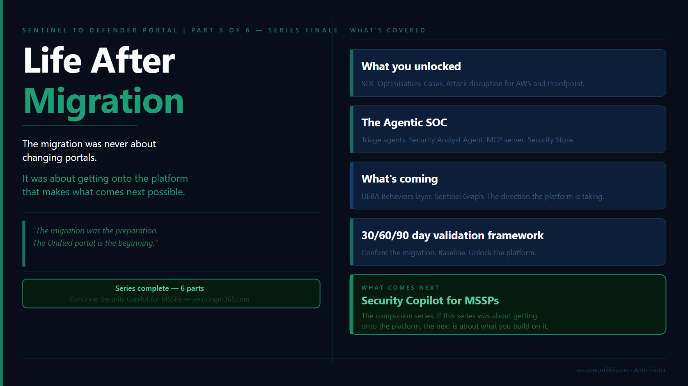

# Series: Sentinel to Defender Portal - Life After Migration 

  > Part 6 of 6

TLDR:

---

Completing the migration from Microsoft Sentinel in the Azure portal to the Microsoft Defender portal is not the end of the journey.

It is the point where the investment starts delivering value.

This migration was never just about moving incidents, workspaces, or connectors. It was about moving security operations onto a platform where SIEM, XDR, threat intelligence, automation, and AI-assisted investigation work together.

The organisations that get the most value from the Unified portal will not be the ones that simply complete the migration checklist.

They will be the ones that change how their security teams investigate, automate, and respond.

In this final article, we will look at:

- What capabilities become available after migration
- How the Unified portal changes security operations workflows
- Where Microsoft is taking the platform with agentic security operations
- The 2026 capabilities worth paying attention to
- How to validate the success of your migration using a practical 30/60/90 day approach
- What comes next with Security Copilot for MSSPs

---

## The Migration Is Complete. Now What?

If you have made it through this series and completed your migration, or you are close to finishing, there is a natural temptation to consider the work complete.

The checklist is done.

The incidents are appearing in the Defender portal.

The analysts have access.

The connectors have moved.

Time to move onto the next project.

This is where many organisations underestimate what they have actually achieved.

The migration was never really about changing portals.

The portal change was simply the visible part of a much larger shift in how Microsoft is building security operations.

The work covered throughout this series, from connector assessment and RBAC design through to automation remediation and MSSP sequencing, was the preparation.

It was the foundation required to move from a collection of separate security capabilities into a more unified operating model.

The Defender portal is where that investment starts paying forward.

A unified security operations platform changes the conversation.

Previously, security teams often had to think about where a signal originated:

- Was this a Sentinel incident?
	
- Was this a Defender alert?
	
- Which workspace contains the data?
	
- Which portal should the analyst investigate from?
	
- Does the analyst have access to the right resources?
	

The analyst was responsible for connecting the story together.

The direction Microsoft is taking removes much of that separation.

The future security operations experience is not built around individual products.

It is built around the investigation.

- The incident becomes the starting point.
	
- The entities become the context.
	
- The data becomes the evidence.
	
- The analyst becomes the decision maker.
	

This matters because security operations have always faced the same fundamental challenge.

There is more security data than analysts can manually process.

There are more alerts than teams can investigate.

There are more security tools than anyone wants to manage separately.

The answer is not simply adding more dashboards or creating more detections.

The answer is improving how humans interact with security data.

This is where the Defender portal, Security Copilot, automation, and agentic capabilities start to come together.

---

## A Migration Is Only Successful When Operations Change

A common mistake after a major platform migration is measuring success only by whether the technology moved successfully.

The question is usually:

> "Did we migrate everything?"

That is important.

It is not the final measure of success.

The better question is:

> "What can we do now that we could not do before?"

That is the difference between a migration project and a security transformation.

A successful migration should create opportunities for:

- Better visibility across SIEM and XDR data
	
- More consistent investigation workflows
	
- Improved detection coverage
	
- Stronger automation
	
- Better use of threat intelligence
	
- New ways for analysts to interact with security data
	

The Defender portal is not valuable because it provides another location to view incidents.

It is valuable because it brings together capabilities that previously existed across different experiences.

For security teams, this means spending less time stitching together information and more time making decisions.

For analysts, it means moving away from manually collecting evidence and towards understanding risk, validating findings, and determining the appropriate response.

For MSSPs, it creates the opportunity to move beyond managing individual customer environments and towards managing security outcomes across many environments.

---

## The Agentic SOC: Where Security Operations Are Heading

The biggest change after migration is not technical.

It is operational.

For many years, the SOC workflow looked something like this:

**Alert → Analyst → Investigation → Response**

The analyst was responsible for collecting context:

- What happened?
	
- Which user was involved?
	
- Which devices were affected?
	
- Is this connected to another alert?
	
- Has this behaviour happened before?
	

The platform provided signals.

The analyst built the story.

The security operations model is now moving towards:

**Signal → Enrichment → Investigation assistance → Analyst judgement → Response**

The platform provides more context.

Automation handles repeatable tasks.

AI assists with investigation.

The analyst focuses on judgement.

This does not reduce the value of skilled analysts.

It increases it.

The future analyst is not the person who can manually process the most alerts or write the longest queries.

The future analyst is the person who can understand the environment, ask better questions, investigate effectively, communicate clearly, and make decisions.

This is the same reason KQL remains important.

The role of KQL is changing, not disappearing.

Understanding the data remains critical.

Knowing how tables relate, how telemetry is generated, and how attacker behaviour appears in data is still a valuable skill.

However, the standout analysts will not be remembered because they memorised the most queries.

They will be remembered because they asked the right questions.

Security Copilot and agentic capabilities do not remove the need for security knowledge.

They amplify it.

The analysts who understand the environment will get the most value from these capabilities because they know what questions to ask and how to validate the answers.

---

## One More Migration Task: Update Your Agent Queries

Before considering the migration complete, there is one additional change worth addressing.

The `AIAgentsInfo` Advanced Hunting table is transitioning to the new `AgentsInfo` table.

The new schema provides a unified view supporting different agent types, including:

- Copilot Studio agents
	
- Microsoft Foundry agents
	
- Microsoft 365 Copilot agents
	
- Third-party agents
	
- Endpoint-discovered agents

If you have Advanced Hunting queries, custom detections, or reporting that references `AIAgentsInfo`, update those queries to use `AgentsInfo`.

The existing table remains available until 1 July 2026.

This is exactly the type of change that can create silent failures if left until the last minute.

A migration is not finished when the portal changes.

It is finished when your operational processes, detections, automation, and reporting have all moved with it.

---

## What You Unlock After Migration

Completing the migration gives you access to more than a new interface.

The Defender portal changes how security operations can work.

Some changes are immediately obvious. Others are less visible but have a much larger impact on how analysts investigate, detection engineers build coverage, and MSSPs operate at scale.

The important question is not:

> "What features did we gain?"

The better question is:

> "What operational problems can we now solve differently?"

---

### A Unified Investigation Experience Across SIEM and XDR

One of the biggest changes after migration is reducing the separation between SIEM and XDR investigations.

Historically, security teams often worked across multiple experiences:

- Microsoft Sentinel incidents in the Azure portal
    
- Defender incidents and alerts
    
- Threat intelligence platforms
    
- Separate investigation workflows
    
- Different access models
    

The analyst was responsible for bringing everything together.

They had to manually build the story.

The Unified portal changes that workflow.

The investigation starts with the incident and expands outward:

- Which identities are involved?
    
- Which devices are affected?
    
- What cloud resources are connected?
    
- Are there related activities elsewhere?
    
- What additional intelligence is available?
    

This is where capabilities such as Cases, entity enrichment, unified identity context, and Advanced Hunting improvements become important.

The value is not simply having more information.

The value is reducing the time required to understand what happened.

Every time an analyst leaves the investigation workflow, context can be lost.

The goal is keeping the investigation together.

---

### Improving Detection Coverage Through SOC Optimisation

One of the first capabilities I recommend reviewing after migration is SOC optimisation.

Migration often reveals something organisations do not expect.

Their detection coverage may not be as complete as they assumed.

Before migration, teams often measured maturity by the number of rules deployed:

"We have hundreds of detections."

The more useful question is:

> "Are we detecting the attacker behaviours that matter for our environment?"

SOC optimisation provides visibility into detection coverage across SIEM and XDR data sources, mapped against MITRE ATT&CK techniques.

This changes the conversation.

Instead of asking:

> "How many analytics rules do we have?"

teams can ask:

> "Which techniques can we detect, and where are our gaps?"

The first 30 days after migration are an ideal time to establish this baseline.

The migration process has already forced teams to review:

- Data sources
    
- Connectors
    
- Analytics rules
    
- Detection logic
    
- Automation dependencies
    

SOC optimisation turns that review into an improvement plan.

---

### Cases: Moving From Alerts To Investigations

Traditional security operations often treat incidents as individual objects.

Attackers do not operate that way.

A real attack may involve:

- Identity compromise
    
- Endpoint activity
    
- Cloud access
    
- Persistence mechanisms
    
- Data access
    

The result can be multiple alerts and incidents across different security products.

Cases provide a higher-level investigation layer above individual incidents.

This matters particularly for MSSPs and larger organisations.

The question changes from:

> "Which incident are we investigating?"

to:

> "What activity are we trying to understand?"

That distinction is important.

Experienced analysts do not investigate alerts.

They investigate activity.

Cases better represent how complex investigations actually happen.

They allow related incidents to be grouped into a broader investigative context, helping teams maintain continuity across analysts, shifts, and customer environments.

---

### Threat Intelligence Becomes Part of the Investigation

One of the biggest sources of investigation friction has always been context gathering.

An analyst finds:

- A suspicious IP address
    
- A questionable domain
    
- A file hash
    
- A user account behaving differently
    

The next step traditionally involves leaving the investigation and searching multiple external sources.

The Defender portal continues moving threat intelligence closer to the analyst workflow.

Entity pages provide additional context, including:

- Reputation information
    
- Threat intelligence relationships
    
- Attributed threat activity
    
- Additional analysis information
    

The benefit is not simply access to more data.

The benefit is reducing investigation friction.

Security analysts make better decisions when context is available at the moment they need it.

---

### Detection Engineering Moves Closer To Hunting

Another important operational improvement is bringing detection management closer to Advanced Hunting.

For many security engineers, Advanced Hunting is where investigations begin.

It is where they:

- Explore attacker behaviour
    
- Validate assumptions
    
- Develop queries
    
- Build detections
    
- Tune existing logic
    

Reducing the separation between hunting and detection management improves the feedback loop.

A mature detection lifecycle looks like this:

**Hunt → Discover behaviour → Create detection → Validate → Improve**

Good detections are not created once and forgotten.

They evolve.

The ability to manage analytics rules and custom detections closer to the hunting experience helps security teams move faster.

For analysts concerned about the future of KQL, this is an important point.

KQL is not becoming less relevant.

Its role is changing.

The value is not only knowing how to write a query.

The value is understanding the data well enough to ask better questions.

---

### Identity Context Becomes More Powerful

Identity remains one of the most important security signals.

Attackers continue targeting identities because identities provide access.

The unified IdentityInfo table brings together a broader set of identity attributes across Defender and Azure experiences.

For organisations with existing hunting queries or analytics rules, migration provides a natural opportunity to review existing detections.

Do not simply move existing content.

Ask:

> "Can we detect better now that we have more context?"

A platform migration should improve your security capability, not just preserve your previous state.

---

### Multi-Workspace Operations Become Easier

For organisations managing multiple workspaces, the Unified portal also reduces operational friction.

The `workspace()` operator is available directly within Defender Advanced Hunting, allowing analysts to query across workspaces without needing to return to the Log Analytics experience.

For MSSPs and large enterprises, this matters.

The challenge is rarely whether the data exists.

The challenge is whether analysts can efficiently access, understand, and act on that data.

Reducing unnecessary boundaries improves investigation speed.

---

## Recent 2026 Updates: What Matters During Migration

One interesting aspect of this migration period is that organisations are moving platforms while the platform itself continues evolving.

The capabilities arriving throughout 2026 reinforce the direction Microsoft is taking.

The Defender portal is becoming less focused on individual products and more focused on security outcomes.

---

### Unified RBAC and Row-Level Scoping

Unified RBAC and row-level scoping moving into general availability is significant for organisations that have struggled with access design.

This is especially relevant for:

- MSSPs
    
- Large enterprises
    
- Shared SOC environments
    
- Multiple security teams
    

Historically, organisations often solved access challenges by creating additional workspaces.

That works, but introduces complexity.

More granular access controls provide additional options:

- Shared security platforms
    
- Scoped analyst access
    
- Centralised detection engineering
    
- Distributed investigation teams
    

The important change is not simply another permission model.

It is greater flexibility in designing how security operations run.

---

### Agent 365 Connector

The Agent 365 connector is one of the clearest indicators of where security operations are heading.

Organisations are introducing more AI agents:

- Microsoft 365 Copilot agents
    
- Copilot Studio agents
    
- Custom business agents
    
- Third-party agents
    

Security teams need visibility into those agents in the same way they monitor:

- Users
    
- Devices
    
- Applications
    
- Cloud workloads
    

AI agents are becoming another identity and another workload.

The security question is changing.

Previously:

> "Did a user perform this action?"

Increasingly:

> "Did an agent perform this action, and was that behaviour expected?"

This is the next evolution of identity security.

---

### Expanding Data Sources

The Sentinel connector ecosystem continues expanding, giving organisations more options to bring security signals into the same investigation experience.

For teams that previously maintained custom ingestion pipelines, capabilities such as the Codeless Connector Framework provide additional flexibility.

The operational impact is simple:

More signals can be investigated in one place without every integration becoming a custom engineering project.

---

### Threat Intelligence Sharing With TAXII Export

Threat intelligence is increasingly collaborative.

The TAXII Export connector enables organisations to share curated intelligence using industry standards.

For organisations involved in:

- Government
    
- Critical infrastructure
    
- Financial services
    
- Industry sharing communities
    

this provides stronger opportunities for collective defence.

Security teams are no longer only protecting their own environment.

They are contributing to a broader intelligence ecosystem.

---

### Microsoft Teams Hunting Data

Collaboration platforms are becoming a larger security surface.

Microsoft Teams is now part of that conversation.

The introduction of Teams-related hunting tables expands visibility into activity that previously required separate investigation paths.

For organisations where Teams is central to communication, this provides additional opportunities to investigate:

- Suspicious collaboration activity
    
- Message-based security events
    
- Post-delivery security activity
    

The broader trend is clear.

Security boundaries are expanding.

The investigation platform has to expand with them.

---

## The Agentic SOC: Where The Platform Is Going

The migration gives you access to a better operational environment.

What it also gives you is a platform that is being built for a different model of security operations.

One where AI agents assist with investigation, automation handles repeatable processes, and analysts spend more time applying judgement.

This is not a future concept.

It is already becoming part of the Microsoft security experience.

The important conversation is not:

> "Will AI replace security analysts?"

The better question is:

> "What work should analysts no longer have to do manually?"

A mature SOC has always been about prioritisation.

The challenge has never been a lack of data.

It has been turning large amounts of security data into decisions.

This is where agentic capabilities start to change the operating model.

---

### Security Copilot Triage Agents

One of the first areas where this shift is visible is alert triage.

For many SOC teams, a significant amount of analyst time is spent reviewing alerts that ultimately do not require action.

The challenge is not identifying that an alert exists.

The challenge is understanding:

- Is this a real threat?
    
- What evidence supports that conclusion?
    
- What is the potential impact?
    
- What should happen next?
    

Security Copilot triage capabilities are designed to assist with this process.

Rather than simply providing a summary, the goal is to provide reasoning that analysts can review.

This distinction matters.

Security teams should not be looking for AI that replaces decision-making.

They should be looking for AI that improves decision-making.

The best analysts will still validate findings, challenge assumptions, and understand the context of their environment.

The difference is they spend less time collecting information and more time applying expertise.

---

### The Security Analyst Agent

The next evolution moves beyond alert triage into investigation assistance.

A triage agent helps answer:

> "Is this alert worth investigating?"

A security analyst agent helps answer:

> "What actually happened?"

This is a significant change.

Complex investigations often require analysts to:

- Review multiple alerts
    
- Correlate identities and devices
    
- Understand attack timelines
    
- Analyse behaviour across different data sources
    
- Build an incident narrative
    

These are valuable activities, but they are also time consuming.

The Security Analyst Agent represents a move towards AI-assisted investigation, where the platform can help gather evidence, identify relationships, and provide an investigation summary.

The analyst remains responsible for the final decision.

The value comes from reducing the time required to reach that decision.

---

### Sentinel MCP: Changing How We Interact With Security Data

One of the more interesting developments in this space is the move towards natural language interaction with security data.

Traditionally, investigating security data required knowing:

- Which table contains the information
    
- Which fields are available
    
- How the schema is structured
    
- How to write the query
    

Those skills remain valuable.

However, they also create a barrier.

A security professional may understand the investigation question without knowing the exact query required to answer it.

The Sentinel MCP server represents a shift towards allowing AI agents and Security Copilot to interact with security data through a controlled, identity-aware interface.

The goal is not to remove the need for understanding security data.

The goal is reducing the gap between:

"I know what I want to investigate"

and:

"I know exactly how to query it."

This is the same shift we are seeing across security operations.

The technology becomes more accessible.

The analyst still needs curiosity, judgement, and understanding.

---

### The Security Store And The Agent Ecosystem

The Security Store represents another important change.

Historically, security teams built many capabilities themselves:

- Detection logic
    
- Automation workflows
    
- Investigation processes
    
- Reporting
    
- Enrichment
    

The future model includes a broader ecosystem of specialised agents.

Different security problems may have specialised AI capabilities:

- Configuration assessment
    
- Data security investigation
    
- Attack path analysis
    
- Threat investigation
    
- Alert prioritisation
    

This creates an interesting shift for security teams.

The question becomes less:

> "How do we build everything ourselves?"

and more:

> "Which capabilities should we build, and which should we consume?"

The same principle applies as with any security technology.

The presence of a capability does not automatically create security value.

It still needs:

- Appropriate governance
    
- Testing
    
- Ownership
    
- Operational processes
    

AI agents are becoming part of the security stack.

They need the same level of consideration as any other security control.

---

## The Analyst Skillset Is Changing

This is where the migration story connects back to the broader security industry.

Security teams are not moving towards a world where technical skills matter less.

They are moving towards a world where different skills become more valuable.

The analyst who succeeds in this environment will understand:

**The platform**

Know where the signals come from.

Understand what the tools can and cannot tell you.

**The data**

Understand telemetry, relationships, and limitations.

**Investigation**

Know how to move from a signal to a conclusion.

**Questions**

Know what to ask, whether that is through KQL, Security Copilot, or another interface.

**Communication**

Explain risk, impact, and decisions clearly.

AI can accelerate each of these areas.
It cannot replace the judgement behind them.
The future SOC is not humans versus AI.
It is analysts using AI effectively.

---

## What To Watch Next

Several capabilities currently in preview show the direction Microsoft is taking the platform.

They are worth understanding, even if organisations are not ready to operationalise them immediately.

### UEBA Behaviours Layer

The UEBA Behaviours layer represents a move towards transforming raw security events into behavioural context.

Instead of requiring analysts to interpret thousands of individual events, the platform can begin presenting higher-level behaviours.

The important distinction is that behaviours describe activity.

They do not automatically decide whether something is malicious.

That distinction matters.

Security teams still need investigation and judgement.

---

### Sentinel Graph

Sentinel Graph represents another shift in investigation thinking.

Traditional security investigations often begin with alerts and build outward.

Graph-based investigation starts with relationships:

- Users
    
- Devices
    
- Applications
    
- Activities
    
- Resources
    

The value is helping analysts understand connections that may not be obvious when looking at individual events.

This aligns with how attackers actually operate.

Attacks are not isolated events.

They are chains of related activity.

---

### Unified Security Summary

Reporting security outcomes is an ongoing challenge.

Security teams need to communicate not only what happened, but the value delivered by security operations.

Unified security summaries aim to simplify this process by providing a more accessible way to communicate security operations outcomes.

For SOC leaders and MSSPs, this type of capability is important because security effectiveness needs to be demonstrated, not assumed.

---

The direction is consistent across all of these capabilities.

Microsoft is moving from a security platform focused on collecting signals towards a platform that helps explain what those signals mean.

The goal is not replacing analysts.

The goal is allowing analysts to operate at a higher level.

The migration gets you onto the platform.

The next step is learning how to operate differently on it.

---

## The Post-Migration Validation Framework

The migration delivered you to the Unified portal.

Whether it delivered the outcomes you expected is a separate question.

A successful migration is not measured by a completed checklist.

It is measured by evidence.

After the technical migration is complete, the next 90 days are about validating that the platform is operating as expected, identifying improvements, and starting to take advantage of what the Unified portal makes possible.

The following framework provides a practical way to approach the first three months after migration.

---

### Days 1 to 30: Confirm The Migration Is Stable

The first 30 days are about stability.

The goal is not optimisation yet.

The goal is making sure nothing important silently stopped working during the transition.

The most common post-migration issues are rarely obvious failures.

They are silent failures.

Things like:

- Automation rules that no longer match because incident properties changed
    
- Playbooks that no longer trigger
    
- Duplicate incidents caused by overlapping configurations
    
- RBAC issues discovered when analysts attempt to perform their daily tasks
    
- Detection rules that migrated successfully but no longer provide the expected outcome
    

A successful migration can still create operational gaps if these areas are not validated.

Perform deliberate checks rather than waiting for someone to discover an issue during an investigation.

For each automation rule, confirm:

- Is it still triggering?
    
- Is it performing the expected action?
    
- Is the output appearing where analysts expect it?
    

For each playbook, confirm:

- Does the trigger still work?
    
- Are permissions still valid?
    
- Are downstream actions completing successfully?
    

The absence of an error does not always mean something is working.

A playbook that never triggers may look healthy because nothing failed.

The first 30 days should be about proving that the migration preserved operational capability.

---

### Days 31 to 60: Baseline And Optimise

Once stability is confirmed, the focus should move from validation to improvement.

By day 60, you should have clear answers to three questions.

## Has incident activity changed?

Migration can change visibility.

You may see:

- Different incident grouping
    
- Different alert prioritisation
    
- New data sources contributing to investigations
    
- Changes in automation behaviour
    

Understanding these changes helps distinguish between:

"Security posture changed"

and:

"Our visibility improved."

---

### Are there detection coverage gaps?

This is where SOC optimisation becomes valuable.

The migration provides an opportunity to review detection capability from a broader perspective.

Do not only ask:

> "Did our existing detections move?"

Ask:

> "Are we detecting the behaviours that matter?"

Review:

- MITRE ATT&CK coverage
    
- Detection gaps
    
- Data source availability
    
- Analytics rule effectiveness
    
- Custom detection opportunities
    

Migration should not be about preserving the past.

It should improve the future state.

---

### Are analysts operating effectively?

Technology changes workflows.

Even when the platform capabilities are better, analysts may need time to adjust.

Review:

- Investigation workflows
    
- Hunting processes
    
- Access requirements
    
- Training gaps
    
- Operational friction
    

A technically successful migration can still fail if the people using the platform struggle with the new experience.

The goal is not simply giving analysts access.

The goal is enabling analysts to work effectively.

---

### Days 61 to 90: Unlock The Platform

The final 30 days are about moving beyond migration.

This is where organisations start using the capabilities that were not available before.

Review and enable capabilities relevant to your environment:

**SOC Optimisation**

Use your detection coverage baseline to identify improvement opportunities.

**Security Store**

Review available agents and determine where specialised capabilities may provide value.

**Advanced Hunting Improvements**

Evaluate new data sources, including Teams-related hunting capabilities where relevant.

**Security Copilot**

If enabled, begin evaluating where AI-assisted investigation can improve analyst workflows.

The goal is not enabling every capability immediately.

The goal is understanding where the platform can improve your operating model.

---

### The Quarterly Review: Keeping The Platform Healthy

The first 90 days establish the new operating model.

They should not be the only time the environment is reviewed.

A mature security operation should continue reviewing:

- Detection coverage
    
- Automation effectiveness
    
- Incident trends
    
- Analyst workflows
    
- Data quality
    
- Access models
    
- New platform capabilities
    

Security platforms continue evolving.

The operating model needs to evolve with them.

The Unified portal is not something you migrate to once and leave unchanged.

It is a platform that requires continuous improvement.

---

# What Comes Next: Security Copilot For MSSPs

This series started with a simple question:

> How do we move from Microsoft Sentinel in the Azure portal to the Defender portal successfully?

The answer was never just about migration steps.

The migration was about preparing security operations for what comes next.

The Unified portal provides the foundation.

The next challenge is understanding how to operate on that foundation.

This is where Security Copilot becomes increasingly important.

The capabilities discussed throughout this article:

- Agentic triage
    
- Security Analyst Agent
    
- Sentinel MCP
    
- Security Store capabilities
    
- AI-assisted investigation
    

all point towards the same direction.

Security operations are becoming more intelligent, more automated, and more focused on analyst decision-making.

For MSSPs, this creates another layer of opportunity and complexity.

Running Security Copilot across multiple customer environments introduces new considerations:

- Architecture
    
- Provisioning
    
- Governance
    
- Data boundaries
    
- Operational processes
    
- Customer outcomes
    

The next series, **Security Copilot for MSSPs**, explores exactly that.

If this series was about getting onto the platform, the next series is about what you build on it.

> *The migration was the preparation. The Unified portal is the beginning.*

---

*Series: Sentinel to Defender Portal: A Practitioner's Migration Guide*

**Part 6: Life After Migration** - Series complete

  
