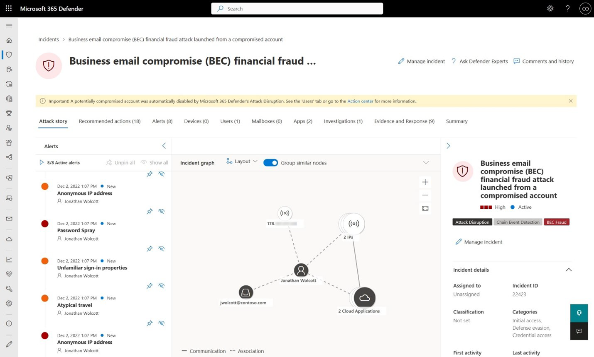
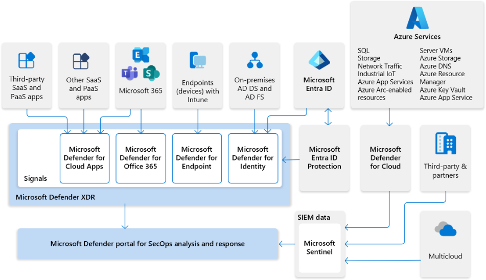
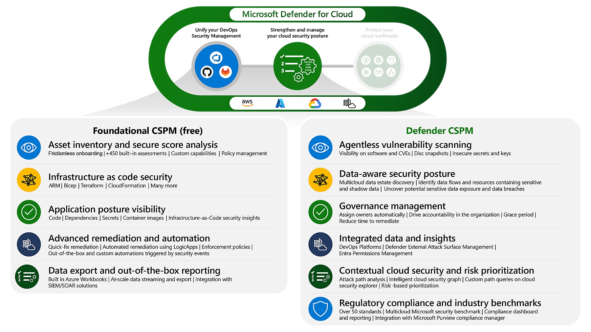
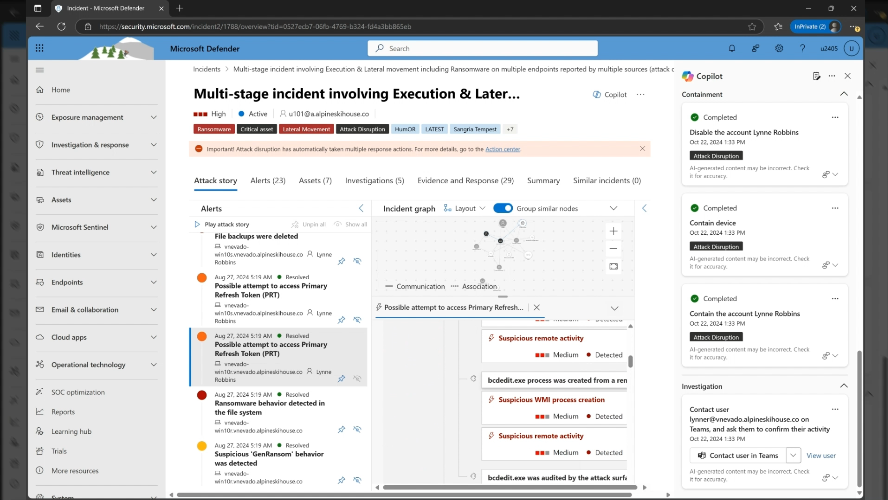
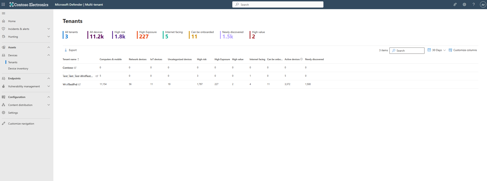

# The Future of SOC, with Microsoft

At the recent Microsoft Perth event, I was thrilled to learn about the latest advancements in cybersecurity, particularly the Unified SOC portal within Microsoft Defender XDR. The discussions were incredibly insightful, and it’s clear that this new approach offers significant advantages over the traditional methods we’ve been using via Azure Subscription. Reflecting on the event, I can’t help but feel a surge of excitement about the Unified SOC portal.

As someone who has juggled multiple security tools and dashboards in a past life, the promise of a centralized solution is incredibly appealing, especially given the high pace and stressful environment in which a SOC can operate. 

## Centralized Threat Management

The benefits of centralized threat management are immediately apparent. The Unified SOC portal consolidates all threat signals and data into a single interface. No more juggling multiple tools and dashboards. Everything we need is right there, making it so much easier to monitor and manage security threats. This centralization could save us countless hours and significantly reduce the risk of missing critical alerts.

Source: 
[What is Microsoft Defender XDR? - Microsoft Defender XDR | Microsoft Learn](https://learn.microsoft.com/en-us/defender-xdr/microsoft-365-defender)
[Incidents and alerts in the Microsoft Defender portal - Microsoft Defender XDR | Microsoft Learn](https://learn.microsoft.com/en-us/defender-xdr/incidents-overview)

## Enhanced Incident Response

The enhanced incident response capabilities is another notable improvement. The portal provides a unified incident queue that aggregates related alerts and security signals into comprehensive incidents. This means we can understand the full scope of an attack and prioritize our response efforts more effectively. The ability to see the bigger picture and act quickly is crucial in our line of work.

Source: 
[Alert correlation and incident merging in the Microsoft Defender portal - Microsoft Defender XDR | Microsoft Learn](https://learn.microsoft.com/en-us/defender-xdr/alerts-incidents-correlation)

## Automatic Threat Disruption

One feature that really stands out to me is the automatic threat disruption. Defender XDR can contain ongoing attacks automatically, giving us precious time to respond. This proactive approach could be the difference between a minor incident and a major breach. It’s like having an extra layer of defense that works tirelessly in the background, providing us with a safety net. 

Source: 
[Automatic attack disruption in Microsoft Defender XDR - Microsoft Defender XDR | Microsoft Learn](https://learn.microsoft.com/en-us/defender-xdr/automatic-attack-disruption)

## Seamless Integration with Microsoft Sentinel

For our engineers, the seamless integration with Microsoft Sentinel is a dream come true. Combining the capabilities of both products into a unified security platform enhances threat detection, investigation, hunting, and response. This integration allows us to leverage the extensive data correlation capabilities of Sentinel, providing a more comprehensive analysis of security data at scale.

The following illustration shows how Microsoft's XDR solution seamlessly integrates with Microsoft Sentinel with Microsoft's unified SecOps platform.

In this diagram:

- Insights from signals across your entire organization feed into Microsoft Defender XDR and Microsoft Defender for Cloud.
- Microsoft Sentinel provides support for multi-cloud environments and integrates with third-party apps and partners.
- Microsoft Sentinel data is ingested together with your organization's data into the Microsoft Defender portal.
- SecOps teams can then analyze and respond to threats identified by Microsoft Sentinel and Microsoft Defender XDR in the Microsoft Defender portal.

Source: 
[Microsoft Defender XDR integration with Microsoft Sentinel | Microsoft Learn](https://learn.microsoft.com/en-us/azure/sentinel/microsoft-365-defender-sentinel-integration?tabs=defender-portal)

## Comprehensive Security Posture Management

The comprehensive security posture management offered by the portal is another significant advantage. It allows us to proactively visualize, assess, remediate, and monitor our organization’s security posture. This helps in identifying and mitigating security risks before they can be exploited. The Security Exposure Management feature continuously discovers assets and data, giving us a comprehensive view of our security landscape and helping us reduce attack surfaces.

Source: 
[Microsoft Defender Cloud Security Posture Management | Microsoft Security](https://www.microsoft.com/en-au/security/business/cloud-security/microsoft-defender-cloud-security-posture-management)

## Unified Configuration and Management

Finally, the unified configuration and management capabilities are incredibly powerful. We can manage both pre-breach and post-breach security across on-premises and multi-cloud assets from a single portal. This unified approach simplifies security management and ensures consistent protection across all environments. The automation and orchestration capabilities streamline our security operations, enhancing our overall efficiency.

## Embedded Security Copilot

And if all of the above isn't enough, To further elevate analysts' skills and efficiency, Security Copilot features are seamlessly integrated into the unified SOC platform and accessible directly within the Defender portal. Leveraging AI, Security Copilot assists analysts with intricate and time-consuming daily tasks, such as comprehensive incident investigation and response. It provides clearly articulated attack narratives, step-by-step actionable remediation guidance, summarized incident activity reports, natural language KQL hunting, and expert code analysis. This integration optimizes SOC efficiency across Microsoft Sentinel and Defender XDR data.

Source: 
[Microsoft Security Copilot | Microsoft Security](https://www.microsoft.com/en-au/security/business/ai-machine-learning/microsoft-security-copilot)

## Benefits for MSSPs

For MSSPs, the benefits are equally compelling. The multi-tenancy support allows MSSPs to manage multiple customer environments from a single interface, simplifying operations and improving efficiency. The platform’s scalability ensures it can grow with the business needs of MSSPs, accommodating a growing customer base and evolving security landscapes.

The enhanced detection and response capabilities provide a comprehensive view of multistage attacks, improving detection and response times. Out-of-the-box enrichments, such as device and user information from Microsoft Defenders, simplify the investigation process, providing additional context and insights.

The proactive threat hunting capabilities allow MSSPs to search for threats across multiple tenants, including SIEM and XDR data, without the need to ingest XDR data. This enhances the ability to detect and respond to threats across different customer environments.

Source: 
[Devices in multitenant management - Microsoft Defender XDR | Microsoft Learn](https://learn.microsoft.com/en-us/defender-xdr/mto-tenant-devices)

## Conclusion

So, why stick with the traditional methods via Azure Subscription when the Unified SOC portal offers so much more? It’s time to embrace this new approach and take our security operations to the next level. The benefits are clear, and the potential for improved efficiency and security is too significant to ignore.

Let’s make the switch and equip our SOC team, engineers, and MSSPs with the best tools available. The Unified SOC portal within Microsoft Defender XDR is exactly that.