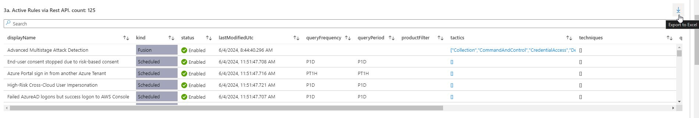

# Streamlining Project Documentation with ‘Workspace Usage Report’ Workbook

---
## The Challenge

In the fast-paced world of security architecture, managing and documenting active Analytics Rules in Microsoft Sentinel can be a daunting task. The need for accurate, up-to-date documentation is critical for maintaining robust security operations. However, the manual process of tracking and exporting these rules often proves to be time-consuming and prone to errors.

## My Solution

The ‘**Workspace Usage Report**’ workbook within Microsoft Sentinel. 

This powerful tool has revolutionized my approach to project documentation, particularly when it comes to generating an exportable list of active Analytics Rules via Rest API. By leveraging this workbook, I have been able to streamline the documentation process, ensuring accuracy and efficiency.

### How-To

For those looking to harness the power of the ‘Workspace Usage Report’ workbook, here are the steps to follow:

1. **Install the Workbook**: Navigate to the Microsoft Sentinel Workspace and install the ‘Workspace Usage Report’ workbook.

2. **Access the Template**: Under Workbooks, select Template > ‘Workspace Usage Report’ and view the template.

3. **Configure Settings**: Select the Subscription, Workspace, and Time Range that align with your requirements.

4. **Set Regular Checks**: Choose the ‘Regular Checks (D/W/M)’ option and select the ‘Weekly’ grouping.

5. **Locate Active Rules**: Scroll to ‘3a. Active Rules via Rest API’ under the Rules section.

6. **Export Data**: Click the Export to Excel button on the far right to download the list of active rules.

---

Implementing the ‘Workspace Usage Report’ workbook has been a massive help managing my security operations and documentation. Here are some key takeaways:

- **Efficiency**: The workbook significantly reduces the time required to document active Analytics Rules, allowing for more focus on critical security tasks.
- **Accuracy**: Automated data export ensures that the documentation is precise and up-to-date, minimizing the risk of errors.
- **Ease of Use**: The intuitive interface and straightforward steps make it accessible even for those new to Microsoft Sentinel.
- **Scalability**: This solution is scalable, making it suitable for both small and large environments.

For anyone navigating the complexities of Microsoft Sentinel, I highly recommend exploring the ‘Workspace Usage Report’ workbook. It’s not just a time-saver; it’s a transformative tool that enhances the precision and ease of managing your security operations.