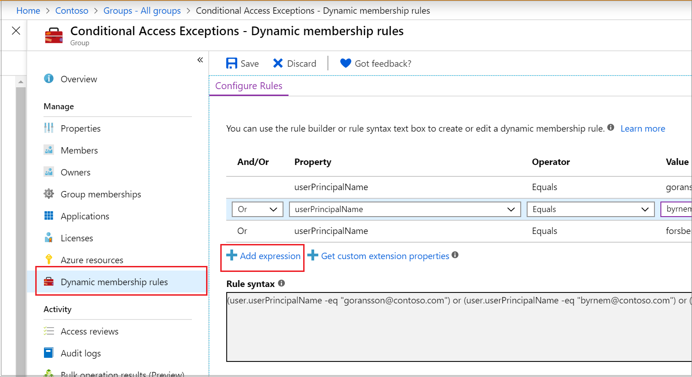

# Dynamic Intune Scope Tagging through Entra ID Groups

**Scope tags in Intune are not just another checkbox.**

They are the difference between clean delegation and messy “everyone sees everything.” 

Now the kicker is that when you connect them to dynamic groups in Entra ID, a single attribute change can ripple across your environment (for good, and for bad). Users, devices, and policies align automatically without the manual grind.

To make this tangible, let’s walk through a few real-world scenes where dynamic scope tagging turns confusion into clarity.

### The Regional IT Team

You’ve got a Perth (I couldn't think of anything else) IT crew who should only touch Perth devices. Right now, they’re wading through a global Intune console, hoping not to misclick.

**Engineer’s view:**

- Create a dynamic group in Entra ID:
    
    ```text
    (user.officeLocation -eq "Perth")
    ```
    
- Assign a scope tag called `Perth-IT`.

**Exec’s view:**

- Delegated visibility reduces risk of global misconfiguration.
	
- Regional teams operate autonomously, but within guardrails.
	
- Audit logs show exactly which team touched which scope.
	

### The Finance Department

Finance needs stricter endpoint policies (ASR rules, Defender settings). Contractors need lighter touch.

**Engineer’s view:**

- Dynamic group:
    
    ```text
    (user.department -eq "Finance")
    ```
    
- Scope tag: `Finance-Devices`.
	
- Apply hardened endpoint setting catalog profiles only to that tag.
	

**Exec’s view:**

- Adaptive enforcement: policies follow business logic, not manual tagging.
	
- HR updates a user’s department → Intune adapts instantly.
	
- Compliance reporting aligns with business units.
	

### The Contractor Onboarding

Contractors arrive, work for 3 months, then leave. Historically, IT scrambles to isolate them.

**Engineer’s view:**

- Use `extensionAttribute1 -eq "Contractor"` in Entra ID (or however you organise it in your tenant).
	
- Devices scoped with `Contractor-Tag`.
	
- Policies: limited access, elevated monitoring, stricter non-compliance with retire/locking actions applied.
	


**Exec’s view:**

- Contractors isolated without manual intervention.
	
- Reduced insider risk.
	
- Faster response to churn.
	

### Emergency Response

Zero-day exploit hits. You need to push mitigations fast, but not globally.

**Engineer’s view:**

- Create a pilot dynamic group (e.g., `user.jobTitle -eq "Field Engineer"`).
	
- Scope tag: `Pilot-Mitigation`.
	
- Apply emergency ASR/Settings Catalog rules only to that tag.
	

**Exec’s view:**

- Controlled blast radius.
	
- Faster roll out without risking productivity.
	
- Clear audit trail for regulators.
	

## Under the Hood: The Technical Mechanics

When you peel back the layers of dynamic scope tagging, the magic isn’t mystical at all. It’s a clean interplay of Entra ID attributes, dynamic group logic, and Intune’s RBAC model working in concert.

- **Dynamic groups:** Entra ID calculates membership automatically.
	
- **Scope tags:** Intune objects (policies, profiles, scripts) tagged to match groups.
	
- **RBAC:** Admin roles tied to scope tags, ensuring least-privilege visibility.
	

Source: [Use role-based access control (RBAC) and scope tags for distributed IT - Microsoft Intune | Microsoft Learn](https://learn.microsoft.com/en-us/intune/intune-service/fundamentals/scope-tags)

### How to Build a Dynamic Security Group in Entra ID

1. **Go to Microsoft Entra ID → Groups → New Group**
	
	- Choose **Security** as the group type
		
	- Set **Membership type** to **Dynamic User**
	
2. **Click “Add dynamic query”**
	
	- Use the rule builder or write directly in the Rule Syntax box
		
	- Example:
	
```text
(user.userPrincipalName -eq "goransson@contoso.com") or 
(user.userPrincipalName -eq "byrnem@contoso.com") or 
(user.userPrincipalName -eq "forsberg@contoso.com")
```



3. **Validate the rule**
	
	- Use the “Validate Rules” button to preview matching users
		
4. **Save and create the group**
	
	- The group will auto-populate based on the rule
		
	- You can now use this group for Conditional Access, Intune scope tagging, or policy targeting

Source: [Manage Rules for Dynamic Membership Groups in Microsoft Entra ID - Microsoft Entra ID | Microsoft Learn](https://learn.microsoft.com/en-us/entra/identity/users/groups-dynamic-membership)

## One Role, One Change, Many Outcomes

In many organisations, the Intune administrator isn’t just the Intune administrator. They’re also the **User and Group Administrator**, the **Conditional Access gatekeeper**, and sometimes even the **Exchange Online troubleshooter**. One person, many hats. 

It’s *efficient*, but it also creates risk: 

The same admin who changes a user’s department in Entra ID might also be the one manually re‑tagging devices and reassigning policies in Intune... a process that’s slow, error‑prone, and dangerously reliant on human judgement.

Dynamic scope tagging changes that equation. Instead of juggling multiple consoles and hoping nothing gets missed, you let **a single attribute change cascade across the environment**:

- Update a user’s `department` → they fall into the right dynamic group → they inherit the correct scope tags → policies apply automatically.
	
- Flip a contractor flag on a user → it joins the contractor group → scope tags adjust → endpoint setting catalog profiles tighten instantly.
	

This model addresses both the **security concern** and the **operational reality**:

- **Security concern:** When one admin wears all the hats, the blast radius of a mistake is huge. Dynamic scope tagging contains that risk by enforcing visibility boundaries and automating policy alignment.
	
- **Operational reality:** The “one role fits all” admin doesn’t have time to manually retag every device. With dynamic groups, they only need to update a single attribute in Entra ID, and Intune does the rest.
	

For engineers, this means fewer manual steps and less chance of misconfiguration. For CISOs and CIOs, it means a governance model that’s auditable, adaptive, and resilient even in lean IT shops. And for the multi‑hat admin, it’s a relief: one change at the identity layer, many outcomes across the endpoint estate.

## Why This Matters

It’s tempting to see scope tags as just another Intune checkbox, but in practice they’re the connective tissue between technical enforcement and business reality. Here’s why they deserve your attention:

- **Consistency beats chaos (Engineer’s lens):** Manual tagging is error‑prone. Dynamic rules ensure every device and policy is scoped correctly, even as users move departments or contractors churn. Less firefighting, more predictable automation.
	
- **Least privilege in action (Security architect’s lens):** Scope tags enforce visibility boundaries. Regional admins can’t accidentally apply global policies, and finance admins don’t see HR devices. It’s Zero Trust applied to management itself.
	
- **Audit trails regulators love (CISO’s lens):** Every scope tag assignment and RBAC action is logged. You can prove who touched what, when, and why. That’s gold for compliance frameworks and incident investigations.
	
- **Agility at business speed (CIO/CTO’s lens):** Mergers, restructures, new offices — all handled by updating a single Entra attribute. Intune adapts instantly, without weeks of re-tagging. IT keeps pace with the business instead of lagging behind.
	
- **Reduced blast radius (Ops lens):** Mistakes happen. With scope tags, their impact is contained. A misconfigured policy in Perth doesn’t ripple across Sydney or Singapore.
	

Source: [Configure Microsoft Intune for Zero Trust: Secure tenants - Microsoft Intune | Microsoft Learn](https://learn.microsoft.com/en-us/intune/intune-service/protect/zero-trust-secure-tenant)

Dynamic scope tagging isn’t just a *technical trick*. 

It’s a way to align endpoint management with the way your organisation actually operates while reducing risk, improving compliance, and giving IT the agility to respond to change without breaking stride.

## High-level step-by-step implementation


1. **Choose authoritative attributes:**  
		
    Decide which Entra ID attributes will drive scoping (e.g., department, officeLocation, custom security attributes like Region=APAC or WorkerType=Contractor). 
    
    Ensure they’re owned by HR/identity ops and updated via a controlled process (if you aren't here yet, no time like the present).
    
2. **Model business-to-attribute mapping:**  
		
    Define the translation from business constructs to attributes and names.
    
    - **Example mappings:** Finance → department=Finance; Perth IT → officeLocation=Perth; Contractors → extensionAttribute1=Contractor.
	    
    - **Naming conventions:** Use predictable, human-readable values (e.g., “Perth”, not “PRT-01”, don't complicate things).
	    
3. **Create dynamic user groups in Entra ID:**  
		
    Build rules that capture your business logic.
    
    - **Finance:**
        
        ```
        (user.department -eq "Finance") -and (user.accountEnabled -eq true)
        ```
	
	That (user.accountEnabled will just keep things clean, no use including Disabled accounts)
	
    - **Perth IT:**
        
        ```
        (user.officeLocation -eq "Perth")
        ```
        
    - **Contractors:**
        
        ```
        (user.extensionAttribute1 -eq "Contractor")
        ```
        
4. **Create dynamic device groups (if device-led scoping is required):** 
		
    Use device attributes for shared/kiosk scenarios or immutable tags.
	    
    - **Device physical IDs or extensions:**
        
        ```
        (device.devicePhysicalIds -any _ -contains "[OrderID]:FINANCE")
        ```
        
    - Populate via provisioning tools, Autopilot, or a post-enrolment script.
		
	
5. **Define Intune scope tags that mirror groups:**  
		
    Create scope tags that map one-to-one with your groups (e.g., ST-Finance, ST-Perth, ST-Contractor). Keep tags narrowly focused to avoid overlap and confusion. 
	
	And please document your changes!
    
6. **Assign scope tags to Intune objects:**  
		
    Tag endpoint setting catalog profiles, configuration profiles, scripts, remediation packages, and apps with the matching scope tag.
    
    - **Tip:** Start with high-signal objects (security baselines, ASR, firewall) before expanding to productivity settings.
	    
7. **Align RBAC roles to scope tags:**  
		
    Create admin roles (Help Desk, Policy Admin, App Admin) and assign them with corresponding scope tags.
    
    - **Outcome:** Perth admins only see Perth-tagged objects; Finance admins only see Finance-tagged objects.
	    
8. **Pilot and validate the cascade:**
	    
    - **Create a pilot cohort:** A small subset per group (Finance, Perth, Contractors).
	    
    - **Validate outcomes:** Membership → scope tags → policy visibility → policy application.
	    
    - **Check guardrails:** Ensure admins cannot see or modify objects outside their tag.
	    
9. **Instrument monitoring and auditing:**
	    
    - **Dashboards:** Track dynamic group sizes, scope tag coverage, policy assignment success.
	    
    - **Logs:** Capture Graph writes, Intune changes, role assignments; alert on unexpected group spikes or tag drift.
	    
    - **Reviews:** Quarterly access reviews for RBAC + tag alignment.
	    
10. **Rollout and operationalise:**
	    
    - **Phased expansion:** Extend tags to additional policies/apps after pilot success.
	    
    - **Playbooks:** Document “one change, many outcomes” steps for HR/IT (attribute update → automatic cascade).
	    
    - **Governance:** Change advisory includes attribute/schema updates, not manual Intune edits.
	    
11. **Evolve with business change:**
	    
    - **M&A or restructures:** Introduce new attributes, dynamic rules, and tags; retire old ones cleanly.
	    
    - **Contractor churn:** Attribute-driven join/leave; devices/visibility adapt automatically.
	    
    - **Refine:** Merge overlapping groups, simplify tags, and remove exceptions over time.
	    
	

> The north star: one attribute change at the identity layer should reliably trigger group membership updates, scope tag alignment, and policy visibility/application, without manual Intune re-tagging. This reduces error, shrinks blast radius, and keeps IT in step with the business.

---

Dynamic scope tagging is more than a clever configuration. It brings structure to Intune, connects endpoint management directly to business logic, and gives IT teams the power to act without losing control.

For engineers, it delivers automation and consistency.  

For CISOs and CIOs, it provides clarity, compliance, and the agility to adapt quickly.  

For the wider organisation, it means fewer errors and faster reactions when change is needed.

In the end, dynamic scope tagging is about working smarter, not harder.

**Time is money, and automation pays dividends.**