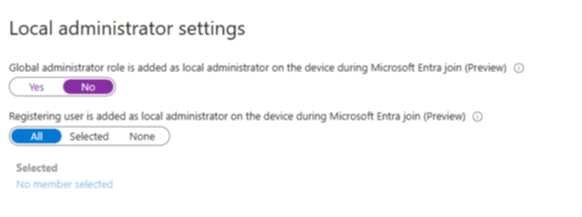
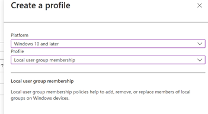
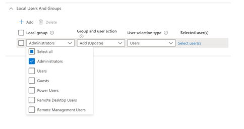

# Lessons Learned: Diagnosing Local Admin Priority Conflicts

By *default*, when a device undergoes a Microsoft Entra ID join, the **registering** user is automatically added to the local Administrators group (“Registering user is added as local administrator”).

In a recent dive into an unexpected issue (and obfuscating the details), the *helpdesk* relied on this setting to elevate help-desk and IT staff during Entra ID join. However, enrolled devices kept landing with Standard user rights, preventing the ability to assist. Though they were not able to determine the root cause, they knew this was not the standard operating procedure.

After a thorough investigation, It was discovered that a legacy Windows Autopilot profile—configured with **User Account Type: Standard**—was being applied during OOBE and silently overriding the Entra ID policy. This blog post unpacks that, in the style of a Lesson Learned.

## Understanding Entra ID Local Administrator Settings

Under **Devices → Device settings** in the Entra portal, two critical policies control local admin assignment:

- **Registering User Is Added as Local Administrator**  
    This was set to (“All”). When set, the enrolling user becomes a local admin during Entra join.  
    _This was the “expected result.”_
    
- **Global Admin Role Inclusion**  
    Governs whether Global Administrators auto-join the local Administrators group.
	

**Now my recommendations on this:**

- Disable Global Admin inclusion (set to **No**) to prevent broad elevation and lateral movement.
	
- Keep “Registering user” enabled only if you trust every enrolling user—or scope it to a specific group via “Selected” for granular control. 
	

!!! note

    This will only really take affect if you are not using Autopilot or Bulk Enrolment. Keep reading...

## Diagnosing the Unexpected Standard Outcome

When devices enrolled without admin rights, my diagnostic steps were:

1. **Verify Entra Settings**  
    Confirm “Registering user is added as local administrator” was still enabled.
    
2. **List All Autopilot Profiles**  
    In Intune’s Autopilot blade, export profiles, noting each one’s **User Account Type** and priority.
    
3. **Reduce Profile Scopes**  
    Identify any legacy Standard profile assigned at a higher priority and remove or adjust it.
    
4. **Deploy to Lab Endpoint**  
    Test on a lab device to confirm which profile applies during OOBE and verify adjustments.
	

## Autopilot Profile Precedence 

It wasn’t until we captured and reviewed the Autopilot diagnostics logs that everything clicked into place. As soon as the device hit OOBE, Autopilot downloaded and applied profiles, long before Entra ID could add the registering user to Administrators. In this case, that meant the old “Standard” profile ran first, effectively vetoing any Entra-based elevation.

Once we saw that behaviour, we grabbed a whiteboard (well, a set of Text Messages) and sketched out the relationship:

- Autopilot profiles are processed in strict assignment order.
	
- The first profile whose scope matches the device wins—its User Account Type becomes law for that enrolment.
	
- Only after OOBE completes does Entra ID join kick in, but by then it’s too late to elevate the primary user.
	

With that “*aha*” moment, we formalized what we’d discovered into a simple matrix, mapping every combination of Entra setting and profile type. That matrix is the single source of truth for predicting OOBE outcomes.

## Policy Priority Matrix

Autopilot profiles are processed during OOBE before Entra policies take effect, meaning their **User Account Type** will always win. Below is a matrix illustrating outcomes:

|Scenario|Entra “Registering User”|Autopilot Profile User Type|Effective Result|
|---|---|---|---|
|1. Expected Entra admin; Autopilot admin|Enabled|Administrator|Registering user (primary user) is admin — as intended.|
|2. Expected Entra admin; Autopilot standard|Enabled|Standard|Primary user remains Standard; Autopilot profile overrides “Registering user.”|
|3. Entra registering user disabled; Autopilot admin|Disabled|Administrator|Primary user becomes admin because Autopilot profile wins.|
|4. Both Entra and Autopilot set to standard|Disabled|Standard|No local admin at OOBE — requires post-enrollment remediation.|

## Bonus: Enforcing Local Admin via Intune Local Group Membership

Cheers for making it this far into the article. As a thanks, here is also how I fixed the problem.

To bake in a safety net for future rollouts, I had leaned on Intune’s Local User Group Membership policy. This ensures your designated admins or support accounts are **always** added to the local Administrators group—no matter what Autopilot or Entra ID settings do upstream.

1. Navigate to **Intune** > **Endpoint Security** > **Account Protection** > **Local User Group Membership**.

2. Create a new policy:
		
	- **Action:** Add (Update)
		
	- **Group:** Administrators
		
	- **Members:**
		
		- Specific user principal names (e.g., helpdesk@securingm365.com)
			
		- Azure AD groups (e.g., “Trusted Enrollers,” “Site IT Support”)
			

3. Scope the policy to your device groups:
		
	- Use device or dynamic groups (e.g., “All Windows 10+ Devices”).
		
	- Exclude any high-risk endpoints if necessary.
		

4. Monitor & maintain:
		
	- Review policy deployment status in Intune to catch any failures.
		

Source: [New settings available to configure local user group membership in endpoint security | Microsoft Community Hub](https://techcommunity.microsoft.com/blog/intunecustomersuccess/new-settings-available-to-configure-local-user-group-membership-in-endpoint-secu/3093207)

