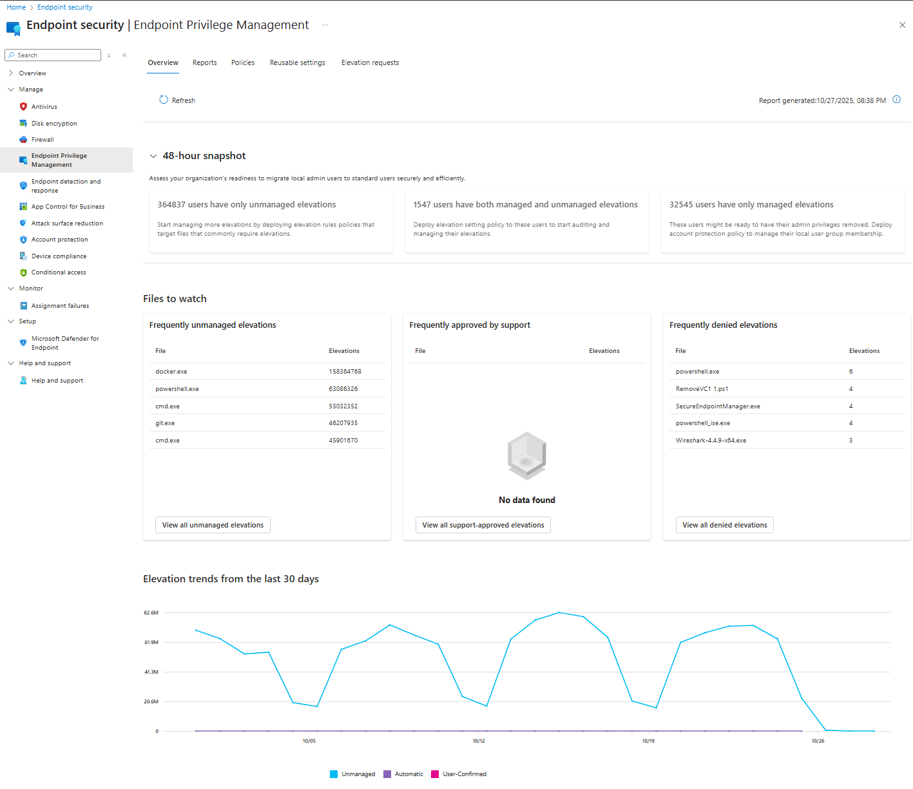

# Endpoint Privilege Management (EPM): The New Era of Privileged Access Management

Let’s start at the beginning, because, honestly, if you’re reading this, you’re probably either 

**(a)** a security architect who’s been burned by local admin rights one too many times, 

**(b)** an IT pro who’s tired of the “just give me admin” refrain, or 

**(c)** someone who’s heard the phrase “least privilege” so often it’s become a mantra. 

---

Endpoint Privilege Management, EPM for short, is Microsoft’s answer to the age-old problem of how to let users do what they need to do, without giving them the keys to the kingdom.

EPM is a feature set within Microsoft Intune (and the broader Intune Suite) that lets you run your Windows fleet with users as standard users by default. No more “everyone’s an admin because it’s easier.” Instead, EPM lets you define exactly which apps, installers, scripts, or binaries can be run with elevated rights, under what circumstances, and for how long. It’s the technical embodiment of the principle of least privilege, users get just enough access to do their jobs, and not a jot more.

But EPM isn’t just about locking things down. It’s about enabling productivity, letting users install that printer driver, run that diagnostic tool, or update that line-of-business app, all without a helpdesk ticket or a risky blanket admin assignment. And, crucially, it’s about doing all this in a way that’s auditable, reportable, and, dare I say, pleasant for both IT and end users. If you’ve ever tried to balance security and productivity, you know that’s a tall order.

So, what’s under the hood? EPM is built on a few core concepts:

- **Standard users by default:** Users run as standard, not local admins.
	
- **Just-in-time elevation:** Elevation is granted only when needed, for specific tasks.
	
- **Policy-based control:** IT defines what can be elevated, how, and by whom.
	
- **Audit logging:** Every elevation is logged, with rich metadata.
	
- **Zero Trust alignment:** EPM is designed to minimise lateral movement and privilege escalation risks.
	

If you’re thinking “this sounds like Privileged Access Management (PAM) for endpoints,” you’re not wrong. EPM is Microsoft’s modern, cloud-native take on endpoint PAM, tightly integrated with Intune, Entra ID, and the rest of the Microsoft security stack.

---

## What Is EPM Used For? (The Real-World Use Cases)

Let’s get practical. What does EPM actually do for you, day-to-day? Here’s where the rubber meets the road.

### 1. Enforcing Least Privilege, Without Breaking Stuff

The classic security conundrum: you want to run everyone as a standard user, but then someone needs to install a driver, update an app, or run a legacy tool that demands admin rights. Historically, you had two choices, make them an admin (and cross your fingers), or lock them down and brace for the helpdesk tickets.

EPM gives you a third way. You define elevation rules for the specific files, installers, or scripts that need admin rights. Users stay standard, but when they need to run (say) OfficeSetup.exe or a trusted PowerShell script, they can right-click and select “Run with elevated access.” EPM checks the rules, and, if it’s allowed, elevates just that process, just for that user, just for that moment.

### 2. Just-in-Time (JIT) Elevation

This is the heart of modern PAM. Instead of giving users persistent admin rights, you grant elevation only when needed, and only for approved tasks. EPM supports several elevation types:

- **Automatic:** The app is elevated silently, no user interaction.
	
- **User confirmed:** The user must confirm (and optionally provide a business justification or re-authenticate).
	
- **Support approved:** The user requests elevation, and IT must approve it before elevation is granted.
	
- **Elevate as current user:** The new kid on the block, lets the process run as the user, not a virtual account (more on this later).
	
- **Deny:** Explicitly block elevation for known risky files.
	

This flexibility means you can tailor elevation to your risk appetite and operational needs. High-trust apps can be auto-elevated; risky or rare scenarios can require support approval. And everything is logged.

### 3. Granular Policy Control

EPM policies are where the magic happens. You can define rules based on:

- **File name and path:** Target specific executables, installers, or scripts.
	
- **File hash:** Ensure only the exact, trusted version is elevated.
	
- **Publisher certificate:** Trust only files signed by known publishers.
	
- **Arguments:** Allow elevation only with specific command-line switches (e.g., allow `dsregcmd /status` but not `/leave`).
	
- **Child process control:** Decide whether child processes inherit elevation, require their own rule, or are denied.
	

This granularity lets you strike a balance between usability and security. You can allow PowerShell scripts from a trusted path, but only if they’re signed and match a known hash. Or you can allow an installer, but only when run from a specific directory.

### 4. Audit, Reporting, and Compliance

Every elevation, managed or unmanaged, is logged. You get rich reports in the Intune admin center: who elevated what, when, on which device, with what result. You can slice and dice by user, app, publisher, or device. This isn’t just for compliance (though it helps there); it’s also invaluable for tuning your policies. See a spike in support-approved requests for a particular app? Maybe it’s time to add an automatic rule. See unmanaged elevations? Time to tighten things up.

### 5. Operational Efficiency

EPM isn’t just about security, it’s about making life easier for IT and users. By reducing the need for persistent admin rights, you cut down on helpdesk tickets, speed up onboarding, and make it easier to roll out new apps or updates. And with features like automated rule creation (more on that in a bit), you can respond to user needs faster, with less manual effort.

---

## Why Would You Use EPM? (The Security-First Perspective)

Now, let’s get to the heart of the matter, why should you care? Why is EPM not just another checkbox, but a foundational piece of your security strategy?

### 1. Reducing the Attack Surface

**This is the big one.** Every user with local admin rights is a potential beachhead for attackers. Phishing, malware, lateral movement, persistent admin rights make all of these easier. By running users as standard and elevating only when necessary, you dramatically shrink the attack surface. Even if a user is compromised, the attacker can’t just waltz in and install a rootkit or dump credentials.

### 2. Enforcing Zero Trust

Zero Trust isn’t just a buzzword, it’s a practical approach to modern security. The core idea: never trust, always verify. EPM operationalises this for endpoints. No one gets blanket admin rights; every elevation is explicit, scoped, and logged. You can even tie elevation to device compliance, Conditional Access, and Defender for Endpoint risk scores, creating a layered, adaptive defence.

### 3. Minimising Lateral Movement and Privilege Escalation

Attackers love lateral movement, jumping from one compromised endpoint to another, escalating privileges as they go. EPM makes this much harder. By isolating elevated processes (especially when using virtual accounts), you prevent attackers from piggybacking on legitimate admin sessions. And with granular rules, you can ensure that only trusted apps can be elevated, and only in tightly controlled contexts.

### 4. Auditability and Compliance

Let’s face it, regulators love logs. EPM gives you a detailed, tamper-resistant record of every elevation, who approved it, and why. This isn’t just about passing audits (though it helps); it’s about having the visibility to detect and respond to suspicious activity. If someone tries to elevate a suspicious binary, you’ll know. If a user is requesting elevation for the same app every day, you can investigate, or automate the rule creation to streamline the process.

### 5. Operational Agility

Security shouldn’t be a roadblock. EPM lets you empower users to get their work done, installing apps, running diagnostics, updating drivers, without waiting for IT or resorting to risky workarounds. And with features like support-approved elevation and automated rule creation, you can respond to new needs quickly, without sacrificing control.

---

## October 2025 Intune Updates: What’s New for EPM?

Alright, let’s talk about what’s fresh off the press. The October 2025 Microsoft Intune release brought some genuinely game-changing enhancements to EPM. If you’ve been waiting for that “aha!” moment to start your EPM journey, this might be it.

### 1. Elevate as Current User: Context Matters

Historically, EPM elevated processes using a virtual account, a synthetic admin identity that’s isolated from the user’s profile. This is great for security (no access to user-specific data, less risk of privilege escalation), but it can break apps that expect to run in the user’s context. Think installers that need to write to `%AppData%`, scripts that read user registry hives, or apps that check the user’s profile path.

Enter **Elevate as Current User**. This new elevation type lets you run the elevated process as the signed-in user, preserving all their environment variables, profile paths, and registry settings. It’s a lifesaver for compatibility, legacy apps, profile-dependent installers, and anything that just won’t play nice with a virtual account.

But, and this is a big but, it comes with security trade-offs. Because the process runs as the user, it has access to all their data, tokens, and potentially sensitive info. The attack surface is larger. So, Microsoft’s guidance (and mine): use this only when necessary, scope it tightly, and audit it regularly. For everything else, stick with virtual account elevation for maximum isolation.

### 2. EPM Overview Dashboard: Visibility at a Glance

If you’ve ever tried to migrate a fleet from local admin to standard user, you know the pain, who’s using what, where are the friction points, which apps are causing the most elevation requests? The new **EPM Overview Dashboard** in Intune gives you a centralised, real-time view of your EPM deployment:

- **Readiness assessment:** See which users are ready to move to standard, which are still using unmanaged elevations, and where the gaps are.
	
- **Managed vs. unmanaged elevations:** Identify where users are still using “Run as administrator” outside of EPM, and target those for new rules.
	
- **Trends and friction points:** Spot which apps are generating the most support-approved requests, which are frequently denied, and where you can streamline with auto-approval rules.

This isn’t just a pretty chart, it’s actionable intelligence. You can use it to refine your policies, target training, and measure the impact of your EPM roll-out.

### 3. Automated Rule Creation: From Request to Policy in One Click

One of the perennial headaches of privilege management is the manual effort, every time a user needs elevation for a new app, IT has to gather file details, create a rule, test it, and deploy. The October 2025 update brings **automated rule creation**: when a user submits a support-approved request, or when you spot a frequent elevation in the reports, you can create a new rule directly from the request or report entry. All the file details, hash, certificate, path, are pre-populated. You just choose the elevation type, tweak as needed, and deploy.

This is a huge win for operational efficiency. It means you can respond to user needs faster, with less risk of manual error. And it encourages a virtuous cycle, users request elevation, IT reviews and approves, and if it’s a common need, you automate the rule for everyone.

Source: [What’s New in Microsoft Intune: October 2025 - Microsoft Intune Blog](https://techcommunity.microsoft.com/blog/microsoftintuneblog/what%E2%80%99s-new-in-microsoft-intune-october-2025/4464595)

---

## EPM Policy Types: Settings and Rules

Let’s get into the weeds, because, let’s be honest, this is where most EPM deployments live or die.

### Elevation Settings Policy

This is the foundation. The **Elevation Settings Policy** enables EPM on the device, sets the default elevation response (what happens when a user tries to elevate a file that isn’t covered by a rule), and configures reporting scope.

- **Enable/disable EPM:** Turns the feature on or off for targeted devices or users.
	
- **Default elevation response:** What to do when there’s no matching rule. Options:
	
    - **Deny all requests:** Block elevation unless explicitly allowed (recommended).
	    
    - **Require support approval:** User must request elevation; IT must approve.
	    
    - **Require user confirmation:** User can elevate with a prompt (optionally requiring business justification or re-authentication).
		
	
- **Reporting scope:** Controls what data is sent to Intune, diagnostic only, managed elevations, or all elevations (including unmanaged).
	

Best practice: set the default response to **Deny all requests** or **Require support approval**. This ensures that only known, trusted files can be elevated, and everything else is blocked or requires explicit approval.

Source: [Managing Elevation Settings for Endpoint Privilege Management - Microsoft Intune | Microsoft Learn](https://learn.microsoft.com/en-us/intune/intune-service/protect/epm-elevation-settings)

### Elevation Rules Policy

This is where you define the specifics, what files can be elevated, how, and by whom. Each rule includes:

- **File identification:** File name, path, hash, publisher certificate, product name, version, etc.
	
- **Elevation type:** Automatic, user confirmed, support approved, elevate as current user, or deny.
	
- **Child process behaviour:** Should child processes inherit elevation, require their own rule, or be denied?
	
- **Arguments:** Restrict elevation to specific command-line switches.
	
- **Scope:** Assign to users or devices, with support for wildcards in file names and paths.
	

You can create rules manually, or (with the latest updates) automatically from elevation requests or reports. And you can use reusable settings groups to manage certificates centrally, update the certificate once, and all referencing rules are updated automatically.

Source: [Creating elevation rules with Endpoint Privilege Management - Microsoft Intune | Microsoft Learn](https://learn.microsoft.com/en-us/intune/intune-service/protect/epm-elevation-rules)

---

## EPM Elevation Types: Security Trade-Offs

Let’s talk about the different ways EPM can elevate a process, and the security implications of each.

|Elevation Type|Security Isolation|User Experience|Typical Use Case|Security Trade-Offs|
|---|---|---|---|---|
|Virtual Account|High|Seamless|Most apps, installers, scripts|Strong isolation, but may break apps needing user context|
|Elevate as Current User|Lower|Seamless|Apps needing user profile, registry, etc|Broader attack surface, less isolation|
|User Confirmed|High|Prompted|Occasional elevation, user-initiated|Requires user action, can require justification/authentication|
|Support Approved|High|Delayed|Rare or risky elevation, IT oversight|Requires IT approval, slower|
|Automatic|High|Transparent|Trusted, frequent apps|No user prompt, use sparingly|
|Deny|N/A|Blocked|Known risky or forbidden files|Explicitly blocks elevation|

**Virtual Account** is the default and most secure, elevated processes run in a synthetic admin context, isolated from the user’s profile. This minimizes the risk of privilege escalation or lateral movement. But some apps just won’t work this way, they need access to `%AppData%`, HKCU, or other user-specific resources.

**Elevate as Current User** solves this, running the process as the signed-in user (with admin rights). It’s great for compatibility, but you lose the isolation, if the process is compromised, it has access to all the user’s data and tokens. Use this only when necessary, and scope it tightly.

**User Confirmed** and **Support Approved** add friction, users must confirm or request elevation, optionally providing a business justification or re-authenticating. This is great for high-risk scenarios or rare needs.

**Automatic** is the most seamless, no prompts, just elevate. But it’s also the riskiest if misused. Only use for highly trusted, business-critical apps.

**Deny** is your safety net, explicitly block elevation for known risky files, malware, or forbidden tools.

---

## EPM Rule Capabilities: Granular Control

EPM’s real power lies in its rule engine. Here’s what you can do:

- **File hash:** The gold standard, only the exact, trusted binary is elevated.
	
- **Publisher certificate:** Trust all files signed by a known publisher (but beware, some vendors sign all their apps with the same cert).
	
- **File name and path:** Target specific files or directories. Wildcards are supported for flexibility.
	
- **Arguments:** Allow elevation only with specific command-line switches.
	
- **Child process control:** Decide whether child processes inherit elevation, require their own rule, or are denied.
	

Best practice: use as many strong attributes as possible, file hash plus certificate, plus path, plus version. The more specific, the less risk of accidental or malicious elevation.

---

## Support Approved and Automated Rule Creation

This is one of my favourite features, because it bridges the gap between security and productivity.

**Support Approved** elevation lets users request elevation for files that aren’t covered by existing rules. The request goes to IT (in the Intune admin center), where an admin can review the file details, justification, and device compliance before approving or denying. If approved, the user gets a 24-hour window to run the file as elevated. Everything is logged, and you can even use Security Copilot to analyse the file for risk before approving.

With the latest updates, you can now **automatically create elevation rules** from support-approved requests or elevation reports. See a pattern of requests for the same app? One click, and you can create a new rule, pre-populated with all the file details. This streamlines operations, reduces manual effort, and ensures consistent, auditable policy enforcement.

---

## EPM Deployment and Prerequisites

Let’s talk brass tacks, what do you need to get started?

- **Licensing:** EPM requires an Intune add-on license, either standalone or as part of the Intune Suite. As of late 2025, the standalone EPM license is $3.15/user/month; the Intune Suite is $10/user/month.
- **Supported devices:** Windows 10/11, Entra joined or hybrid joined, Intune-enrolled or co-managed. AVD single-session is now supported; multi-session and workplace-join devices are not.
- **Client installation:** When you assign an Elevation Settings Policy, the EPM agent is automatically installed on the device (`C:\Program Files\Microsoft EPM Agent`). The agent handles policy enforcement, reporting, and provides a PowerShell module for troubleshooting.
- **Network requirements:** Devices must have outbound access to Intune and Azure Front Door endpoints. Update your firewall allowlists to include the new AzureFrontDoor.MicrosoftSecurity service tag by December 2, 2025.

---

## EPM Reporting and Monitoring

Visibility is everything. EPM provides rich, actionable reports in the Intune admin center:

- **EPM Overview Dashboard:** Readiness assessment, managed vs. unmanaged elevations, trends, friction points.
- **Elevation report:** All elevations, managed and unmanaged, with details on user, device, file, result, and timestamp.
- **Managed elevations report:** Only elevations covered by EPM rules.
- **Reports by application, publisher, or user:** Slice and dice to spot patterns, outliers, or policy gaps.

Data is processed every 24 hours, and retained for 30 days. You can drill into any entry for full details, and use the data to refine your policies, automate rule creation, or investigate suspicious activity.

For advanced analysis, you can use Microsoft Defender for Endpoint’s advanced hunting with KQL queries to correlate elevation events with other security signals.

---

## Operational Guidance: Planning, Rollout, and User Experience

Deploying EPM isn’t just a technical exercise, it’s an organisational change. Here’s how to do it right:

(Source: [Deploy Endpoint Privilege Management with Microsoft Intune - Microsoft Intune | Microsoft Learn](https://learn.microsoft.com/en-us/intune/intune-service/protect/epm-deploy))

### 1. Plan and Audit

Start with an audit phase, enable EPM in audit mode, collect elevation data, and identify which apps, installers, or scripts users are running with admin rights. Use the EPM Overview Dashboard to spot patterns and friction points.

### 2. Define Personas and Pilot Groups

Not all users are created equal. Define personas, IT admins, developers, information workers, and group users with similar needs. Start with a pilot group (5–10 users per persona), and run the pilot for 10–14 days to collect data and feedback.

### 3. Build and Refine Rules

Use the audit data to create elevation rules for the most common needs. Start with tight, specific rules, file hash, certificate, path. Iterate based on user feedback and elevation reports.

### 4. Monitor and Iterate

Continuously monitor elevation activity, managed and unmanaged. Refine rules, add support-approved workflows for rare needs, and automate rule creation as patterns emerge.

### 5. Transition to Standard Users

Once you’ve covered the major use cases, start transitioning users from local admin to standard. Use EPM to fill any gaps, and use the Overview Dashboard to track progress and spot issues.

### 6. Communicate and Train

User experience matters. Communicate the changes, provide training on how to request elevation, and set expectations for support-approved workflows. The right-click “Run with elevated access” menu is intuitive, but users need to know when and how to use it.

---

## Security Considerations and Mitigations

EPM is a powerful tool, but with great power comes great responsibility. Here’s how to use it securely:

- **Set a secure default elevation response:** Deny all requests or require support approval for unmanaged files.
	
- **Use strong rule attributes:** File hash plus certificate, plus path, plus version. The more specific, the better.
	
- **Restrict file paths:** Only allow elevation from directories that standard users can’t modify.
	
- **Differentiate installer vs. runtime elevation:** Be intentional, installers should be tightly controlled; runtime elevation should be minimised.
	
- **Apply stricter rules to high-risk apps:** Browsers, scripting engines, PowerShell, use script-specific rules, require business justification, or block entirely.
	
- **Audit and review regularly:** Use reports to spot anomalies, investigate frequent requests, and refine policies.
	
- **Limit use of Elevate as Current User:** Only when necessary for compatibility, and scope tightly.
	
- **Integrate with Defender for Endpoint and Conditional Access:** Tie elevation to device compliance, risk scores, and other security controls for layered defence.
	

---

## Final Thoughts: EPM as the New Standard for Endpoint PAM

If you’ve made it this far, congratulations, you’re ready to lead your organisation into the new era of endpoint privilege management (and I thank you for keeping with me through this all). EPM isn’t just a feature; it’s a philosophy. It’s about empowering users, reducing risk, and making security an enabler, not a barrier.

With the October 2025 updates, EPM is more flexible, powerful, and user-friendly than ever. Elevate as current user solves real-world compatibility headaches; automated rule creation and argument control streamline operations; the Overview Dashboard gives you the visibility to manage at scale.

But the real magic is in the mindset shift, from “everyone’s an admin” to “just enough privilege, just in time, just for what’s needed.” That’s how you reduce the attack surface, enforce Zero Trust, and build a security posture that’s both robust and agile.

So, go forth and deploy. Start with a pilot, iterate, and don’t be afraid to lean on the community (and Microsoft’s ever-growing documentation). EPM is here, it’s ready, and it’s the new standard for endpoint PAM in the Microsoft ecosystem.

And if you ever find yourself tempted to just “give them admin”, remember: there’s a better way now. EPM is your friend. Use it wisely.

---

**Key Takeaways (for the TL;DR crowd):**

- **EPM lets you run users as standard by default, elevating only what’s needed, when it’s needed.**
	
- **October 2025 brings Elevate as Current User, automated rule creation, argument control, AVD support, and a new Overview Dashboard.**
	
- **EPM supports granular, auditable, policy-based control, file hash, certificate, path, arguments, child process behavior.**
	
- **Security is front and center: least privilege, Zero Trust, reduced attack surface, and full auditability.**
	
- **Operational efficiency is real: fewer helpdesk tickets, faster onboarding, and streamlined rule management.**
	
- **Start with a pilot, iterate, and use the data to refine your policies.**
	
- **EPM is the new standard for endpoint PAM, embrace it, use it, love it.**
	

_Now, go secure those endpoints, and make admin rights a thing of the past._