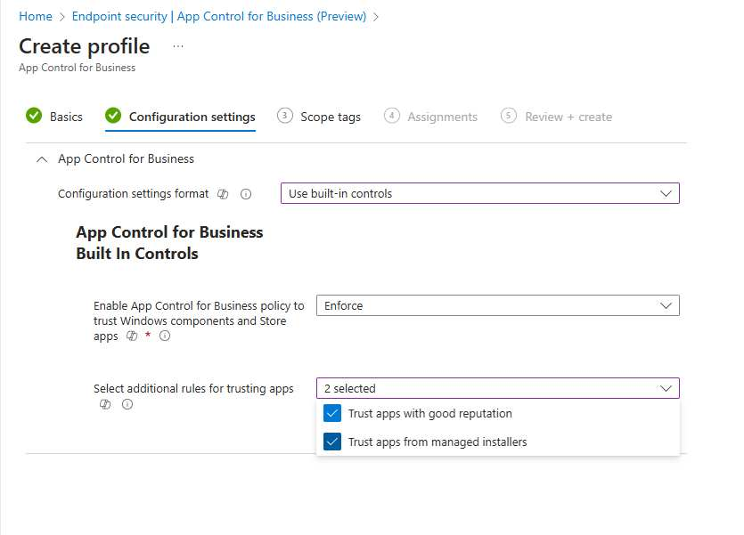

# Quick Wins: Implementing App Control for Business to Replace Legacy Systems

In discussion with a lot of IT professionals in my time, its pretty clear that all IT administrators are always looking for effective ways to enhance security, while navigating the transition from legacy on-premises systems. 

One such 'quick win' is implementing App Control for Business as a modern replacement for outdated solutions like Windows Defender Application Control (WDAC), or AppLocker. 

This article delves into the functionalities and benefits of App Control for Business, offering a step-by-step guide for its deployment using Intune’s Built-In Policies.

## Functionality of App Control for Business

App Control for Business is a security feature designed to enforce application control policies, ensuring that only trusted software and drivers are allowed to run on Windows client computers. This prevents unauthorized or malicious applications from compromising the system.

**Key Features**:

- **Code-Signing Certificate**: Policies can be based on trusted code-signing certificates.
    
- **App Binaries**: Control over specific application binaries.
    
- **App Reputation**: Utilizing the app’s reputation to allow or block it.
    
- **Installer Identity**: Policies based on the identity of the installer.
    
- **Launch Paths**: Control based on where the app is launched from.
    

Unlike AppLocker, which is limited to user mode policies, App Control for Business supports kernel mode policies, providing a more robust level of security. App Control also allows for multiple policies, offering greater flexibility and control.

### Why App Control for Business?

App Control for Business is tailored for modern Windows environments (Windows 10 and later). This means it’s designed to leverage the latest security advancements and system capabilities, ensuring better protection and compatibility.

For organizations still running legacy systems such as Windows 7, the best course of action is to implement AppLocker instead of App Control for Business. AppLocker provides a robust level of application control tailored to older systems, ensuring that only approved applications can run, thereby enhancing security without the need for modern hardware requirements.

## Challenges with Windows Defender Application Control (WDAC) Deployment

**Deploying WDAC is not as simple as it might appear on the surface.** While it offers strong security benefits, implementing it effectively across an organization can be a complex and resource-intensive process. The configuration process often requires deep technical expertise, thorough testing, and careful planning to avoid unintended disruptions.

### Key Challenges:

1. **Policy Complexity**: WDAC policies need to be meticulously crafted to ensure that all required applications, drivers, and processes are allowed while blocking unauthorized software. This involves detailed analysis of the environment and can be time-consuming.
    
2. **Compatibility Issues**: Legacy systems, older software, or uncommon applications may not align with WDAC policies, leading to potential operational disruptions.
    
3. **Limited Built-In Controls**: While Microsoft's Built-In controls simplify the baseline configuration, they do not cover all organizational needs, especially in highly customized or legacy-heavy environments. Additional configurations via XML or PowerShell scripts may be necessary.
    
4. **Testing Requirements**: Without proper testing in audit-only mode, there’s a significant risk of blocking legitimate applications, which can disrupt business processes and affect productivity.
    
5. **Ongoing Management**: Maintaining and updating WDAC policies to reflect changes in software and drivers requires sustained attention and operational resources.
    

### A Practical Approach:

For organizations new to application control, **Intune’s Built-In App Control policies** provide an excellent starting point. Although these policies won’t fulfill all requirements, they establish **baseline controls** where none previously existed. This is particularly beneficial for environments transitioning from no application control to a more secure framework.

**Using the Built-In controls:**

- Quickly deploy essential protections, such as restricting unsigned or unauthorized apps, without extensive policy customization.
    
- Focus on building a foundational layer of security that can be enhanced over time with more advanced configurations.
    

By starting with baseline controls, administrators can introduce app control gradually, reduce complexity, and address more specific requirements over time with confidence.

## Deployment Using Intune’s Built-In Policies

Intune’s built-in policies allow you to configure Windows client computers to run only:

- Windows components
    
- Third-party hardware and software kernel drivers
    
- Microsoft Store-signed apps
    
- (Optional) Reputable apps as defined by the Intelligent Security Graph (ISG)
    
- **(Optional) Trusted apps as defined by Managed Installers**
	

**Steps for Deployment**:

1. **Open Intune Portal**: Access the Microsoft Intune portal.
    
2. **Navigate to App Control for Business**: Under 'Endpoint Security > App Control for Business', Create a new policy profile using the built-in settings or custom settings (via XML). For the "quick win", I suggest the Built-In.
    
3. **Configure Settings**: Define the policy settings, specifying trusted apps and components. This includes selecting the Trusted Apps associated to either Good Reputation (ISG), and/or from the Managed Installer.
    
4. **Deploy Policy**: Assign the policy to target devices and monitor its application.
    

The Managed Installer process in Intune tags approved applications, ensuring they are recognized and allowed by the App Control policy. This streamlines the deployment and management of trusted applications.

**Steps for Managing Apps via 'Managed Installer'**:

1. **Open Intune Portal**: Access the Microsoft Intune portal.
    
2. **Navigate to App Control for Business**: Under 'Endpoint Security > App Control for Business', Select the Managed Installers Tab.
    
3. **Add the Intune Management Extension**: After clicking Add on the Managed Installer tab, you will be prompted to grant the permissions to Intune Management Installer as a managed installer on all applicable devices. Click Add. (This can take a while to refresh)
    
4. **Deploy Apps**: Once completed, you can navigate the Managed Installer tab, Add applications, and they will be trusted by your App Control policy, to be used on your endpoints.
    

### Leveraging Managed Installers for Simplified Application Management

**Streamlining application control policies can be challenging without an efficient management process.** This is where Managed Installers come in, offering a practical solution to reduce administrative overhead and enhance policy precision.

### Benefits of Using Managed Installers:

1. **Automated Trust Assignment**: Applications deployed through Managed Installers are tagged as trusted, reducing the need for manual policy updates.
    
2. **Consistency Across Devices**: Ensures uniform application control across all endpoints without the risk of inconsistent configurations.
    
3. **Reduced Administrative Overhead**: Eliminates the tedious process of individually approving trusted applications and drivers.
    
4. **Enhanced Policy Accuracy**: Decreases the likelihood of legitimate apps being blocked, ensuring a smoother end-user experience.
    
5. **Improved Scalability**: Facilitates easier onboarding of new applications or devices as the organization grows.
    

### A Strong Recommendation for Managed Installers

For organizations transitioning to **App Control for Business**, adopting Managed Installers is highly recommended. It not only simplifies the deployment and management process but also provides a solid foundation for secure application control.

By prioritizing Managed Installers:

- IT administrators can focus on strategic tasks rather than managing app exceptions.
    
- Applications deployed through Intune or similar trusted tools are seamlessly integrated into the control framework.
    
- The risk of policy misconfigurations is significantly reduced.

## Technical Tips for Seamless Implementation

**A few technical recommendations can make the difference between success and disruption.**

1. **Start Small**: Deploy policies in pilot groups to identify issues before large-scale rollout.
    
2. **Audit First**: Use **audit-only mode** to monitor policy impact without enforcement.
    
3. **Dynamic Maintenance**: Leverage Intune for frequent updates to adapt to changing requirements.
    
4. **Fail-Safe Planning**: Backup policy configurations and prepare fallback policies to ensure business continuity.
    
5. **Collaborate with Security Ecosystems**: Integrate App Control for Business with solutions like Entra Conditional Access and Endpoint Detection and Response for comprehensive protection.
	

## Benefits of App Control for Business

- **Enhanced Security**: By restricting unauthorized applications and drivers, App Control for Business significantly reduces the risk of malware and other security threats.
    
- **Compliance**: Helps organizations meet regulatory requirements by ensuring only approved software runs on the network.
    
- **Simplified Management**: Centralized management through Intune allows for easy deployment and updating of policies, reducing administrative overhead.
	

## Risks and Considerations

**Potential Impact**:
Without thorough testing, deploying new policies may cause disruptions to business operations if legitimate applications are mistakenly blocked.

**Mitigation Strategies**: 
Test policies in a controlled environment before full deployment. Create an audit policy to monitor and review application execution without enforcing blocks initially.

#### Conclusion

App Control for Business offers a powerful solution for IT administrators aiming to enhance security and replace legacy systems. By adopting this modern technology, organizations can ensure better protection, streamlined management, and regulatory compliance. It’s time to make the transition and embrace a more secure and efficient IT environment.