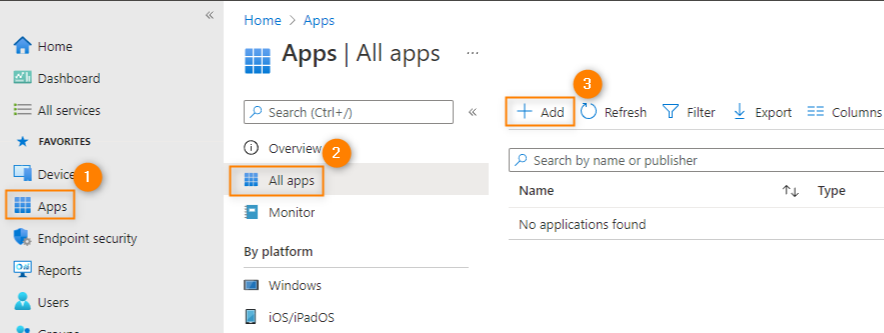
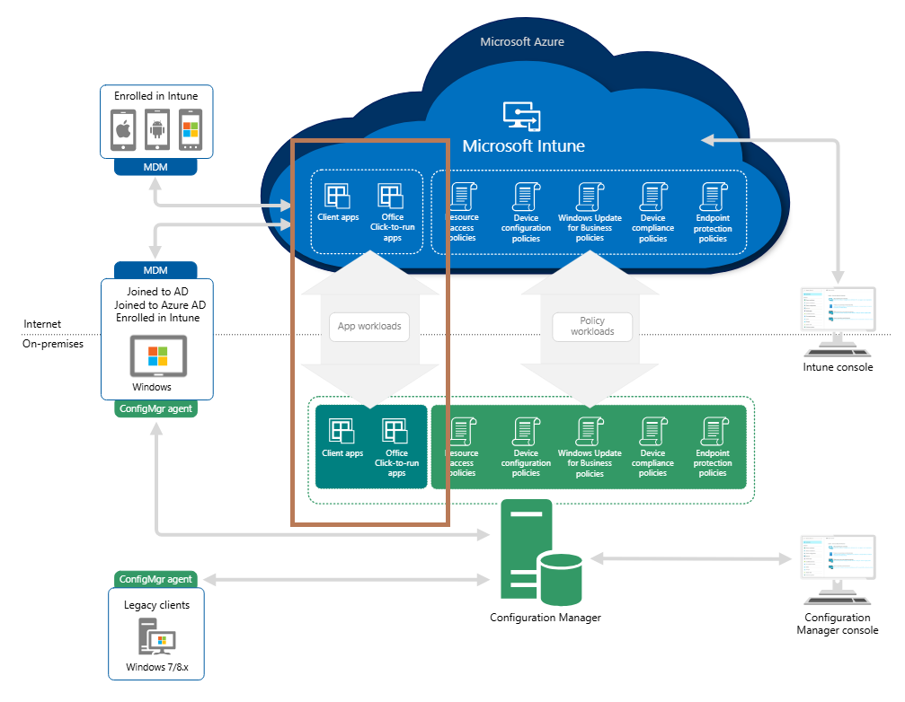

# Quick Wins: Migrating Application Management to Microsoft Intune

Migrating from traditional on-premises application management systems like Microsoft Configuration Manager to cloud-based solutions such as Microsoft Intune offers a streamlined approach to device and application management. I hope that this article acts as a guide, and provides essential information and steps to help IT administrators make this transition smoothly, highlighting the benefits, configuration details, application types, co-management functions, and deployment techniques.

## Benefits of Utilizing Microsoft Intune for App Management Over Alternative Systems

When considering a migration to the cloud, it is crucial to understand why Microsoft Intune stands out from other application management systems. Running through some of the general key benefits that demonstrate the advantages of using Intune over alternative solutions would include:

    
1. **Unified Management Platform**: Intune offers a comprehensive platform that integrates device, application, and policy management in one place, reducing complexity and administrative overhead compared to multiple disparate systems.
    
2. **Flexibility and Scalability**: Intune can seamlessly scale to accommodate the growth of your organization, whether you're managing a small team or a global enterprise. This scalability is often more challenging to achieve with traditional on-premises solutions.
    
3. **Reduced Infrastructure Costs**: By moving to a cloud-based solution, organizations can significantly reduce costs associated with maintaining on-premises infrastructure, such as servers and storage, as well as the associated power and cooling expenses.
    
4. **Simplified Application Deployment**: Intune simplifies application deployment with support for various app types, including Win32, MSI, and Microsoft Store apps. This flexibility is often lacking in alternative systems.
    
5. **Seamless Integration with Microsoft 365**: Intune integrates seamlessly with Microsoft 365, allowing for easy deployment and management of Microsoft 365 applications, such as Word, Excel, and Teams. This integration is a key advantage over other systems that may not offer the same level of compatibility.
    
6. **Modern User Experience**: Intune supports modern application delivery methods, ensuring that users have access to the apps they need, when they need them, without the limitations often imposed by older on-premises systems.
    
7. **Built-In Compliance and Reporting**: Intune offers built-in compliance policies and reporting capabilities, enabling organizations to ensure that devices and applications comply with corporate policies and regulatory requirements. This feature can be more cumbersome to implement with alternative systems.
    

## App Types for Deployment

Understanding the different types of applications that can be deployed using Microsoft Intune is essential for effective application management. Planning ahead and using the best app type will vastly ease the management of your fleet, and ensure that you wont have headaches down the track. Here are some of the key app types you can deploy:

1. **Microsoft Store Apps**: Deploy trusted applications from the Microsoft Store.
    
2. **Line-of-Business (LOB) Apps**: Deploy custom in-house applications critical to organizational operations.
    
3. **Built-In Apps**: Utilize built-in apps provided by Intune for easy management.
    
4. **Web Link Apps**: Create shortcuts to web-based applications.
    
5. **Microsoft 365 Apps**: Deploy Microsoft 365 productivity tools like Word, Excel, and Teams.
    
6. **Windows Apps (Win32)**: Deploy traditional Win32 applications using the Intune Win32 App Wrapper, which will be covered in detail below.
    

And to deploy the Application itself, its quite simply:
Navigating to Microsoft Intune ([https://intune.microsoft.com](https://intune.microsoft.com)) > Selecting Apps > All Apps > Add!



### Key Information Related to Configuration and Specific Apps

As mentioned above, Migrating to Microsoft Intune involves several crucial steps and considerations to ensure a smooth transition. The more planning you can have towards your current inventory, as well as the potential inventory you look to have in the future, is going to save you a lot of time and headaches in the long run. Below is a breakdown of the key information related to configuring Intune and managing specific applications:

**Preparation**:

1. **Inventory**: Take inventory of all applications currently managed by Configuration Manager (or your current Application Management system).
    
2. **Compatibility Check**: Ensure all applications are compatible with Intune.
    

Pretty simple, right? Check what you got, Check if its relevant, Check if its compatible.
    

**Configuration**:

1. **Create Application Policies**: Define application policies in Intune to control deployment settings and update schedules.
    
2. **App Deployment Types**: Use Intune to deploy various application types, including Win32, MSI, and Microsoft Store apps.
    
3. **Packaging Applications**: Package applications using the Win32 App Wrapper (IntuneWinAppUtil) to create .intunewin files for deployment. (Ill get into this a bit deeper down below...)
    

Once again, Check what you got, define where it sits, confirm how you plan to deploy.
      

**Specific Apps**:

4. **Microsoft 365 Apps**: Utilize Intune’s built-in support for deploying Microsoft 365 Apps, ensuring users have access to the latest productivity tools.
    
5. **Line-of-Business Apps**: Configure and deploy custom line-of-business applications to meet organizational needs.
    

This is where you can speed up the process by streamlining the deployments of some of your commonly required software, and of course, Microsoft 365 Apps.
    

### Win32 App Wrapper and Prep Tool

Now, the **Microsoft Win32 Content Prep Tool** (IntuneWinAppUtil) is a powerful utility designed to package Win32 applications for deployment through Intune. Here’s a step-by-step guide to using this tool effectively:

1. **Download and Install**: Obtain the IntuneWinAppUtil tool from the Microsoft Download Center. Ensure you have **.NET Framework 4.7.2** installed before proceeding. For Ease, here is the Microsoft GitHub Repo link: [GitHub - microsoft/Microsoft-Win32-Content-Prep-Tool: A tool to wrap Win32 App and then it can be uploaded to Intune](https://github.com/Microsoft/Microsoft-Win32-Content-Prep-Tool)
    
2. **Prepare Application Files**: Gather the source files and installer for the Win32 application. Ensure that only the setup files for the app are in the specified folder.
    
3. **Package the Application**:
    
	- **Run IntuneWinAppUtil**: Use the tool to convert the application installer into a .intunewin file.
		
	- **Specify Parameters**: Define installation and uninstallation commands, as well as any additional parameters. For example:
     ```sh
     IntuneWinAppUtil -c <setup_folder> -s <source_setup_file> -o <output_folder> -q
     ```
     This command will generate the .intunewin file from the specified source folder and setup file. The `-q` flag puts the tool in quiet mode.
    
4. **Deploy the Application**:
	
	- **Upload to Intune**: Upload the .intunewin file to Intune and configure the deployment settings.
		
	- **Assign to Devices**: Assign the packaged application to the target devices or user groups.\
	    
    
5. **Additional Features**:
	
	- **Catalog Files**: If you have catalog files, use the `-a` parameter to bundle them into the .intunewin file.
		
	- **Quiet Mode**: Use the `-q` parameter to run the tool in quiet mode, which suppresses prompts and automatically overwrites existing output files.
		
	- **Help and Version Information**: Use `IntuneWinAppUtil -h` to display usage information and `IntuneWinAppUtil -v` to show the tool version.
		
	

For any further information, I would suggest looking at the GitHub repo itself (in case of any changes), and ensure you meet any current (and potentially future) prerequisites.
    

## Co-Management Function During Migration

During the migration process, And if you are currently running Configuration Manager for your Application management system, the co-management capability allows you to manage devices with both Configuration Manager and Intune. This phased approach ensures a smooth transition and minimizes disruption.

    
- Don't **Big Bang** approach anything in migration, you will regret it. Move specific workloads, such as application deployment, from Configuration Manager to Intune incrementally (Pilot Intune). This allows for careful monitoring and adjustment.
    
- Continuously monitor the performance and functionality of the migrated workloads to ensure there are no disruptions to operations.
    
- Make sure to include the collect of feedback from the pilot group to identify any issues and make necessary adjustments.
    
- Once the pilot phase is successful, gradually extend the co-management setup to the rest of the organization.
    



## In Summary

Migrating application management from on-premises systems like Configuration Manager to Microsoft Intune is a strategic move that offers numerous benefits, including enhanced security, centralized management, and improved user experience. By leveraging Intune’s capabilities, such as co-management and the Win32 App Wrapper, organizations can achieve a seamless transition to modern, cloud-based application management. Use this guide as a reference to ensure a successful migration and embrace the future of IT management.