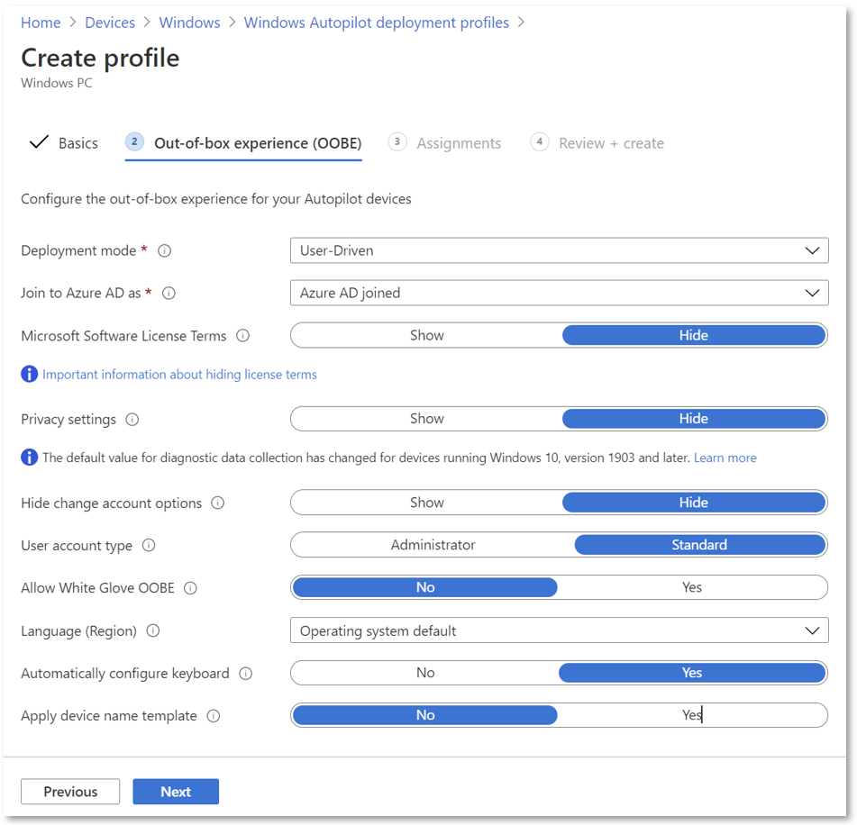
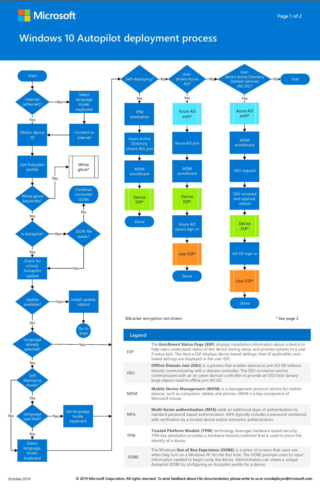
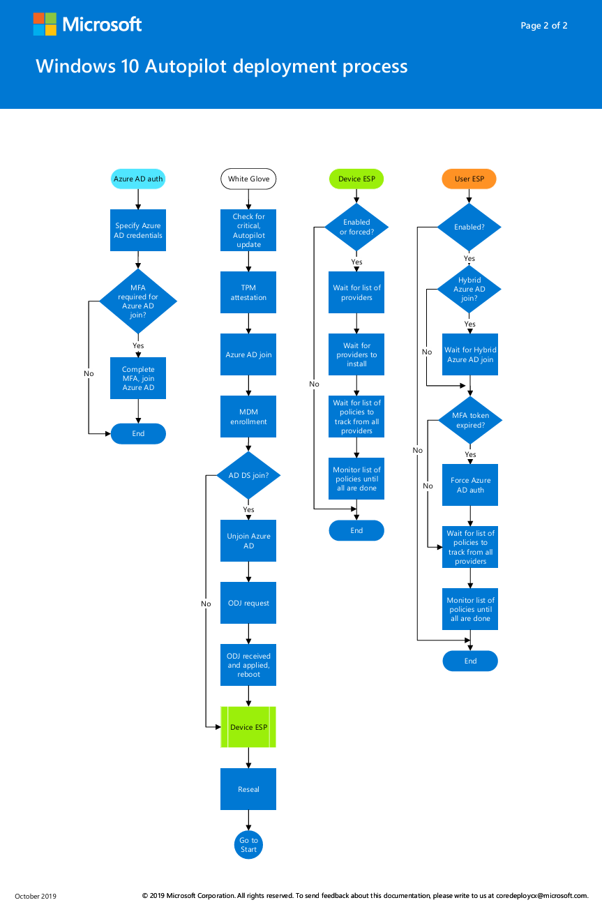

# Migrating from Traditional SOE Deployment to Intune Autopilot v2

The shift from traditional Standard Operating Environment (SOE) deployment methods to modern, cloud-based solutions is not just a trend—it's a necessity. One of the most significant advancements in this domain is the introduction of Windows Autopilot v2, a modernized breakthrough for organizations looking to streamline their device deployment processes, while utilizing cloud services. This article delves into the benefits of migrating from traditional SOE deployment, typically managed through Configuration Manager, to the innovative Intune Autopilot v2.

## The Evolution of Windows Autopilot

Windows Autopilot has been a revolutionary tool since its inception, offering a zero-touch, user-friendly deployment experience. However, the latest iteration, Autopilot v2, takes this a step further by re-architecting the underlying infrastructure to enhance efficiency and scalability. This new version introduces several key features that make it an attractive option for IT administrators.

### Key Features of Autopilot v2

1. **No Registration Required**: Unlike its predecessor, Autopilot v2 eliminates the need for device registration. This means IT admins no longer need to import hardware hashes into Intune, simplifying the process significantly. 
    
2. **Enhanced Enrollment Status Page (ESP)**: Autopilot v2 allows scripts to be deployed during the ESP, improving the overall deployment experience.
    
3. **Automatic Grouping**: Devices are automatically added to static groups, making it easier to assign configurations and applications.
    
4. **Improved Reporting**: With real-time monitoring and reporting, you get detailed insights into deployment status, including application and script statuses.
    
5. **Selective App Installation**: Only selected apps are installed during the Out-of-Box Experience (OOBE), reducing deployment time and improving efficiency.
    

### Benefits of Migrating to Autopilot v2

1. **Reduced IT Overhead**: By eliminating manual device registration and leveraging cloud-based management, Autopilot v2 lightens the load on IT teams.
    
2. **Faster Deployment**: The streamlined process ensures devices are ready for use more quickly, boosting productivity.
    
3. **Scalability**: With its re-engineered architecture, Autopilot v2 supports a larger number of devices and more efficient provisioning, making it perfect for organizations of all sizes.
    
4. **Enhanced Security**: With support for Microsoft Entra ID and improved identity and access management, Autopilot v2 ensures devices are secure from the moment they're deployed.
	

### Requirements for Intune Autopilot v2

Before diving into the detailed software, networking, licensing, and configuration requirements, it's important to note that all technical and specific requirements should be cross-referenced with the official documentation available on **Microsoft Learn**. This ensures accuracy and alignment with the most up-to-date guidelines and recommendations. Below is an overview of the requirements for each section:

#### Software Requirements

Windows Autopilot relies on specific software configurations to function effectively. These include compatible Windows client versions and other software specifications necessary for deployment.

- Source: [Windows Autopilot requirements | Microsoft Learn](https://learn.microsoft.com/en-us/autopilot/requirements?tabs=software)

#### Networking Requirements

Network connectivity is essential for Windows Autopilot, as devices must communicate with the necessary Microsoft services. This includes ensuring proper firewall configurations, domain name system (DNS) requirements, and internet accessibility.

- Source: [Windows Autopilot requirements | Microsoft Learn](https://learn.microsoft.com/en-us/autopilot/requirements?tabs=networking)

#### Licensing Requirements

Windows Autopilot depends on specific capabilities available in Windows client and Microsoft Entra ID. It also requires a mobile device management (MDM) service such as Microsoft Intune. These capabilities can be obtained through various editions and subscription programs. To provide needed Microsoft Entra ID and MDM functionality, including automatic MDM enrollment and company branding features, one of the following subscriptions is required:

- Source: [Windows Autopilot requirements | Microsoft Learn](https://learn.microsoft.com/en-us/autopilot/requirements?tabs=licensing)

#### Configuration Requirements

Before Windows Autopilot can be used, some configuration tasks are required to support the common Autopilot scenarios:

 - Source: [Windows Autopilot requirements | Microsoft Learn](https://learn.microsoft.com/en-us/autopilot/requirements?tabs=configuration)

## Step-by-Step Guide to Using Autopilot v2

### 1. Set up Windows Automatic Intune Enrollment

First things first—automatic enrollment lets users enroll their Windows devices in Microsoft Intune without lifting a finger. This magic happens when a device joins Microsoft Entra ID. Here's how to set it up:

1. Sign in to the Azure portal.
    
2. Navigate to `Microsoft Entra ID > Mobility (MDM and MAM) > Microsoft Intune`.
    
3. Configure the MDM user scope. If you select **Some**, choose an Azure AD Group that contains user objects.
    

This step ensures that your devices are ready to join Intune as soon as they're part of your Entra ID. Think of it as the VIP entrance to your device management party!

### 2. Allow Users to Join Devices to Microsoft Entra ID

Next, we need to ensure that users can join devices to Microsoft Entra ID. It's like giving them the keys to the kingdom.

1. Go to the Azure portal.
    
2. Navigate to `Entra ID > Devices > Device settings`.
    
3. Enable the setting that allows users to join devices to Microsoft Entra ID.
    

This permission is crucial as it allows your team to connect their devices to your organization's network seamlessly.

### 3. Create a Device Group for Windows Autopilot Device Preparation

Creating a device group is a vital part of the process. During deployment, devices are automatically added to this group, streamlining management:

1. Sign in to the Microsoft Intune admin center.
    
2. Navigate to `Groups > All Groups`.
    
3. Click on **New Group** and provide the following details:
    
    - **Group type**: `Security`
        
    - **Group Name** (example): `Windows Autopilot Device Preparation – Device Group`
        
    - **Group description**: Enter an appropriate description.
        
    - **Microsoft Entra roles can be assigned to the group**: `No`
        
    - **Membership type**: `Assigned`
        
4. Add the **Intune Provisioning Client** as the owner of the group.
    

Think of this as creating a special club where all the devices getting ready for Autopilot hang out.

### 4. Create a User Group

Now, let's create a user group. This group will receive the Windows Autopilot device preparation deployment:

1. Sign in to the Microsoft Intune admin center.
    
2. Navigate to `Groups > All Groups`.
    
3. Click on **New Group** and provide the following details:
    
    - **Group type**: `Security`
        
    - **Group Name**: `Windows Autopilot Device Preparation – User Group`
        
    - **Group description**: User group to receive Windows Autopilot device preparation policy.
        
    - **Microsoft Entra roles can be assigned to the group**: `No`
        
    - **Membership type**: `Assigned`
        
4. Select **Create** to create the group.
    

This step is all about organizing your users so that they receive the necessary deployment settings.

### 5. Assign Applications and PowerShell Scripts to the Device Group

It's time to get down to business by assigning applications or running PowerShell scripts during device preparation. You'll need to assign these to the device group as required assignments. This ensures that all necessary apps and configurations are set up automatically.

### 6. Create a Windows Autopilot Device Preparation Policy

Creating this policy is where you specify the settings to configure the device during Autopilot:

1. Go to the Intune admin center.
    
2. Navigate to `Devices > Device onboarding > Enrollment`.
    
3. Select `Device preparation policy` under Windows Autopilot device preparation.
    
4. Click on `+ Create`.
    
5. Enter a suitable policy name and description.
    
6. Add the `Device preparation – device group` created earlier.
    
7. Configure the following settings:
    
    - **Deployment mode**: `User-driven` or `Self-Deploying` (discussed more in detail below)
        
    - **Join Type**: `Microsoft Entra Join`
        
    - **User account type**: `Standard` or `Administrator`
        
8. Assign up to 10 managed apps and PowerShell scripts to the policy.
    
9. Assign the policy to the Windows Autopilot device preparation user group.
    
10. Review and create the policy.
    

This step is like setting up the rules for your device deployment playbook.

### 7. Add Windows Device to the Corporate Device Identifier

Windows Autopilot device preparation doesn’t require device hash, though adding the device serial number ensures it's recognized as a corporate device:

1. Go to the Intune admin console.
    
2. Navigate to `Devices > Enrollment > Corporate Identifier`.
    
3. Select `Add identifiers`.
    
4. Enter the serial number and details, then click `Add`.
    

This step is crucial for identifying and managing corporate devices effectively.

### 8. Reset Device to Factory Setting

Finally, reset the device to factory settings to enroll it in Intune using Autopilot device preparation. Follow the steps to reset a Windows 11 device to factory settings. This ensures the device starts fresh and ready for the new deployment settings.

### 9. End User Experience

Once a Windows 11 device is reset to factory settings, the user will go through the setup process, which includes selecting the country, keyboard layout, reviewing the license agreement, and setting up a PIN. The device will then be ready for use with the Windows Autopilot Device Preparation completed.

## Understanding Deployment Scenarios in Windows Autopilot: Key Modes and Best Use Cases

Windows Autopilot offers several deployment scenarios, including **User-Driven**, **Self-Deploying**, and others such as **Pre-provisioned** and **Windows Autopilot Reset**. Selecting the right scenario depends on the purpose and use case of the deployment. Without going into too much detail, I want to mainly dive into an overview of what I believe are the core scenarios, with a detailed comparison of **User-Driven** and **Self-Deploying** modes.

### Pros and Cons of User-Driven and Self-Deploying Modes

#### User-Driven Mode

**Pros**:

- Requires no interaction from IT admins, OEMs, or resellers.
    
- Works on both physical devices and virtual machines (VMs), as it doesn't require TPM attestation.
    
- Supports both Microsoft Entra join and hybrid join.
    

**Cons**:

- Takes longer for the user, as they must go through both device and user Enrollment Status Pages (ESP).
    
- Requires user interaction during deployment.
    

**Best Use Cases**:

- Ideal for devices intended for single users.
    
- Suitable for scenarios where the device is shipped directly to the end user without IT intervention.
    

#### Self-Deploying Mode

**Pros**:

- Fully automated, requiring no interaction from users, IT admins, OEMs, or resellers.
    
- Streamlines deployment for shared devices, kiosks, or digital signage.
    

**Cons**:

- Requires TPM attestation, so it only works on physical devices with supported TPM (not on VMs).
    
- Doesn't support Microsoft Entra hybrid join.
    
- Cannot assign a user to the device, as user ESP doesn't run during deployment.
    

**Best Use Cases**:

- Perfect for shared devices or resources like kiosks.
    
- Suitable for scenarios requiring rapid, unattended setup.
	

Source: [Windows Autopilot scenarios | Microsoft Learn](https://learn.microsoft.com/en-us/autopilot/tutorial/autopilot-scenarios) 

## Windows Autopilot Deployment Process

And if you are interested in the whole process, you can check out the following posters, which define the whole deployment. 

Source: [Windows deployment process posters | Microsoft Learn](https://learn.microsoft.com/en-us/autopilot/deployment-process)

## Transition and Migration from Configuration Manager to Intune Autopilot v2

Making the leap from the traditional SOE Build managed through Microsoft Configuration Manager to Intune Autopilot v2 is a journey, but don't worry — I'm here to guide you through every step!

1. **Assessment and Planning**: Start by getting a clear picture of your current environment. Identify all the devices, applications, and configurations managed by Configuration Manager. Then, craft a migration plan that covers the timeline, resources needed, and potential challenges. Think of it like planning a road trip—know your starting point and plan your route!
    
2. **Pilot Testing**: Before diving in headfirst, conduct a pilot test with a small group of devices. This test run helps you spot any hiccups early and make necessary adjustments. It's like a dress rehearsal for the big show.
    
3. **Configuration and Enrollment**: Next, configure your Intune policies and profiles to meet your organization's needs. Set up device compliance policies, configuration profiles, and application deployments. Then, enroll devices into Intune using Autopilot v2, ensuring that the Enrollment Status Page (ESP) is used to deploy necessary scripts and configurations during setup. This step is all about getting everything just right.
    
4. **Data Migration**: Ensure that all necessary data is backed up and migrated to the new environment. This may involve transferring user data, application settings, and other critical information from devices managed by Configuration Manager to those managed by Intune Autopilot v2. This is where you may need to really look into capabilities, and define what should be carried over.
    
5. **User Training and Support**: Provide comprehensive training for your IT staff and end-users to familiarize them with the new deployment process and management tools. Establish a support system to address any issues or concerns that may arise during and after the migration. Think of it as offering a user manual for a new gadget—people need to know how to make the most of it.
    
6. **Monitoring and Optimization**: Finally, keep an eye on the deployment process and device performance using the improved reporting capabilities of Autopilot v2. Use the insights gained to optimize configurations and address any issues promptly. It's like fine-tuning an engine to ensure it runs smoothly.
    

## How to migrate Autopilot devices between Tenants

Migrating to Autopilot v2 can be a seamless process if you follow the right steps. Whether you're dealing with a merger, acquisition, or simply need to transfer devices between tenants, Windows Autopilot offers efficient methods to help you manage the transition. The catch, if done incorrectly, can be extremely time consuming, and risk loss of data.

Microsoft has provided a nice guide on how this can be achieved, both an Online Migration, and Offline Migration option. Here’s is the comprehensive guide to assist IT admins in migrating to Autopilot v2 ([Support tip: How to transfer Windows Autopilot devices between tenants | Microsoft Community Hub](https://techcommunity.microsoft.com/blog/intunecustomersuccess/support-tip-how-to-transfer-windows-autopilot-devices-between-tenants/3920555)). 

Those two methods in summary:

### Online Migration Method

The **Online Migration Method** is quick and ideal for short time frames. It involves:

1. Collecting hardware hashes from devices using scripts or Configuration Manager.
    
2. Uploading the hashes to Intune through the admin center or PowerShell.
    
3. Removing Autopilot registration from the old tenant.
    
4. Registering the devices with the new tenant.
    
5. Resetting the devices to join the new tenant.
    

### Offline Migration Method

The **Offline Migration Method** is suitable for large device uploads. It includes:

1. Deregistering devices from any Autopilot profiles.
    
2. Creating an offline Autopilot JSON file for the new tenant.
    
3. Deploying a PowerShell script to copy the profile to devices.
    
4. Performing a full wipe of the device.
    
5. Setting up the device with the new tenant Autopilot experience.
    

Both methods ensure devices are successfully migrated while minimizing downtime and complexity.

## Conclusion

Migrating from traditional SOE deployment methods managed through Microsoft Configuration Manager to Intune Autopilot v2 is a big step, but it's a step towards a more modern and efficient IT infrastructure. With careful planning and execution, the benefits—including reduced IT overhead, faster deployment, scalability, and enhanced security—make it a move well worth making.