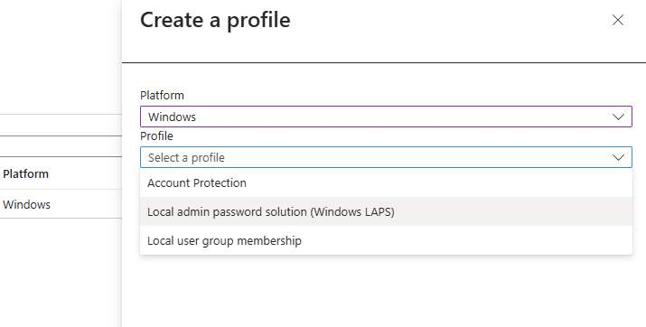
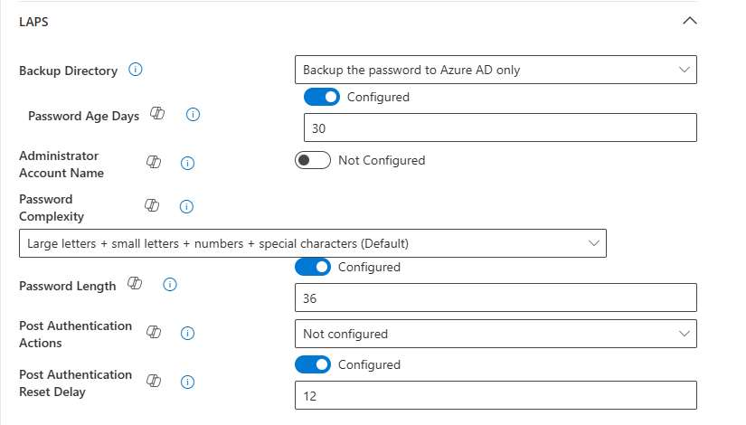
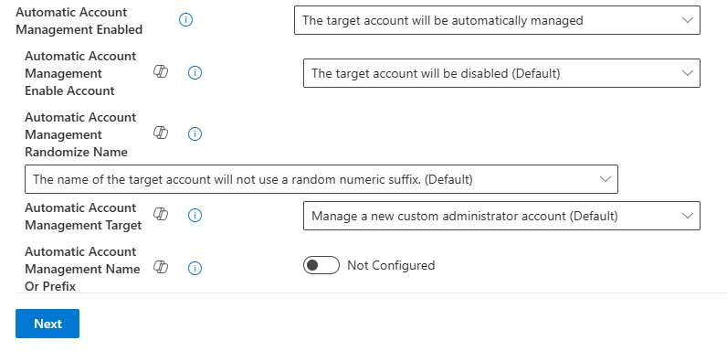
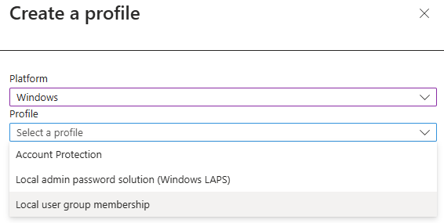

# Quick Wins: Securing Local Devices with Microsoft Intune's LAPS

In today’s IT landscape, where cloud migration is the goal for many organizations, managing rogue or disconnected devices presents unique challenges. These devices, especially those still reliant on local administrator accounts, can become security weak points. But here’s the good news: Microsoft Intune’s **Local Admin Password Solution (LAPS)** provides a smart, automated way to secure these devices.

In this article, I’ll guide you through the process of setting up LAPS in Microsoft Intune, highlight why backing up to Entra ID is a crucial step, and introduce an additional tip for managing the **Local Administrator Group** on your devices. By the end, I hope you will have a clear understanding of how to make your devices more secure and your management process more efficient.

## Benefits of Using Microsoft Intune's LAPS

When discussing security solutions like LAPS, it’s important to understand not only how it works but why it’s valuable. Imagine trying to manage dozens—or even thousands—of local admin accounts manually. It’s time-consuming and risky. Here’s where LAPS simplifies things.

Microsoft Intune’s LAPS enhances security by automating password management for local administrator accounts. It does more than just save time; it protects your environment against potential threats such as credential reuse or pass-the-hash attacks. LAPS achieves this by automatically generating unique, complex passwords for local admin accounts and regularly rotating them to prevent exploitation.

Additionally, the solution offers centralized management through the Intune admin center, where you can define policies, monitor compliance, and retrieve passwords when necessary. By storing these passwords securely in Entra ID (or on-premises Active Directory if preferred), you gain both accessibility and peace of mind.

**Key benefits include:**

- **Strengthened device security** with automated password generation and rotation.
    
- **Streamlined management** of admin account credentials from a single platform.
    
- **Flexible, secure backup options** tailored to cloud or hybrid environments.

## Step-by-Step Guide to Setting Up LAPS in Intune

Setting up LAPS is straightforward, even for those just beginning their Intune journey. With a few steps, you can implement robust security for local administrator accounts across your organization.

Start by enabling LAPS in **Microsoft Entra ID**—this step ensures that passwords are safely backed up and accessible when needed. After that, move on to creating a LAPS policy within Intune’s **Endpoint Security** section, where you’ll define essential settings like password complexity and rotation intervals. Finally, assign the policy to your device groups and monitor its implementation to ensure compliance.

### Step 1: Enable LAPS in Microsoft Entra ID

1. Open the **Microsoft Entra admin center** and navigate to the **Devices** section.
    
2. Under Device Settings, Locate the LAPS settings and enable the feature for your tenant.
    
3. Confirm password backup settings. For cloud-first deployments, ensure backups are configured to **Microsoft Entra ID**.
    

### Step 2: Create a LAPS Policy in Intune

1. Go to the **Intune admin center** and head to **Endpoint Security > Account Protection**.
    
2. Select **Create Policy** and choose your desired platform (e.g., Windows), and desired profile, in this case, Local Admin Password Solution (Windows LAPS) .
    
3. Configure the following:
    
    - **Password Settings**: Define complexity, length, and expiration intervals. I would recommend configuring a strong password complexity (obviously), with the expiration interval to be set to fortnightly.
        
    - **Backup Configuration**: Ensure passwords are backed up to **Azure AD** (yes, still referred to as Azure AD in Intune, I'm sure it will be updated soon), or your preferred directory.
        
    - **Rotation**: Set a regular schedule for password rotation. I would recommend a rotation after the use of the password.
        

Example of LAPS configuration:

### Step 3: Assign the Policy

- Target the policy to device groups within your organization. For testing, consider starting with a pilot group before rolling out tenant-wide.
    

### Step 4: Monitor Compliance

- Use the **Reports** section in Intune to monitor devices and ensure LAPS policies are applied correctly. This is also the go-to place for auditing and manual password retrieval.
    

## **2025 Update! Automatic Account Management**

Of course when I release this article, they update LAPS with Automatic Account Management! 

One of the more exciting updates to Microsoft Intune's LAPS is the recent introduction of **Automatic Account Management**, a feature designed to further streamline and secure local admin account handling.

This feature enables organizations to automatically create and manage local administrator accounts across devices. You can now specify custom account names or prefixes and even randomize account names for added security. Additionally, policies allow you to enable or disable these accounts as required, simplifying account lifecycle management.

**Key benefits of Automatic Account Management include:**

- Reduced administrative effort with automatic account creation and updates.
    
- Enhanced security through randomized account names and controlled enable/disable policies.
    
- Streamlined compliance with advanced password and account configurations.
    

To configure this feature:

1. In the **Intune admin center**, navigate to **Endpoint Security > Account Protection**, and modify your LAPS policy.
    
2. Set the **Automatic Account Management Enabled** option to "**The Target Account will be automatically managed.**"
    
3. Specify additional settings like account name prefixes or randomized account names for flexibility.
    

For more information, I would recommend: [LAPS CSP | Microsoft Learn](https://learn.microsoft.com/en-us/windows/client-management/mdm/laps-csp)

## Using LAPS with Microsoft Entra ID: A Comprehensive Guide

When managing local administrator passwords, Microsoft Entra ID (formerly Azure AD) provides a secure and centralized solution. By integrating LAPS with Entra ID, organizations can ensure that passwords are securely backed up and accessible only to authorized personnel. This section will guide you through the setup process, the permissions required for Helpdesk staff, and the steps they should follow to retrieve and manage passwords.

### Permissions Required for Helpdesk Staff

To ensure secure access to local administrator passwords, role-based access control (RBAC) must be configured in Entra ID. Helpdesk staff typically require specific permissions to view and manage passwords. Here’s what you need to know:

- **Custom Role Creation**:
    
    - Create a custom role in Entra ID with the following permissions:
        
        - `microsoft.directory/deviceLocalCredentials/password/read`: Allows viewing of local admin passwords.
            
        - `microsoft.directory/deviceLocalCredentials/standard/read`: Grants access to password metadata.
            
    - Assign this role to Helpdesk staff or groups that need access.
        
- **Built-in Roles**:
    
    - Alternatively, you can use built-in roles like **Cloud Device Administrator**, but ensure they meet your organization’s security requirements.
        

### Process for Helpdesk Staff to Retrieve Passwords

Once permissions are in place, Helpdesk staff can follow these steps to retrieve and manage local administrator passwords:

1. **Access the Entra Admin Center**:
    
    - Log in to the Microsoft Entra admin center with the appropriate credentials.
        
2. **Locate the Device**:
    
    - Navigate to the **Devices** section and search for the specific device requiring password recovery.
        
3. **Retrieve the Password**:
    
    - Select the device and view the local administrator password. Ensure that MFA is completed if required by Conditional Access policies.
        
4. **Update or Rotate Passwords**:
    
    - If necessary, manually rotate the password using the Intune admin center or trigger an immediate update through the Entra admin center.
        
5. **Document and Close the Request**:
    
    - Record the password retrieval in your Helpdesk ticketing system and ensure the request is closed securely.
        

## Bonus: Managing the Local Administrator Group with Intune

While LAPS secures local administrator credentials, there’s another piece of the puzzle to address: who has access to the **Local Administrator Group** on each device. It’s not uncommon for these groups to become cluttered with legacy users or unauthorized accounts, creating potential security gaps. Intune’s **Account Protection** feature allows you to clean up and tightly manage group memberships, ensuring only authorized users are included.

For example, you can use Intune to remove outdated accounts, add specific service accounts, or replace the entire membership list with a defined set of users. This capability not only improves security but also simplifies auditing and compliance efforts.

To get started, navigate to Intune’s **Local User Group Membership** settings. From there, create a policy tailored to your organization’s needs. By assigning this policy to Azure AD groups, you can automate the management process and ensure consistency across all devices.

For more information on how to configure the Local User Group membership [Click Here](https://learn.microsoft.com/en-us/mem/intune-service/protect/endpoint-security-account-protection-policy#manage-local-groups-on-windows-devices)

## Conclusion

Migrating to the cloud isn’t just about data—it’s about securing every corner of your IT ecosystem, including the often-overlooked local devices. By leveraging Microsoft Intune’s LAPS and Account Protection features, you can simplify password management, lock down administrative access, and remove outdated configurations. These quick wins not only enhance security but also demonstrate how modern tools can make IT management smarter and more efficient.