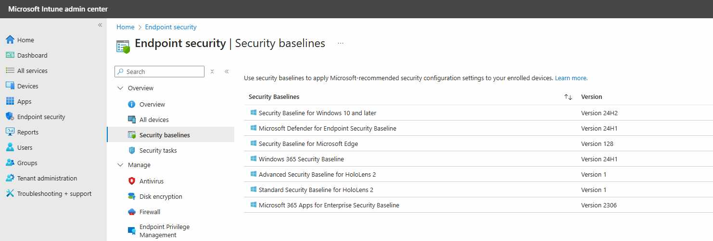
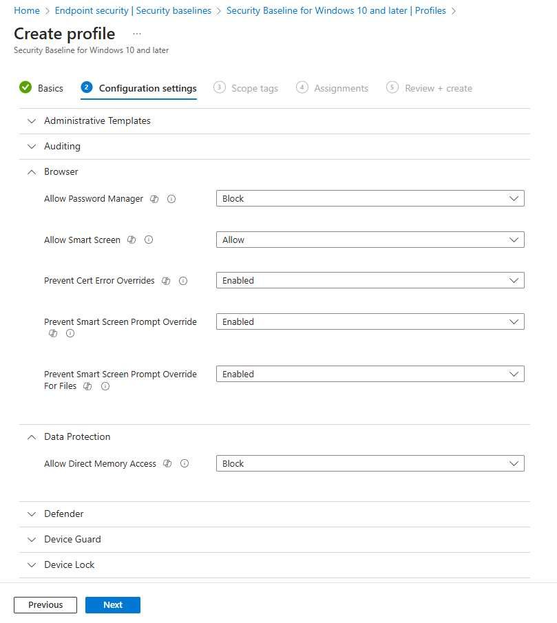
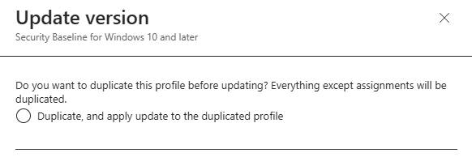

# Quick Win: Establishing a Secure Baseline in a Greenfield Cloud Environment

Transitioning from an on-premises environment to a greenfield setup in the cloud presents a unique opportunity to enhance security and streamline management. While this is an obvious benefit to some, this also poses as a difficult starting point if you are not sure of where to begin to look. Do you go with what others say is Best Practice? do you go straight to Zero Trust?

Establishing security baselines is a critical step in this journey, as it allows organizations to standardize security settings across all devices, ensuring a robust defense against potential threats.

## What is 'Security Baselines' in Intune?

Security baselines in Intune are predefined sets of security configurations provided by Microsoft. These baselines are designed to help organizations quickly and efficiently implement a standardized level of security across all devices. By applying security baselines, organizations can ensure that their devices adhere to best practices and industry standards, reducing vulnerabilities and improving overall security posture.

## So what are the Benefits?

When implementing Microsoft Security Baselines, there are several key benefits:

- **Consistency**: Uniform security settings across all devices reduce vulnerabilities due to configuration drifts.
    
- **Simplified Management**: Easily deploy and manage security settings from a central location.
    
- **Compliance**: Meet industry and regulatory compliance requirements effortlessly.
    
- **Reduced Risk**: Mitigate risks associated with misconfigurations and ensure devices are protected against known threats.
    

## Lets implement a Security Baseline, yeah?

Fairly straight forward process, I wont bore you further, so lets get into it...

1. **Access Microsoft Intune**: Navigate to Microsoft Intune admin center ([Microsoft Intune](https://intune.microsoft.com)).
    
2. **Navigate to Security Baselines**:
	    
    - Go to **Endpoint Security** > **Security Baselines**.
        
3. **Select the Baseline to Deploy**:
	    
    - Choose from the available security baselines: Windows 10 and later, Microsoft Edge, Microsoft Defender for Endpoint, and Microsoft 365 Apps for Enterprise (there's a few others, but I wont over complicate things).
        
4. **Create a Profile**:
    
    - Click **Create profile** and provide a meaningful name and description for the profile.
        
5. **Configure the Settings**:
	    
    - Review and configure the settings as per your organization's requirements. The default settings provided by Microsoft are a great starting point for any greenfield environment, and can confidently be placed into a Pilot deployment.
        
6. **Assign to Groups**:
	    
    - Assign the profile to user or device groups within your organization. This ensures the baseline settings are applied to all intended devices. (Please, use a Pilot Group before you go guns blazing!)
        
7. **Monitor Compliance**:
	    
    - Use the **Reports** section in the Microsoft Intune admin center to monitor compliance and remediate any issues.
        

## What about the different Baseline Versions and Instances

When you create a security baseline profile in Intune, you're creating a template that consists of multiple device configuration settings. Each security baseline is a group of preconfigured Windows settings that help you apply and enforce granular security settings recommended by relevant security teams. You can customize each baseline you deploy to enforce only those settings and values you require.

When multiple versions for a security baseline exist, only the most recent version can be used to create a new instance of that baseline. You can continue to use instances of older baselines that you previously created and edit the groups they're assigned to. 

However, outdated versions don't support changes to their setting configurations. Instead, create new baselines that use the most recent baseline version, or update your older baselines to that newest version if you need to introduce new configurations for settings.

## What are the types of Security Baselines?

Microsoft Intune provides several types of security baselines, each tailored to specific products and security needs. Here are the main types of security baselines and what they cover:

1. **Windows 10 and Later Security Baseline**:
    
    - This baseline includes settings to help secure Windows 10 and later devices. It covers areas such as BitLocker encryption, Windows Defender Antivirus, Windows Firewall, and user account control.
        
2. **Microsoft Edge Security Baseline**:
    
    - This baseline includes settings to help secure the Microsoft Edge browser. It covers areas such as browser security, privacy settings, and extensions management.
        
3. **Microsoft Defender for Endpoint Security Baseline**:
    
    - This baseline includes settings to help secure devices using Microsoft Defender for Endpoint. It covers areas such as endpoint detection and response, attack surface reduction, and automated investigation and remediation.
        
4. **Microsoft 365 Apps for Enterprise Security Baseline**:
    
    - This baseline includes settings to help secure Microsoft 365 Apps for Enterprise. It covers areas such as application security, privacy settings, and update management.
        
5. **Windows HoloLens 2 Standard Security Baseline**:
    
    - This baseline includes settings to help secure HoloLens 2 devices. It covers areas such as account management, application management, browser settings, and device lock.
        
6. **Windows HoloLens 2 Advanced Security Baseline**:
    
    - This baseline includes more stringent settings for HoloLens 2 devices, recommended for environments with strict security controls. It covers advanced settings for account management, application management, browser settings, and connectivity.
        
7. **Windows 365 Security Baseline**:
    
    - This baseline includes settings to help secure Windows 365 Cloud PCs. It covers areas such as administrative templates, control panel settings, and Microsoft Security Guide settings.

## Change Version Function in Intune

The "Change Version" function in Microsoft Intune is essential for maintaining up-to-date security baselines. You wont have to worry about this if you are deploying to a greenfield cloud environment, but essentially, this feature allows administrators to update existing security baseline profiles to the latest versions without disrupting current settings.

The outcome will be a few Next, Next clicks, where your output will be an exact copy of your current policy, with the new template settings present. If you have any configuration changes that you are aware were required from the existing Baseline, I would recommend that you note that within your internal SOE documentation, as this will likely be the best reference point for information in your environment.

## So what about setting conflicts?

To avoid conflicts when deploying security baselines, it's important to ensure that the settings in the baseline do not overlap with other policies or configurations applied to the same devices. Conflicts can arise when multiple policies attempt to configure the same setting with different values. Here are some tips to avoid conflicts:

- **Review Existing Policies**: Before deploying a new security baseline, review existing policies and configurations to identify any potential overlaps.
    
- **Customize Baselines**: Customize the security baseline settings to align with your organization's existing policies and configurations.
    
- **Monitor Conflicts**: Use the reporting and monitoring tools in the Microsoft Endpoint Manager admin center to identify and resolve any conflicts that arise.
    

### Policy Conflicts and Precedence

Understanding the precedence of policies is crucial for avoiding conflicts and ensuring the intended settings are applied to devices. Here's an overview of how policy precedence works in Intune:

1. **Endpoint Security Policies**:
	    
    - Endpoint security policies focus on specific areas of device security, such as antivirus, disk encryption, and firewalls. 
	    
    - These policies take precedence over other policy types when it comes to security settings.
        
2. **Security Baselines**:
	    
    - Security baselines are preconfigured setting groups of settings recommended by Microsoft security teams. When a security baseline is deployed, it enforces the specified settings on devices. 
	    
    - If a setting is configured by both a security baseline and another policy, the setting in the security baseline takes precedence.
        
3. **Configuration Profiles**:
	    
    - Configuration profiles can manage a wide range of device settings, including those related to security. 
	    
    - When a setting is configured by both a configuration profile and a security baseline, the setting in the security baseline takes precedence.
        

To avoid conflicts, it's important to plan which methods to use for deploying configurations to different devices and ensure your different methods either agree or aren't deployed to the same devices. If conflicts occur, you can use Intune's built-in tools to identify and resolve the source of those conflicts.

## As much as you probably already know by now, but the Best Practices in this would be...

- **Pilot Deployment**: Test the security baseline settings on a small group of devices before a wide-scale rollout to identify and resolve any potential issues.
    
- **Regular Reviews**: Periodically review and update the security baseline settings to ensure they align with the latest security standards and organizational policies.
    
- **User Training**: Educate users about the importance of security and how the baseline settings help protect them and the organization.
    

## Can I still use Co-Management?

When using co-managed devices, you must switch the **Device configuration** workload (its settings) to Pilot Intune, or Intune, or the devices you wish to Pilot the deployment. This in itself is an amazing starting point towards the full transition of Device Configuration management away from traditional device management, into modern device management.

## Lets summarize this off

Moving from an on-premises environment to a greenfield setup in the cloud, while implementing security baselines for Windows 10 and later, Microsoft Edge, Microsoft Defender for Endpoint, and Microsoft 365 Apps for Enterprise, offers significant benefits. These include enhanced scalability, reduced infrastructure costs, improved security, and a better user experience. By following the quick steps and best practices outlined above, organizations can achieve a secure, compliant, and manageable cloud environment.