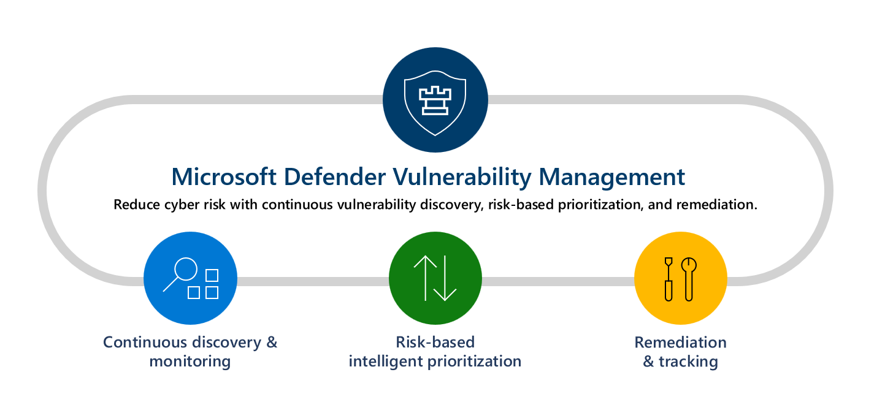

# Quick Wins: Why Your Organization Should Adopt Microsoft Intune Security Tasks Today

**Quickly remediating vulnerabilities is no longer just an optional extra - Its an expectation.** 

Organizations can no longer afford to take a passive approach to vulnerability management. **Quick remediation is not just a best practice—it's an expectation.** Yet, without the right tools in place, security teams often struggle with delays in turning threat insights into actionable remediation steps.

By integrating **Microsoft Intune with Microsoft Defender for Endpoint**, organizations can **close the gap between vulnerability discovery and resolution** by using automated security tasks. This integration improves operational efficiency, strengthens security posture, and enables teams to remediate vulnerabilities with speed and accuracy.

## From Discovery to Resolution – Streamlining Remediation

Microsoft Defender for Endpoint continuously scans and assesses Intune-managed devices, identifying vulnerabilities in real time. **Security Tasks simplify this process** by automatically generating actionable tasks based on these findings. With clear guidance, IT teams can move directly from detection to remediation without unnecessary manual overhead.

### How the Integration Supports Faster Response

1. **Defender for Endpoint Identifies Vulnerabilities** – Continuous assessment detects potential threats.
    
2. **Security Tasks Are Created Automatically** – Only vulnerabilities with direct remediation paths generate security tasks in Intune.
    
3. **Admins Review and Execute Tasks** – IT teams accept tasks and follow step-by-step remediation guidance.
    
4. **Status Updates Sync Across Intune and Defender** – Every action is tracked, ensuring visibility and accountability.
    

This automated flow **reduces time to resolution, eliminates guesswork, and ensures vulnerabilities are addressed quickly** before they become high-risk security incidents.

## Finding and Managing Security Tasks in Defender for Endpoint

Microsoft Defender for Endpoint continuously scans devices to identify vulnerabilities, providing security admins with real-time visibility into potential risks. Within the **Defender XDR**, security teams can **review endpoint vulnerabilities** and create **Security Tasks** that are then managed through Microsoft Intune.

### How Security Tasks Are Created and Found

Once Defender for Endpoint detects a vulnerability, it assesses whether remediation through Intune is possible. **Only vulnerabilities that support direct remediation within Intune** trigger the creation of Security Tasks.

Security admins can find these tasks by navigating to: 

- **Threat & Vulnerability Management > Remediation Tasks** within Defender for Endpoint.
	
- Reviewing identified vulnerabilities, categorized by severity and remediation type.
	
- Security Tasks then appear in **Microsoft Intune admin center**, where IT admins can take action.
	

Each **Security Task** contains the following details:  

- **Remediation Type** – Application-based or configuration-based security issue. 
	
- **Priority** – Defines urgency for remediation.
	
- **Status** – Pending, Accepted, Completed (or Rejected), depending on task progression.
	
- **Steps for Remediation** – Clear guidance for IT admins on how to resolve the issue.
	

Once a Security Task appears in **Microsoft Intune**, admins have the option to **accept or reject** the task. For accepted tasks, remediation is carried out according to the provided guidance. **Once remediation is successful, the task is marked as Complete, updating its status in both Defender for Endpoint and Intune**.

### Types of Security Tasks

Each security task falls into one of two categories based on the type of remediation required:

#### Application Remediation

When Defender for Endpoint detects a vulnerability in an application, a task is created to resolve the issue.  

- **Example:** Defender flags a security risk in **Anto Media Player v4**, which is unmanaged.  
	
- The Intune admin follows the remediation instructions to **update or install a secured version** of the app.
	
#### Configuration Remediation

Security tasks may also require modifications to configuration settings.  

- **Example:** Devices lack protection against **Potentially Unwanted Applications (PUA)**.  

- The admin configures the **Microsoft Defender Antivirus profile** to enforce security policies.
	

If Intune **doesn’t support a direct remediation method**, **Defender for Endpoint does not generate a security task**, meaning admins must look for alternative resolutions.

### Common Security Task Remediation Actions

Once a security task is accepted, IT admins can deploy remediation using one or more of the following actions: 

- **Block an application** to prevent execution.
	
- **Deploy an update** to mitigate vulnerabilities.
	
- **Apply an endpoint security policy** for system-wide protection.
	
- **Modify registry values** to enforce configuration changes.
	
- **Enable or disable security settings** to address vulnerabilities.
	
- **Mark tasks as “Require Attention”** when manual remediation steps are necessary.
	

### Workflow Example – Application Vulnerability Remediation

Following is an example of how a **security task progresses from detection to resolution**:

1. **Detection:** A Microsoft Defender for Endpoint scan finds a vulnerability in **Anto Media Player v4**, an unmanaged application.
	
2. **Security Task Creation:** Defender for Endpoint generates a Security Task instructing admins to update the app.
	
3. **Task Appears in Intune:** The task is **marked as Pending** in the Intune admin center.
	
4. **Admin Review:** The Intune admin views the task details and **selects Accept**, updating the task to **Accepted** in both consoles.
	
5. **Remediation Actions:** The admin follows instructions—updating managed apps directly via Intune or providing text-based remediation steps for unmanaged apps.
	
6. **Task Completion:** Once the vulnerability is resolved, the admin **marks the task as Complete**, updating the status in both Intune and Defender for Endpoint.
	
7. **Final Confirmation:** Security admins verify the revised status, ensuring remediation is successful.
	

## Operational Flow – How Organizations Can Get Started

For organizations that have not yet implemented Security Tasks, structuring the right teams and workflows is essential.

### Team Roles & Responsibilities

- **Security Admins:** Responsible for monitoring vulnerability data in Defender for Endpoint and creating security tasks.  
	
- **Intune Admins:** Accept and remediate security tasks within the Intune admin center.  
	
- **Help Desk & Support Teams:** Assist with manual interventions where automated remediation is not possible.
	

For organizations integrating **Microsoft Intune Security Tasks**, having a clear division of responsibilities ensures efficient remediation.

### Security Admins

**Primary Role:** Monitor vulnerabilities and initiate Security Tasks.  

**Key Responsibilities:**

- Continuously assess threat and vulnerability data in Defender for Endpoint.
    
- Create security tasks based on priority and severity.
    
- Track remediation progress across IT teams.
    
- Ensure compliance with security policies and best practices.
    

### Intune Admins

**Primary Role:** Accept, execute, and update remediation tasks within Intune.  

**Key Responsibilities:**

- Review security tasks in the Intune admin center.
    
- Deploy patches, security policies, and configuration updates.
    
- Mark tasks as complete once remediation is verified.
    
- Provide feedback to Security Admins for improved workflows.
    

### Helpdesk & Support Teams

**Primary Role:** Assist users with remediation tasks requiring manual intervention.  

**Key Responsibilities:**

- Provide support when remediation actions affect end-user experience.
    
- Troubleshoot technical issues related to security policies or updates.
    
- Escalate non-standard cases to IT Admins for resolution.
    
- Communicate security updates and guidelines to affected users.
	

## Why Organizations Should Adopt Security Tasks Now

If you're not yet convinced, let me round out the why's:

- **Faster Security Incident Response** – Automated task generation removes bottlenecks.
    
- **Improved Visibility Across IT and Security Teams** – Real-time updates ensure accountability.
    
- **Reduced Risk Exposure** – Faster remediation prevents vulnerabilities from becoming attack vectors.
    
- **Centralized Management with Intune and Defender XDR** – Simplifies tracking and workflow coordination.
    

By adopting this structured approach, **security teams can act faster, streamline their processes, and strengthen their overall security posture**.

I hope that this gives you the insights and evidence to adopt Security Tasks within your organization.

---

[Use Intune to remediate vulnerabilities found by Microsoft Defender for Endpoint | Microsoft Learn](https://learn.microsoft.com/en-us/intune/intune-service/protect/atp-manage-vulnerabilities)
[Microsoft Defender Vulnerability Management | Microsoft Learn](https://learn.microsoft.com/en-us/defender-vulnerability-management/defender-vulnerability-management#remediation-and-tracking)
