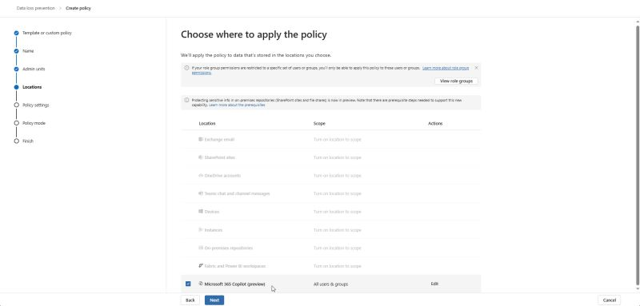

# Safeguarding Sensitive Information with Microsoft Purview DLP and Microsoft 365 Copilot

In the ever-evolving landscape of **data security**, and the rise of **AI** within the cyber space, staying ahead of potential threats is paramount. As highlighted in the recent episode of **Out of Band: A Microsoft Security Podcast**, **Microsoft Purview Data Loss Prevention (DLP)** now offers a robust and much easier solution to protect sensitive information within **Microsoft 365 Copilot**, compared to existing 'workarounds' (The following of which I suspect and suggest be the primary method moving forward in the Data Security space).

---

## Creating Effective DLP Policies

By leveraging **DLP policies** that utilize the **'Microsoft 365 Copilot (preview)' policy location**, with the **“Content contains > Sensitivity labels”** condition defined (to your requirements), organizations can prevent items with specific sensitivity labels from being used in response summarization prompts. This ensures that sensitive information remains secure and is not inadvertently exposed.

---

## Coverage and Implementation

Now, given this is still in preview, The **'Microsoft 365 Copilot (preview)' policy location** exclusion applies to items in **SharePoint** and **OneDrive**. In its preview phase, **DLP for Microsoft 365 Copilot** is supported for **Microsoft 365 Copilot Chat**. 

*However*, it is not yet fully implemented in **Word, Excel, and PowerPoint**. For example, Copilot will not summarize a labeled document in the chat if the document is subject to the DLP policy, but it will if you ask Copilot on the page to summarize the same document. Identified items will still be available in the citations of the response, but the content of the item won’t be used in the response.

### Example Use Case

Consider '**Anto's Company**' (I swear, I am creative), a company that has established and applied a sensitivity label taxonomy to their data, including labels such as **Highly Confidential, Confidential, Internal, Public, and Personal**. They have deployed **Microsoft 365 Copilot** to help users find and use enterprise information within their organization. 

To minimize the risk of **General Data Protection Regulation (GDPR)** data being included in Microsoft 365 Copilot summaries and to exclude private information from summaries, they plan to create a **DLP policy** that uses the **Microsoft 365 Copilot (preview) policy location** with the **Content contains > Sensitivity labels** condition. This policy will exclude items with the **Personal sensitivity label** and the **Highly Confidential sensitivity label** from being processed in the response summary.

### Important Advisory

Now given that this is currently still in preview, there are still some limitations, and what is worth noting for those wanting to get their hands dirty:

- **Simulation mode** isn’t supported for **‘Microsoft 365 Copilot (preview)’**.
    
- The **‘Microsoft 365 Copilot (preview)’ policy location** is only available in the **Custom policy template**.
    
- This capability is rolling out and will appear in your tenant when the rollout reaches you.
    
- When you select the **‘Microsoft 365 Copilot (preview)’ policy location**, all other locations for that policy are disabled.
    
- The **‘Microsoft 365 Copilot (preview)’ policy location** doesn’t support **Admin units**.
    

---

## Conclusion: Bridging the Skills Gap and Ensuring Security

In today's digital scape, the rise of **cyber threats** and the malicious use of data are growing concerns for organizations of all sizes. **Microsoft Purview DLP** and **Microsoft 365 Copilot** provide a powerful combination to bridge the skills gap and ensure that sensitive information remains protected. By implementing these innovations, organizations can empower their employees to work more efficiently while maintaining a high level of security.

Imagine a small business owner who may not have a dedicated IT team but still needs to safeguard their sensitive data. With **Microsoft Purview DLP** and **Microsoft 365 Copilot**, they can create and enforce **DLP policies** that prevent sensitive information from being exposed, even in response summarization prompts. This not only helps protect their business but also builds trust with their customers.

For larger organizations, these tools offer a scalable solution to manage data security across multiple departments and locations. By leveraging the power of **AI** and advanced **DLP policies**, they can ensure that their sensitive information is protected, regardless of the size or complexity of their operations.

These innovations are designed to help you stay ahead in **data security**, and ensure your sensitive information remains protected within your organization.

---

Source: [Learn about the Microsoft 365 Copilot location (preview) | Microsoft Learn](https://learn.microsoft.com/en-us/purview/dlp-microsoft365-copilot-location-learn-about)
