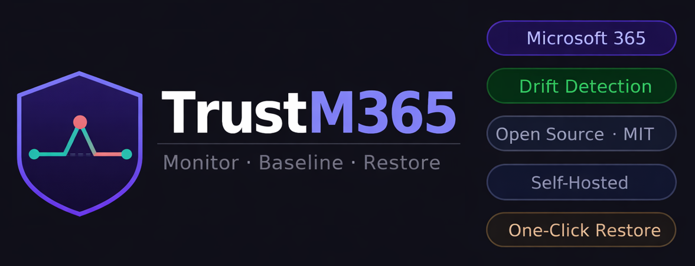

# TrustM365

**Monitor. Baseline. Restore.**

Self-hosted baseline management and drift detection for Microsoft 365 tenants.

---

## Overview

TrustM365 is an open source platform for Microsoft 365 administrators, MSSPs, and security teams to:

- Define and manage security baselines for one or many tenants
	
- Detect configuration drift in real time
	
- Restore drifted settings with a single click
	
- Generate detailed audit reports (HTML, PDF, DOCX)

Run TrustM365 in your own environment for full control, privacy, and compliance—no cloud dependencies.

---

## Key Features

- **Multi-tenant management** with portfolio and scorecard views
	
- **Property-level drift detection** and clear diff reporting
	
- **One-click remediation** and full restore history
	
- **Customisable baselines** and resource grouping
	
- **Webhook notifications** (Teams, Slack, PagerDuty)
	
- **White-label branding** for MSSPs
	
- **Secure, local-first architecture** (Node.js, React, SQLite, AES-256-GCM)
	

---

## Get Started

TrustM365 is open source and ready for self-hosted deployment.

- [View the project on GitHub](https://github.com/AntoPorter/TrustM365)
	
- [Read the documentation](https://github.com/AntoPorter/TrustM365/blob/main/docs/guides)
	

---

## Contribute

Contributions, feedback, and issues are welcome! Visit the GitHub repository to get involved or open an issue.

---

## See TrustM365 in Action

<iframe width="100%" height="600" src="https://www.youtube.com/embed/T3MVJdNVUqY" title="TrustM365: Monitor. Baseline. Restore." frameborder="0" allow="accelerometer; autoplay; clipboard-write; encrypted-media; gyroscope; picture-in-picture; web-share" allowfullscreen></iframe>

---

## FAQ

**Is TrustM365 free?**

TrustM365 is open-source and free to use under the included licence. Deployment and infrastructure costs depend on your environment.

**Can TrustM365 manage multiple tenants?**

Yes. TrustM365 is designed for multi-tenant MSSP operations and enterprise scenarios with multiple business units.

**What permissions does TrustM365 need?**

TrustM365 requires read-only or read-write delegated permissions depending on your use case. See the [GitHub repo](https://github.com/AntoPorter/TrustM365) for detailed permission requirements.

**Does TrustM365 send data to the cloud?**

No. TrustM365 is fully self-hosted. All baseline data, drift detection results, and audit logs remain in your local environment.

**When will Purview, Teams, and Exchange baselines be available?**

These are on the roadmap for future releases.

---

**Ready to secure your Microsoft 365 environment?**

[Get Started with TrustM365](https://github.com/AntoPorter/TrustM365)
