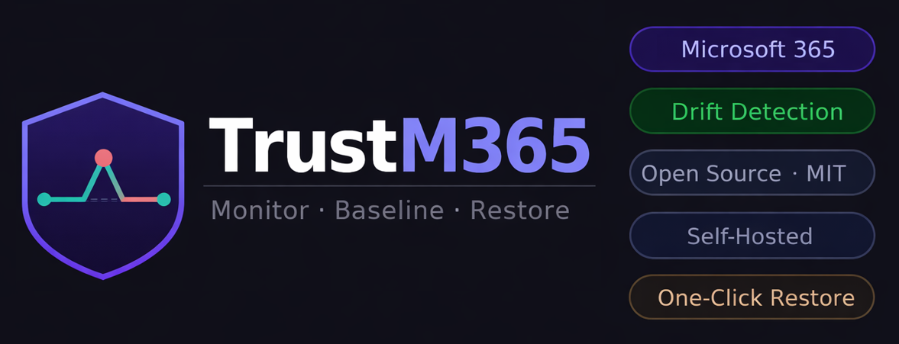

# TrustM365

**Monitor. Baseline. Restore.**

Self-hosted baseline management, drift detection, configuration assurance, and operational monitoring for Microsoft 365.

---

## Overview

TrustM365 is an open source platform for Microsoft 365 administrators, security teams, and MSSPs who need visibility and control over tenant configuration.

Define baselines, detect configuration drift, restore unintended changes, and monitor operational events across one or many Microsoft 365 tenants.

TrustM365 helps answer four critical questions:

- What changed?
	
- When did it change?
	
- How do I restore it?
	
- Does my configuration align with expected standards?
	

Run TrustM365 in your own environment for full control, privacy, and compliance with no SaaS dependencies.

---

## Key Features

### Baseline Management & Drift Detection

- Property-level drift detection with detailed diffs
	
- Selective baseline monitoring
	
- Snapshot and property-based monitoring modes
	
- Baseline versioning and change history
	
- One-click remediation and restore history
	

### Multi-Tenant Operations

- MSSP-ready multi-tenant management
	
- Portfolio dashboards and scorecards
	
- Shared application registration management
	
- Cross-tenant reporting and operational visibility
	
- White-label branding and reporting
	

### Microsoft 365 Coverage

Monitor and manage configuration across:

- Microsoft Entra ID
	
- Conditional Access
	
- Intune
	
- SharePoint Online
	
- Exchange Online
	
- Microsoft Teams
	

Additional workloads continue to be added with each release.

### Security & Configuration Assurance

- Security Templates for tenant assessment
	
- Zero Trust Assessment V2 integration
	
- Reference Templates (Preview)
	
- OpenIntuneBaseline template alignment (Work in Progress)
	
- Exportable assessment results and reporting
	

### SIEM & Operational Visibility

- Native Azure Log Analytics integration
	
- Microsoft Sentinel content pack
	
- Drift, remediation, webhook, scheduler, and operational event export
	
- KQL queries, workbooks, and analytic rule templates
	

### Reporting & Automation

- HTML, PDF, and DOCX report generation
	
- Teams, Slack, and PagerDuty webhook notifications
	
- Scheduled monitoring and drift detection
	
- Automated remediation support
	
- Full audit and activity history
	

### Secure by Design

- Self-hosted architecture
	
- AES-256-GCM encrypted secrets
	
- Node.js, React, and SQLite
	
- No mandatory cloud dependencies
	
- Complete control of your data
	

---

## What's New in v1.1

TrustM365 v1.1 introduces several major platform enhancements:

- Native Microsoft Sentinel and Log Analytics integration
	
- SharePoint Online, Exchange Online, and Microsoft Teams workload coverage
	
- Shared App Registration management for MSSPs
	
- Expanded Security and Reference Template capabilities
	
- Improved deployment, authentication, and operational tooling
	
- Enhanced upgrade and migration experience
	

See the release notes on GitHub for full details.

---

## Get Started

TrustM365 is open source and ready for self-hosted deployment.

- [View the project on GitHub](https://github.com/AntoPorter/TrustM365)
	
- [Read the documentation](https://github.com/AntoPorter/TrustM365/blob/main/docs/guides)
	

---

## Contribute

Contributions, feedback, and issues are welcome! Visit the GitHub repository to get involved or open an issue.

---

## See TrustM365 in Action

<iframe width="100%" height="600" src="https://www.youtube.com/embed/T3MVJdNVUqY" title="TrustM365: Monitor. Baseline. Restore." frameborder="0" allow="accelerometer; autoplay; clipboard-write; encrypted-media; gyroscope; picture-in-picture; web-share" allowfullscreen></iframe>

---

## FAQ

**Is TrustM365 free?**

Yes. TrustM365 is open source and free to use under the included licence. Deployment and infrastructure costs depend on your environment.

**Can TrustM365 manage multiple tenants?**

Yes. TrustM365 was designed for MSSPs and organisations managing multiple Microsoft 365 tenants from a single platform.

**Can TrustM365 integrate with Microsoft Sentinel?**

Yes. TrustM365 can export drift detection, remediation, scheduler, webhook, and operational events directly into Azure Log Analytics and Microsoft Sentinel.

**What permissions does TrustM365 require?**

TrustM365 supports both read-only and read-write scenarios depending on the features you use. Detailed permission requirements are documented in the GitHub repository.

**Does TrustM365 send data to the cloud?**

No. TrustM365 is fully self-hosted. Configuration data, baselines, drift history, reports, and audit logs remain within your environment.

**What are Reference Templates?**

Reference Templates are an evolving feature that allows comparison of tenant configuration against known baseline recommendations, including selected OpenIntuneBaseline configuration sets. This capability is currently considered preview/work-in-progress.

---

**Ready to secure your Microsoft 365 environment?**

[Get Started with TrustM365](https://github.com/AntoPorter/TrustM365)
